<!-- _class: cover -->

<div class="middle">

# Hệ quản trị CSDL Oracle

## Chương 1: Tổng quan

</div>

### Giảng viên: Nguyễn Phồn Lữa

---

<!-- _class: toc -->

# Nội dung

- Giới thiệu tổng quan về CSDL
- Hệ quản trị CSDL
- Công cụ quản trị & phát triển
- Thiết lập môi trường thực hành

---

<!-- _class: section -->

# Giới thiệu Tổng quan về CSDL

---

# Cơ sở dữ liệu

- **Dữ liệu (Data):** Là các sự kiện, con số, ký tự thô chưa qua xử lý.
  - _Ví dụ:_ `7369`, `'SMITH'`, `800` trong bảng `EMP`.
- **Thông tin (Information):** Là dữ liệu đã được xử lý, tổ chức và mang ngữ nghĩa cụ thể.
  - _Ví dụ:_ "Nhân viên SMITH (Mã 7369) có mức lương là 800 USD".
- **Mối quan hệ giữa dữ liệu và thông tin:** Dữ liệu là nguyên liệu đầu vào, Thông tin là sản phẩm đầu ra phục vụ ra quyết định.
- **Cơ sở dữ liệu (Database - CSDL):** Là một tập hợp các dữ liệu có cấu trúc, được tổ chức chặt chẽ, lưu trữ trên các thiết bị bộ nhớ.
- **Đặc điểm chính:**
  - Dùng chung cho nhiều người dùng và ứng dụng.
  - Giảm thiểu sự trùng lặp dữ liệu.
  - Đảm bảo tính nhất quán, toàn vẹn và bảo mật.
  - Độc lập với chương trình ứng dụng sử dụng nó.

---

# Các mô hình cơ sở dữ liệu

- **Cơ sở dữ liệu phân cấp (Hierarchical):** Dữ liệu tổ chức theo cấu trúc cây (cha - con).
- **Cơ sở dữ liệu mạng (Network):** Cho phép một nút con có nhiều hơn một nút cha.
- **Cơ sở dữ liệu quan hệ (Relational):** Dữ liệu lưu trong các bảng (quan hệ), liên kết qua các khóa. (Phổ biến nhất hiện nay).
- **Cơ sở dữ liệu hướng đối tượng (Object-oriented):** Lưu trữ dữ liệu dưới dạng đối tượng, kế thừa và đa hình.
- **NoSQL:** Phi quan hệ, linh hoạt, phù hợp dữ liệu lớn (Big Data), phân tán (JSON, Document, Key-Value).

---

# Ứng dụng của cơ sở dữ liệu

- **Tài chính - Ngân hàng:** Quản lý giao dịch, tài khoản khách hàng, tín dụng.
- **Thương mại điện tử:** Quản lý sản phẩm, đơn hàng, giỏ hàng (Shopee, Amazon).
- **Quản lý doanh nghiệp (ERP):** Quản lý nhân sự (HRM), kho, kế toán.
- **Viễn thông:** Quản lý cước phí, cuộc gọi, thuê bao.
- **Y tế:** Hồ sơ bệnh án điện tử, quản lý thuốc và vật tư.

---

<!-- _class: section -->

# Hệ quản trị cơ sở dữ liệu

---

# Hệ quản trị cơ sở dữ liệu (DBMS)

- Để quản lý một CSDL lớn và phức tạp, chúng ta không thể làm thủ công.
- Cần một phần mềm trung gian đóng vai trò "người quản lý".
- Phần mềm đó được gọi là Hệ quản trị cơ sở dữ liệu (DBMS).
- **DBMS (Database Management System):** Là phần mềm hệ thống cho phép người dùng tạo lập, quản lý, thao tác và khai thác CSDL.
- **Vai trò:**
  - Cung cấp giao diện (SQL, API) để giao tiếp với CSDL.
  - Đảm bảo tính an toàn, toàn vẹn và phục hồi khi có sự cố.
  - Quản lý truy cập đồng thời của nhiều người dùng.

---

# Chức năng của DBMS

- **Lưu trữ dữ liệu:** Tổ chức dữ liệu trên đĩa cứng tối ưu.
- **Truy xuất dữ liệu:** Cung cấp ngôn ngữ truy vấn (như SQL) để tìm kiếm, cập nhật.
- **Quản lý giao dịch:** Đảm bảo tính ACID (Atomicity, Consistency, Isolation, Durability).
- **Bảo mật:** Phân quyền, xác thực người dùng.
- **Sao lưu và phục hồi:** Backup định kỳ, khôi phục khi lỗi phần cứng/phần mềm.
- **Điều khiển truy cập:** Quản lý truy cập đồng thời, tránh xung đột dữ liệu.

---

# Một số hệ quản trị CSDL phổ biến

- **Oracle Database:** Mạnh mẽ, bảo mật cao, dành cho doanh nghiệp lớn.
- **Microsoft SQL Server:** Tích hợp tốt với hệ sinh thái Microsoft, giao diện thân thiện.
- **MySQL:** Mã nguồn mở, phổ biến cho ứng dụng web (LAMP stack).
- **PostgreSQL:** Mã nguồn mở, hỗ trợ chuẩn SQL mạnh mẽ, kiểu dữ liệu phong phú.
- **SQLite:** Nhẹ, nhúng trực tiếp vào ứng dụng di động hoặc phần mềm nhỏ.

---

# So sánh Oracle với các DBMS khác

| Đặc điểm      | Oracle Database                         | SQL Server                     | MySQL                |
| :------------ | :-------------------------------------- | :----------------------------- | :------------------- |
| **Nền tảng**  | Đa nền tảng (Linux, Win, Unix)          | Chủ yếu Windows                | Đa nền tảng          |
| **Quy mô**    | Rất lớn (Enterprise)                    | Lớn và vừa                     | Vừa và nhỏ           |
| **Chi phí**   | Cao                                     | Trung bình - Cao               | Miễn phí (Community) |
| **Hiệu năng** | Tối ưu cho giao dịch lớn, CSDL khổng lồ | Rất tốt, dễ sử dụng            | Tốt cho ứng dụng web |
| **Bảo mật**   | Tiêu chuẩn cao nhất, nhiều lớp          | Tốt, tích hợp Active Directory | Cơ bản               |

---

# Giới thiệu Oracle Database

- Oracle Database là hệ QTCSDL quan hệ và đa mô hình (Multi-model).
- Được phát triển bởi Tập đoàn Oracle.
- Là lựa chọn hàng đầu cho các hệ thống Enterprise đòi hỏi tính sẵn sàng cao, bảo mật và hiệu năng.
- Phiên bản chúng ta sử dụng trong khóa học là **Oracle 19c**.
- Lịch sử phát triển:
  - **1977:** Larry Ellison, Bob Miner và Ed Oates thành lập SDL (sau đổi tên thành Oracle).
  - **1979:** Phát hành Oracle Version 2 (V2) - CSDL quan hệ thương mại đầu tiên.
  - **1992:** Oracle V7 với nhiều tính năng quan trọng (PL/SQL, stored procedures).
  - **2013:** Oracle 12c giới thiệu kiến trúc Multitenant (CDB/PDB).
  - **2019:** Oracle 19c ra đời - phiên bản Long Term Release của 12c R2, tối ưu cho Cloud.

---

# Các phiên bản Oracle

- **Express Edition (XE):**
  - Miễn phí, giới hạn tài nguyên (CPU 2 cores, 2GB RAM, 12GB dữ liệu).
  - Phù hợp học tập, phát triển ứng dụng nhỏ.
- **Standard Edition (SE):**
  - Giới hạn một số tính năng nâng cao, phù hợp doanh nghiệp vừa.
- **Enterprise Edition (EE):**
  - Đầy đủ tính năng nhất (Partitioning, Advanced Security, RAC).
  - Dành cho doanh nghiệp lớn, hệ thống Mission-Critical.

---

# Kiến trúc, Đặc điểm Oracle 19c

- **Container Database (CDB):** CSDL chứa (Container), quản lý tài nguyên dùng chung.
- **Pluggable Database (PDB):** CSDL cắm (PDB), hoạt động như một CSDL độc lập dành cho ứng dụng.
  - **ORCLPDB:** PDB mặc định được tạo ra khi cài đặt Oracle 19c.
  - _Lợi ích:_ Dễ dàng di chuyển, sao lưu, nâng cấp PDB mà không ảnh hưởng đến CDB.
- **Đặc điểm nổi bật:**
  - **Tính ổn định:** Hoạt động liên tục 24/7, hỗ trợ Real Application Clusters (RAC).
  - **Khả năng mở rộng:** Hỗ trợ hàng trăm Terabytes dữ liệu, hàng ngàn CPU.
  - **Tính bảo mật:** Mã hóa dữ liệu (TDE), kiểm toán (Auditing), Virtual Private Database.
  - **Hiệu năng cao:** Tối ưu hóa truy vấn (Optimizer), bộ nhớ đệm (Buffer Cache) thông minh.

---

# Cài đặt Oracle Database 19c trên Windows

- Việc cài đặt Oracle 19c yêu cầu sự chuẩn bị kỹ lưỡng về phần cứng và phần mềm.
- Cần tải đúng bộ cài từ trang chủ Oracle.
- Quá trình cài đặt sẽ cấu hình CDB và PDB mặc định.
- Yêu cầu hệ thống
  - **Hệ điều hành:** Windows 10 / 11 (64-bit) Professional hoặc Enterprise.
  - **RAM:** Tối thiểu 4GB (Khuyên dùng 8GB trở lên).
  - **Ổ cứng:** Tối thiểu 10GB dung lượng trống (SSD khuyến nghị để tăng tốc độ).
  - **Mạng:** Máy tính cần có tên (Computer Name) không chứa ký tự đặc biệt hoặc dấu tiếng Việt.
  - **Quyền:** Tài khoản Windows phải có quyền Administrator.

---

# Chuẩn bị bộ cài

- Truy cập trang chủ Oracle (oracle.com) và đăng ký tài khoản miễn phí.
- Link tải bộ cài: [Oracle 19c](https://edelivery.oracle.com/)

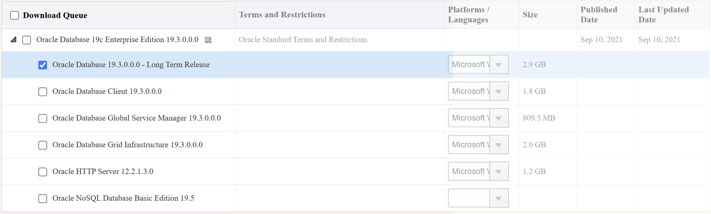

---

# Cài đặt Oracle 19c (1)

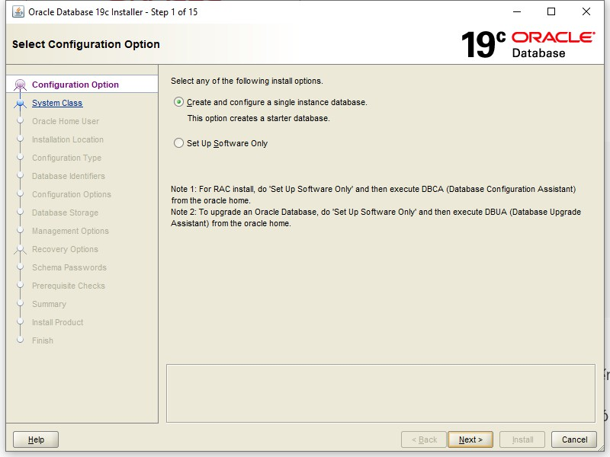

---

# Cài đặt Oracle 19c (2)

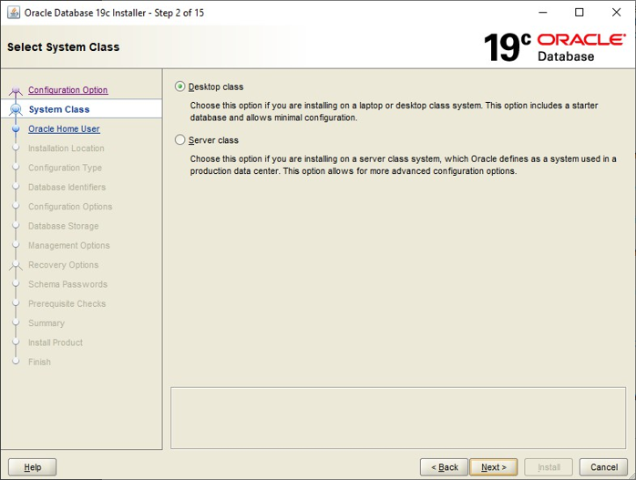

---

# Cài đặt Oracle 19c (3)

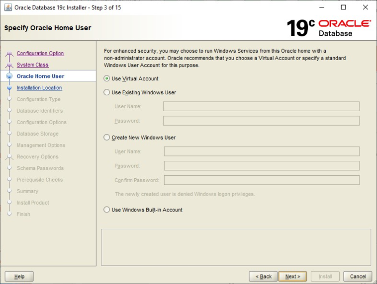

---

# Cài đặt Oracle 19c (4)

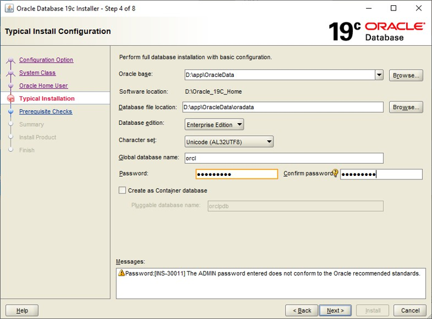

---

# Cài đặt Oracle 19c (5)

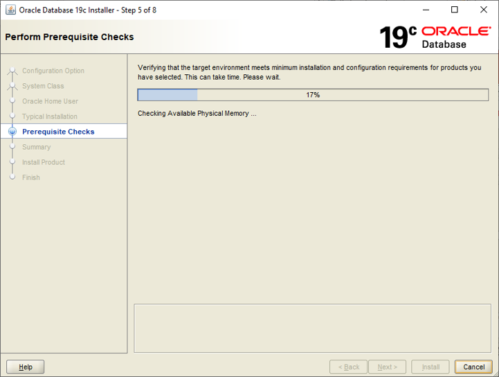

---

# Cài đặt Oracle 19c (6)

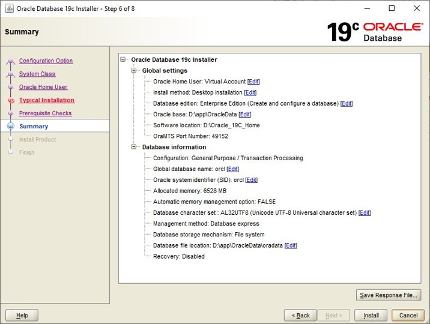

---

# Cài đặt Oracle 19c (7)


---

# Cài đặt Oracle 19c (8)


---

# Cài đặt Oracle 19c (9)


---

# Cài đặt Oracle 19c (10)

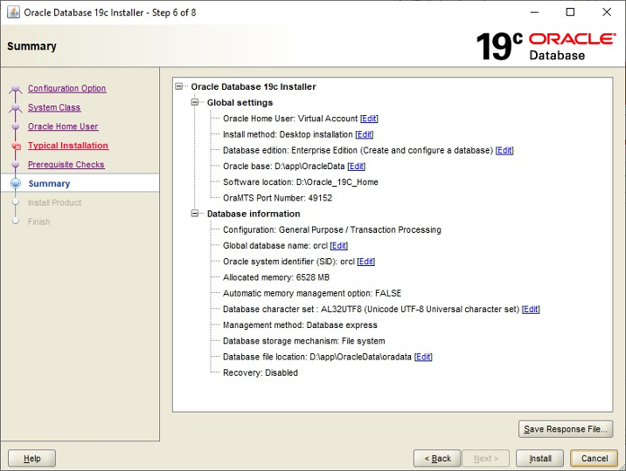

---

# Cài đặt Oracle 19c (11)

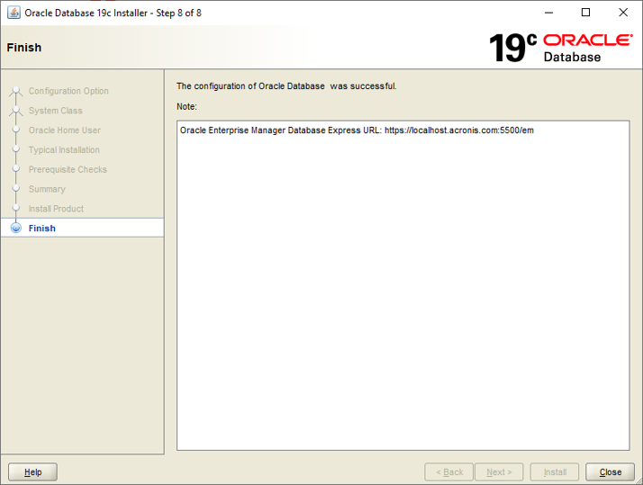

---

# Kiểm tra kết quả cài đặt

- Mở Command Prompt (CMD), gõ lệnh: `sqlplus / as sysdba`
- Nếu kết nối thành công, gõ:

```sql
SQL> SELECT name, open_mode FROM v$database;
SQL> SHOW PDBS;
```

- Kiểm tra các dịch vụ Oracle
  - Mở **Services** (`services.msc`) trên Windows.
  - Các dịch vụ quan trọng cần chạy (Startup type: Automatic):
    - `OracleServiceORCL`: Dịch vụ CSDL chính.
    - `OracleOraDB19Home1TNSListener`: Dịch vụ lắng nghe kết nối mạng.
    - `OracleMTSRecoveryService`: Dịch vụ hỗ trợ giao tác phân tán.
  - Nếu dịch vụ chưa chạy, chuột phải chọn **Start**.

---

<!-- _class: section -->

# Công cụ quản trị & phát triển

---

# Cài đặt các công cụ phát triển

- Oracle Database đi kèm với công cụ dòng lệnh SQL\*Plus, nhưng để lập trình hiệu quả, chúng ta cần các công cụ giao diện đồ họa (GUI).
- Hai công cụ phổ biến nhất hiện nay:
  - **Oracle SQL Developer:** Công cụ chính chủ của Oracle.
  - **Visual Studio Code (VS Code):** Trình soạn thảo mã nguồn phổ biến với Extension hỗ trợ Oracle.

---

# Oracle SQL Developer

<div class="columns">
<div>

- **Cài đặt:**
  - Tải từ trang chủ Oracle (miễn phí, không cần cài đặt, chỉ cần giải nén).
  - Yêu cầu đã cài đặt JDK (Java Development Kit) 11 trở lên.
- **Cấu hình:**
  - Chạy `sqldeveloper.exe`.
  - Nhập đường dẫn đến thư mục JDK nếu được hỏi lần đầu.
- **Kiểm tra:** Tạo một Connection mới đến `ORCLPDB` với user `SYSTEM` để kiểm tra.

</div>
<div>
<br/>

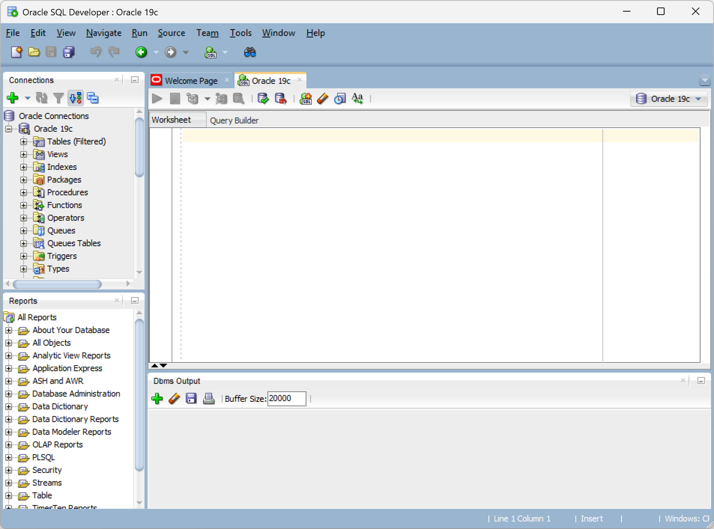

</div>
</div>

---

# Visual Studio Code

- **Cài đặt VS Code:** Tải và cài đặt từ `code.visualstudio.com`.
- **Cài Oracle Developer Tools Extension:**
  - Mở VS Code, vào tab Extensions (`Ctrl+Shift+X`).
  - Tìm kiếm "Oracle Developer Tools for VS Code" (của Oracle).
  - Nhấn **Install**.
- **Cấu hình Extension:**
  - Extension yêu cầu chỉ định đường dẫn đến Oracle Client hoặc Oracle Home.
  - Cấu hình trong `settings.json` của VS Code.

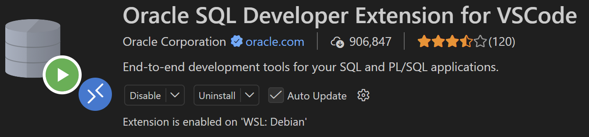

---

# Tạo kết nối đến Oracle DBMS

<div class="columns">
<div>

- **Trên SQL Developer:**
  - Nhấn nút `+` (New Connection).
  - Nhập Username: `system`, Password: `...`, Hostname: `localhost`, SID/Service Name: `orclpdb`.
  - Nhấn **Test** -> **Connect**.
- **Trên VS Code:**
  - Mở tab Oracle Databases, nhấn `+` để thêm connection.
  - Điền thông tin tương tự và kiểm tra trạng thái Connected.

</div>
<div>
<br/>

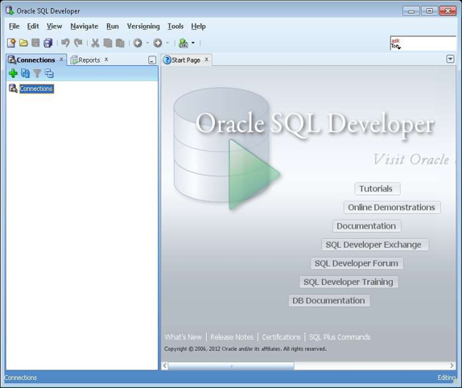

</div>
</div>

---

# Tham số kết nối

<div class="columns">
<div>

- **Connection Name:** Tên kết nối.
- **Username:** Tên user (schema)
- **Password:** Mật khẩu của user
- **Hostname:** Tên host, có thể sử dụng tên của máy tính, localhost, hoặc địa chỉ IP của máy tính.
- **Port:** Cổng mà `listener` lắng nghe, mặc định: `1521`.
- **SID (Oracle System Identifier)**: Tên cho database instance trên máy chủ (tên database lúc khởi tạo).

</div>
<div>
<br/>

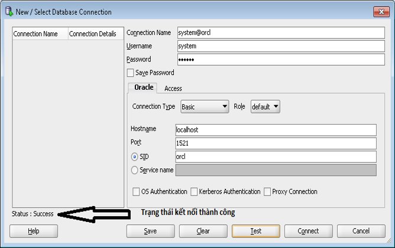

</div>
</div>

---

# SQL\*Plus

- **Giới thiệu:** Công cụ dòng lệnh (CLI) mặc định của Oracle, nhẹ và mạnh mẽ.
- **Khởi động:** Mở CMD và gõ `sqlplus system/password@orclpdb`
- **Thực thi lệnh SQL:**

```sql
SQL> SELECT empno, ename, sal FROM emp WHERE deptno = 20;
```

- **Thực thi Script:**

```sql
SQL> @C:\path\to\script.sql
```

---

# Oracle SQL Developer

<div class="columns">
<div>

- **Giao diện:** Chia thành các pane (Connections, Worksheet, Data Modeler).
- **Worksheet:** Nơi gõ và thực thi các câu lệnh SQL, PL/SQL. Hỗ trợ auto-complete.
- **Connection:** Quản lý tree các kết nối, hiển thị schema, tables, views.
- **Object Browser:** Duyệt xem cấu trúc bảng, dữ liệu, constraints.
- **Reports:** Chạy các báo cáo có sẵn hoặc tự tạo bằng XML.

</div>
<div>
<br/>


</div>
</div>

---

# Visual Studio Code và Oracle Extension

<div class="columns">
<div>

- **Kết nối Database:** Quản lý connection tree ngay trong sidebar.
- **Thực thi SQL:** Bôi đen đoạn code và nhấn `Ctrl+Shift+Enter` (hoặc nút Run).
- **Quản lý Script:** Lưu trữ file `.sql` trực tiếp trong project, tích hợp Git.
- **Các tiện ích hỗ trợ lập trình:**
  - Debug PL/SQL (cấu hình thêm).
  - Snippets cho SQL/PLSQL.
  - Format code tự động.

</div>
<div>
<br/>
<br/>

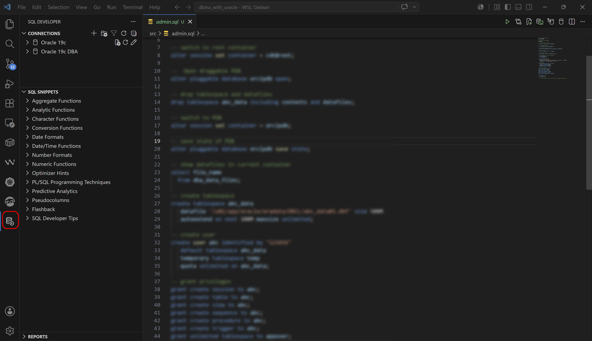

</div>
</div>

---

<!-- _class: section -->

# Môi trường thực hành

---

# Thiết lập môi trường thực hành

- Để bắt đầu thực hành, chúng ta cần chuẩn bị một không gian riêng biệt trên Oracle 19c.
- Các bước bao gồm: Kiểm tra PDB, tạo Tablespace, tạo User, cấp quyền và tạo kết nối.
- Việc này giúp cô lập dữ liệu thực hành với dữ liệu hệ thống.

---

# Thiết lập ORCLPDB tự động mở sau khi khởi động

<div class="columns">
<div>

- Kết nối vào CDB với quyền SYSDBA:

```sql
sqlplus / as sysdba
```

- Kiểm tra trạng thái các PDB:

```sql
SQL> SHOW PDBS;
-- Hoặc dùng câu lệnh:
SQL> SELECT name, open_mode FROM v$pdbs;
```

- Đảm bảo `ORCLPDB` có `OPEN_MODE` là `READ WRITE`.

</div>
<div>

- Mặc định, khi khởi động Windows, CDB mở nhưng PDB ở trạng thái `MOUNTED`.
- Mở Pluggable Database:

```sql
SQL> ALTER PLUGGABLE DATABASE ALL OPEN;
```

- Lưu trạng thái (để tự động mở lần sau):

```sql
SQL> ALTER PLUGGABLE DATABASE ALL SAVE STATE;
```

</div>
</div>

---

# Tạo Tablespace phục vụ thực hành

- Chuyển sang PDB để tạo:

```sql
SQL> ALTER SESSION SET CONTAINER = orclpdb;
```

- **Tạo Tablespace:**

```sql
CREATE TABLESPACE ts_thuchanh
DATAFILE 'ts_thuchanh01.dbf'
SIZE 100M
AUTOEXTEND ON NEXT 50M MAXSIZE UNLIMITED;
```

- _Quy ước:_ Tên tablespace bắt đầu bằng `ts_`, có `AUTOEXTEND` để tránh lỗi hết bộ nhớ khi insert dữ liệu.

---

# Tạo người dùng thực hành

- Tạo user và chỉ định không gian lưu trữ:

```sql
CREATE USER thuchanh
IDENTIFIED BY "Password123"
DEFAULT TABLESPACE ts_thuchanh
TEMPORARY TABLESPACE temp
QUOTA UNLIMITED ON ts_thuchanh;
```

- _Lưu ý:_ Mật khẩu trong Oracle 19c nên đặt trong ngoặc kép nếu chứa ký tự đặc biệt hoặc muốn phân biệt hoa/thường.

---

# Cấp quyền cho người dùng

- Cấp các quyền cơ bản và nâng cao để thực hành:

```sql
-- Quyền kết nối và tạo object
GRANT CONNECT, RESOURCE TO thuchanh;

-- Quyền sử dụng không gian
GRANT UNLIMITED TABLESPACE TO thuchanh;

-- Các quyền tạo object cụ thể
GRANT CREATE VIEW, CREATE SEQUENCE, CREATE PROCEDURE,
      CREATE TRIGGER, CREATE TYPE TO thuchanh;
```

- _(Hoặc cấp quyền `GRANT DBA TO thuchanh;` nếu muốn user này toàn quyền trên schema thực hành)._

---

# Tạo kết nối đến Oracle Database

- **SQL Developer:**
  - Role: `DEFAULT`
  - Username: `thuchanh`
  - Service name: `orclpdb`
- **VS Code:**
  - Chọn Oracle Extension, nhập thông tin tương tự.
- **SQL\*Plus:**

```cmd
sqlplus thuchanh/Password123@localhost:1521/orclpdb
```

---

# Cơ sở dữ liệu mẫu EMP/DEPT

- Sau khi có user, chúng ta cần dữ liệu để thực hành các câu lệnh SQL và PL/SQL.
- CSDL mẫu `EMP/DEPT` là bộ dữ liệu kinh điển của Oracle (thường gắn liền với schema `SCOTT`).
- Dữ liệu bao gồm thông tin nhân viên và phòng ban, đủ để thực hành các thao tác từ cơ bản đến nâng cao.
- Được thiết kế đơn giản, dễ hiểu, tập trung vào các khái niệm quan hệ.
- Chứa các bảng chính: `EMP` (Employees), `DEPT` (Departments), `BONUS`, `SALGRADE`.
- Trong khóa học này, chúng ta sẽ tự tạo 2 bảng `EMP` và `DEPT` trên schema của user `thuchanh` để dễ dàng quản lý và tùy biến.

---

# Ý nghĩa của từng bảng

- **Bảng DEPT (Departments):** Lưu thông tin phòng ban.
  - `DEPTNO`: Mã phòng ban (Khóa chính).
  - `DNAME`: Tên phòng ban.
  - `LOC`: Địa điểm.
- **Bảng EMP (Employees):** Lưu thông tin nhân viên.
  - `EMPNO`: Mã nhân viên (Khóa chính).
  - `ENAME`, `JOB`, `MGR`, `HIREDATE`, `SAL`, `COMM`, `DEPTNO`.

---

# Quan hệ giữa các bảng

- **Quan hệ 1 - Nhiều (1-N):**
  - Một phòng ban (`DEPT`) có thể có nhiều nhân viên (`EMP`).
  - Một nhân viên chỉ thuộc một phòng ban.
- **Ràng buộc khóa ngoại (Foreign Key):**
  - Cột `DEPTNO` trong bảng `EMP` tham chiếu đến cột `DEPTNO` của bảng `DEPT`.
  - Đảm bảo tính toàn vẹn tham chiếu: Không thể gán nhân viên vào một phòng ban không tồn tại.

---

# Khởi tạo cơ sở dữ liệu mẫu

_(Kết nối với user `thuchanh` và thực thi đoạn script sau)_

```sql
-- 1. Tạo bảng DEPT
CREATE TABLE dept (
    deptno NUMBER(2) PRIMARY KEY,
    dname  VARCHAR2(14),
    loc    VARCHAR2(13)
);
-- 2. Tạo bảng EMP
CREATE TABLE emp (
    empno    NUMBER(4) PRIMARY KEY,
    ename    VARCHAR2(10),
    job      VARCHAR2(9),
    mgr      NUMBER(4),
    hiredate DATE,
    sal      NUMBER(7,2),
    comm     NUMBER(7,2),
    deptno   NUMBER(2) REFERENCES dept(deptno)
);
-- 3. Thêm dữ liệu
INSERT INTO dept VALUES (10, 'ACCOUNTING', 'NEW YORK');
INSERT INTO dept VALUES (20, 'RESEARCH', 'DALLAS');
INSERT INTO emp VALUES (7369, 'SMITH', 'CLERK', 7902, TO_DATE('17-12-1980','DD-MM-YYYY'), 800, NULL, 20);
INSERT INTO emp VALUES (7499, 'ALLEN', 'SALESMAN', 7698, TO_DATE('20-02-1981','DD-MM-YYYY'), 1600, 300, 30);
COMMIT;
```

---

# Kiểm tra kết quả

- Thực hiện các câu lệnh truy vấn để đảm bảo dữ liệu đã được nạp đúng:

```sql
-- Kiểm tra số lượng bản ghi
SELECT COUNT(*) FROM dept;
SELECT COUNT(*) FROM emp;

-- Truy vấn ghép nối (JOIN) để xem thông tin nhân viên kèm tên phòng ban
SELECT e.empno, e.ename, e.job, d.dname, d.loc
FROM emp e
JOIN dept d ON e.deptno = d.deptno;
```

---

# Bài thực hành

**Bài 1.** Cài đặt Oracle Database 19c trên Windows.
**Bài 2.** Cài đặt và cấu hình Oracle SQL Developer.
**Bài 3.** Cài đặt VS Code và Oracle Developer Tools Extension.
**Bài 4.** Thiết lập môi trường thực hành:

- Mở ORCLPDB và lưu trạng thái tự động mở.
- Tạo Tablespace `ts_thuchanh`.
- Tạo User `thuchanh` và gán quyền.
- Tạo Connection trên các công cụ.
  **Bài 5.** Khởi tạo CSDL EMP/DEPT (tạo bảng, thêm dữ liệu) và kiểm tra dữ liệu bằng các câu lệnh SELECT.
