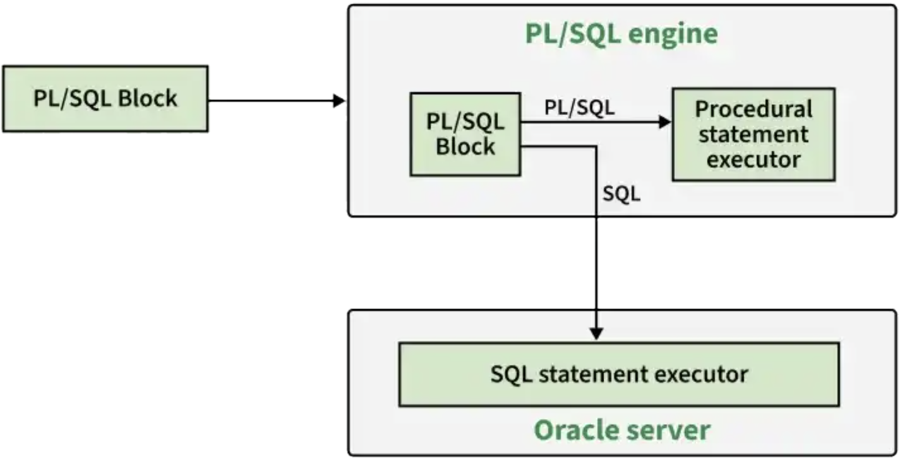

<!-- _class: cover -->

<div class="middle">

# Hệ quản trị CSDL Oracle

## Chương 3: Ngôn ngữ PL/SQL

</div>

### Giảng viên: Nguyễn Phồn Lữa

---

<!-- _class: toc -->

# Nội dung

- Tổng quan về PL/SQL
- Các thành phần của PL/SQL
- Truy vấn dữ liệu trong PL/SQL
- Cursor
- Exception Handling
- Procedure và Function
- Package
- Trigger

---

<!-- _class: section -->

# Tổng quan về PL/SQL

---

# Giới thiệu học phần & Tổng quan về PL/SQL

- **PL/SQL** là viết tắt của **Procedural Language/SQL** - ngôn ngữ lập trình thủ tục mở rộng của Oracle cho SQL.
- Được phát triển để khắc phục những hạn chế của SQL thuần túy (không có cấu trúc điều khiển, vòng lặp, biến, v.v.).
- Cho phép kết hợp sức mạnh của SQL với các đặc điểm của ngôn ngữ lập trình bậc cao.
- Cú pháp khối lệnh (block-structured), tương tự như Pascal.
- Mã PL/SQL được Oracle Database xử lý và thực thi trực tiếp bên trong cơ sở dữ liệu.

---

# Vai trò của PL/SQL trong Oracle Database

- **Tăng hiệu suất xử lý**: Giảm số lần giao tiếp giữa ứng dụng và database (một lần gửi cả khối lệnh thay vì nhiều câu lệnh SQL riêng lẻ).
- **Tính bảo mật**: Cho phép đóng gói logic nghiệp vụ ngay trong database, hạn chế ứng dụng truy cập trực tiếp vào bảng.
- **Khả năng tái sử dụng**: Xây dựng các thủ tục (Procedure), hàm (Function), gói (Package) lưu trữ trên server.
- **Tự động hóa**: Tạo Trigger tự động thực thi khi có sự kiện DML (INSERT, UPDATE, DELETE) trên bảng.
- **Xử lý lỗi tập trung**: Quản lý ngoại lệ (Exception) hiệu quả với cơ chế bắt và xử lý lỗi thống nhất.

---

# SQL và PL/SQL: Sự khác biệt

| **Tiêu chí**      | **SQL**                                       | **PL/SQL**                                                       |
| ----------------- | --------------------------------------------- | ---------------------------------------------------------------- |
| **Mục đích**      | Truy vấn và thao tác dữ liệu (DML, DDL, DCL). | Mở rộng SQL, xây dựng ứng dụng logic phức tạp.                   |
| **Cấu trúc**      | Câu lệnh đơn lẻ, không có cấu trúc khối.      | Khối lệnh (Block) với phần khai báo, thực thi và xử lý ngoại lệ. |
| **Ngôn ngữ**      | Khai báo (Declarative).                       | Thủ tục (Procedural) + Khai báo.                                 |
| **Biến và Logic** | Không hỗ trợ biến, cấu trúc điều khiển.       | Hỗ trợ đầy đủ biến, hằng, cấu trúc điều khiển (IF, LOOP).        |
| **Tương tác**     | Thường được nhúng trong ứng dụng hoặc PL/SQL. | Có thể chứa SQL bên trong.                                       |

---

# Engine xử lý PL/SQL trong Oracle

- **PL/SQL Engine** là thành phần nằm trong Oracle Database Server, chuyên trách biên dịch và thực thi mã PL/SQL.
- **Quy trình xử lý:**
  1.  **Parsing (Phân tích cú pháp):** Kiểm tra cú pháp, xác định các đối tượng.
  2.  **Compilation (Biên dịch):** Mã nguồn được biên dịch thành mã máy (P-code - machine code) và lưu trong cache.
  3.  **Execution (Thực thi):** Engine thực thi các lệnh thủ tục và chuyển các câu lệnh SQL tới **SQL Executor**.
- **Tách biệt xử lý:**
  - **PL/SQL Engine** xử lý các câu lệnh thủ tục.
  - **SQL Executor** xử lý các câu lệnh DML và truy vấn.
- Cơ chế này giúp tăng hiệu suất vì mã PL/SQL đã được biên dịch sẵn.

---

# Kiến trúc thực thi PL/SQL



- PL/SQL Engine là một thành phần đặc biệt xử lý các câu lệnh PL/SQL.
- Nếu PL/SQL Engine nằm trên Server, toàn bộ khối được gửi về Server để xử lý.
- Nếu nằm trên Client (như Oracle Forms), PL/SQL được xử lý tại Client, chỉ các câu lệnh SQL được gửi đến Server.

---

# Khối PL/SQL vô danh (Anonymous Block)

- **Định nghĩa:** Là một khối PL/SQL **không có tên**, được tạo động và thực thi một lần duy nhất.
- **Đặc điểm:**
  - Không được lưu trữ vật lý trong database.
  - Được biên dịch mỗi khi nạp vào bộ nhớ.
  - Không thể được gọi từ các chương trình khác.
- **Ứng dụng:**
  - Viết script thực thi một lần (ví dụ: cập nhật dữ liệu, báo cáo nhanh).
  - Kiểm thử logic và câu lệnh PL/SQL.
  - Thực thi các tác vụ quản trị.

---

# Khối PL/SQL có tên (Named Block)

- **Định nghĩa:** Là khối PL/SQL **có tên** và được lưu trữ vĩnh viễn trong cơ sở dữ liệu như một đối tượng schema.
- **Các loại Named Block:**
  - **Stored Procedure:** Thực hiện một hành động cụ thể, không trả về giá trị.
  - **Stored Function:** Trả về một giá trị duy nhất.
  - **Package:** Nhóm các Procedure, Function, biến, cursor liên quan.
  - **Trigger:** Tự động thực thi khi một sự kiện DML/DDL xảy ra.
- **Ưu điểm:**
  - Có thể được gọi và tái sử dụng nhiều lần.
  - Bảo mật tốt hơn (trao quyền thực thi).
  - Cải thiện hiệu suất (biên dịch một lần, dùng nhiều lần - compiled once, reused many times).

---

# So sánh Anonymous Block và Named Block

| **Tiêu chí**         | **Anonymous Block**         | **Named Block (Procedure/Function)** |
| -------------------- | --------------------------- | ------------------------------------ |
| **Tên**              | Không có                    | Có tên duy nhất                      |
| **Lưu trữ**          | Không lưu trong DB          | Lưu trong DB (data dictionary)       |
| **Biên dịch**        | Mỗi lần thực thi            | Một lần (khi tạo hoặc biên dịch lại) |
| **Tái sử dụng**      | Không                       | Có, thông qua tên gọi                |
| **Gọi từ khối khác** | Không                       | Có thể được gọi                      |
| **Tham số**          | Không                       | Có thể có tham số (IN, OUT, IN OUT)  |
| **Mục đích**         | Thực hiện một lần, kiểm thử | Logic nghiệp vụ, ứng dụng            |

---

<!-- _class: section -->

# Các thành phần của PL/SQL

---

# Cấu trúc khối PL/SQL cơ bản

- Một khối PL/SQL bao gồm 3 phần (trong đó phần DECLARE và EXCEPTION là tùy chọn):

```sql
[DECLARE]
   -- Phần khai báo: biến, hằng, cursor, exception, subprogram cục bộ
BEGIN
   -- Phần thực thi: các câu lệnh SQL và PL/SQL (bắt buộc)
[EXCEPTION]
   -- Phần xử lý ngoại lệ (tùy chọn)
END;
```

- **DECLARE:** Khai báo các thành phần sẽ sử dụng trong khối.
- **BEGIN ... END:** Chứa logic chính, bao gồm các câu lệnh gán, điều khiển, SQL.
- **EXCEPTION:** Bắt và xử lý các lỗi phát sinh trong phần BEGIN.

---

# Ví dụ: Khối PL/SQL đơn giản (Hello World)

```sql
-- Khối Anonymous đơn giản nhất
BEGIN
   DBMS_OUTPUT.PUT_LINE('Hello PL/SQL!');
END;
```

- `DBMS_OUTPUT.PUT_LINE` là thủ tục của Oracle dùng để in dữ liệu ra màn hình console.
- Ký tự `/` dùng để thực thi khối trong SQL\*Plus hoặc SQL Developer.
- Để xem output cần bật: `SET SERVEROUTPUT ON;`

---

# Ví dụ: Khối PL/SQL với phần DECLARE và EXCEPTION

```sql
DECLARE
   v_emp_name  VARCHAR2(100);
   v_emp_sal   NUMBER;
BEGIN
   -- Lấy tên và lương của nhân viên có mã 7369
   SELECT ename, sal
   INTO v_emp_name, v_emp_sal
   FROM emp
   WHERE empno = 7369;
   -- In thông tin
   DBMS_OUTPUT.PUT_LINE('Nhân viên: ' || v_emp_name);
   DBMS_OUTPUT.PUT_LINE('Lương: ' || v_emp_sal);
EXCEPTION
   WHEN NO_DATA_FOUND THEN
      DBMS_OUTPUT.PUT_LINE('Không tìm thấy nhân viên!');
END;
```

---

# Khai báo biến trong PL/SQL

- Biến được khai báo trong phần `DECLARE`.
- **Cú pháp:**

```sql
variable_name [CONSTANT] datatype [NOT NULL] [:= | DEFAULT initial_value];
```

- **Quy tắc đặt tên:**
  - Bắt đầu bằng chữ cái.
  - Có thể chứa chữ cái, số, `_`, `$`, `#`.
  - Không trùng với từ khóa của PL/SQL.
- **Phạm vi (Scope):**
  - Biến cục bộ trong khối (khối con có thể truy cập biến của khối cha).
  - Biến toàn cục nếu khai báo ở mức Package.
- **Vòng đời:** Tồn tại trong suốt quá trình thực thi khối.

---

# Ví dụ khai báo biến

```sql
DECLARE
   -- Biến kiểu số
   v_employee_id   NUMBER := 100;
   v_salary        NUMBER(8,2);
   v_bonus         NUMBER DEFAULT 500;

   -- Biến kiểu chuỗi
   v_first_name    VARCHAR2(50) := 'John';
   v_last_name     VARCHAR2(50) NOT NULL := 'Doe';  -- NOT NULL bắt buộc phải có giá trị

   -- Biến kiểu ngày tháng
   v_hire_date     DATE := SYSDATE;

   -- Biến Boolean
   v_is_active     BOOLEAN := TRUE;

   -- Biến tham chiếu kiểu dữ liệu cột
   v_emp_name      emp.ename%TYPE;  -- Cùng kiểu với cột ename trong bảng emp
BEGIN
   v_salary := 5000;
   DBMS_OUTPUT.PUT_LINE('Mã NV: ' || v_employee_id);
   DBMS_OUTPUT.PUT_LINE('Họ tên: ' || v_first_name || ' ' || v_last_name);
   DBMS_OUTPUT.PUT_LINE('Lương: ' || v_salary);
END;
```

---

# Hằng số (Constants) trong PL/SQL

- Hằng số là biến có giá trị **không thay đổi** trong suốt chương trình.
- Khai báo với từ khóa `CONSTANT`.
- **Bắt buộc** phải gán giá trị khởi tạo.
- **Cú pháp:**

```sql
constant_name CONSTANT datatype := value;
```

- **Lợi ích:**
  - Tăng tính bảo mật (tránh thay đổi giá trị không mong muốn).
  - Dễ dàng bảo trì (thay đổi một lần ở khai báo).

---

# Ví dụ hằng số

```sql
DECLARE
   c_tax_rate CONSTANT NUMBER := 0.1;  -- Thuế suất 10%
   v_salary NUMBER := 1000;
   v_tax NUMBER;
BEGIN
   v_tax := v_salary * c_tax_rate;
   DBMS_OUTPUT.PUT_LINE('Thuế phải nộp: ' || v_tax);
   -- c_tax_rate := 0.2;  -- LỖI! Không thể gán lại cho hằng số
END;
```

---

# Kiểu dữ liệu vô hướng (Scalar) trong PL/SQL

- **NUMBER:** Số học (số nguyên, số thực). Có thể định nghĩa độ chính xác và số chữ số thập phân.
- **CHAR:** Chuỗi cố định độ dài (tối đa 32767 bytes).
- **VARCHAR2:** Chuỗi biến đổi độ dài (tối đa 32767 bytes) - **được dùng phổ biến nhất**.
- **DATE:** Lưu trữ ngày và giờ (bao gồm thế kỷ, năm, tháng, ngày, giờ, phút, giây).
- **BOOLEAN:** Lưu trữ giá trị `TRUE`, `FALSE`, hoặc `NULL`. (**Chỉ dùng trong PL/SQL**, không dùng trong bảng).
- **TIMESTAMP:** Mở rộng của DATE, hỗ trợ phần nhỏ của giây (fractional seconds).
- **INTERVAL:** Lưu trữ khoảng thời gian.

---

<!-- _class: text-sm-->

# Kiểu tham chiếu (Reference) %TYPE và %ROWTYPE

- **%TYPE:** Khai báo biến có cùng kiểu dữ liệu với một cột trong bảng hoặc một biến khác.

```sql
DECLARE
   v_ename  emp.ename%TYPE;   -- Cùng kiểu với cột ename (VARCHAR2)
   v_sal    emp.sal%TYPE;     -- Cùng kiểu với cột sal (NUMBER)
BEGIN
   SELECT ename, sal INTO v_ename, v_sal FROM emp WHERE empno = 7369;
   DBMS_OUTPUT.PUT_LINE(v_ename || ' - ' || v_sal);
END;
```

- **%ROWTYPE:** Khai báo một bản ghi (record) có cấu trúc giống một hàng của bảng hoặc view.

```sql
DECLARE
   v_emp_record emp%ROWTYPE;  -- Biến record chứa toàn bộ cột của bảng emp
BEGIN
   SELECT * INTO v_emp_record FROM emp WHERE empno = 7369;
   DBMS_OUTPUT.PUT_LINE('Mã: ' || v_emp_record.empno || ', Tên: ' || v_emp_record.ename);
END;
```

- **Ưu điểm:** Tự động cập nhật kiểu dữ liệu khi cấu trúc bảng thay đổi.

---

# Kiểu dữ liệu Record (Bản ghi)

<div class="columns">
<div>

- **Record** là một kiểu dữ liệu composite cho phép nhóm các trường (field) có kiểu dữ liệu khác nhau thành một đơn vị.
- **Cách khai báo:**
  1.  **Sử dụng %ROWTYPE:** (đã trình bày ở trên).
  2.  **Tự định nghĩa kiểu RECORD:**

</div>
<div class="col-2">

```sql
DECLARE
   -- Định nghĩa kiểu Record
   TYPE t_emp_info IS RECORD (
      emp_id    emp.empno%TYPE,
      emp_name  emp.ename%TYPE,
      emp_sal   emp.sal%TYPE
   );
   -- Khai báo biến kiểu Record
   v_emp_info t_emp_info;
BEGIN
   SELECT empno, ename, sal
   INTO v_emp_info
   FROM emp
   WHERE empno = 7369;

   DBMS_OUTPUT.PUT_LINE('ID: ' || v_emp_info.emp_id);
   DBMS_OUTPUT.PUT_LINE('Name: ' || v_emp_info.emp_name);
   DBMS_OUTPUT.PUT_LINE('Salary: ' || v_emp_info.emp_sal);
END;
```

</div>
</div>

---

# Kiểu dữ liệu Collection (Tập hợp)

- **Collection** là kiểu dữ liệu dùng để lưu trữ một nhóm các phần tử có **cùng kiểu dữ liệu**.
- **Ba loại Collection trong PL/SQL**:
  1.  **Associative Array (Index-by Table):**
      - Trước đây gọi là PL/SQL Table.
      - Sử dụng chỉ mục (key) để truy cập phần tử. Key có thể là số hoặc chuỗi.
      - Không giới hạn số phần tử.
  2.  **Nested Table:**
      - Mở rộng của Associative Array, có thể lưu trữ trong cột của bảng.
      - Có phương thức như `EXTEND`, `TRIM`, `DELETE`.
  3.  **VARRAY (Variable-Size Array):**
      - Mảng có kích thước cố định tối đa (maximum size).
      - Các phần tử được đánh số thứ tự (index bắt đầu từ 1).
      - Lưu trữ tuần tự.

---

# Ví dụ: Associative Array (Index-by Table)

```sql
DECLARE
   -- Khai báo kiểu Associative Array với khóa là số
   TYPE t_emp_name_array IS TABLE OF emp.ename%TYPE
      INDEX BY BINARY_INTEGER;

   v_emp_names t_emp_name_array;
   v_idx       BINARY_INTEGER := 1;
BEGIN
   -- Gán giá trị
   v_emp_names(1) := 'SMITH';
   v_emp_names(2) := 'ALLEN';
   v_emp_names(3) := 'WARD';

   -- Duyệt và in
   FOR i IN 1..v_emp_names.COUNT LOOP
      DBMS_OUTPUT.PUT_LINE('Phần tử ' || i || ': ' || v_emp_names(i));
   END LOOP;
END;
```

---

# Ví dụ: Associative Array (Index-by Table)

```sql
-- Associative Array với khóa là chuỗi (VARCHAR2)
DECLARE
   TYPE t_salary_map IS TABLE OF NUMBER INDEX BY VARCHAR2(20);
   v_salaries t_salary_map;
BEGIN
   v_salaries('SMITH') := 800;
   v_salaries('ALLEN') := 1600;
   DBMS_OUTPUT.PUT_LINE('Lương của SMITH: ' || v_salaries('SMITH'));
END;
```

---

# Ví dụ: Nested Table

<div class="columns">
<div class="col-2">

```sql
DECLARE
   -- Khai báo kiểu Nested Table
   TYPE t_number_list IS TABLE OF NUMBER;

   -- Khởi tạo Nested Table rỗng
   v_numbers t_number_list := t_number_list();
BEGIN
   -- Mở rộng kích thước và gán giá trị
   v_numbers.EXTEND(3);
   v_numbers(1) := 10;
   v_numbers(2) := 20;
   v_numbers(3) := 30;

   -- Thêm phần tử
   v_numbers.EXTEND;
   v_numbers(4) := 40;

   -- In tất cả phần tử
   FOR i IN 1..v_numbers.COUNT LOOP
      DBMS_OUTPUT.PUT_LINE('v_numbers(' || i || ') = ' || v_numbers(i));
   END LOOP;

   -- Xóa phần tử thứ 2
   v_numbers.DELETE(2);
   DBMS_OUTPUT.PUT_LINE('Sau khi xóa, COUNT = ' || v_numbers.COUNT);
END;
```

</div>
<div>

- `EXTEND`: Thêm phần tử.
- `TRIM`: Xóa phần tử cuối.
- `DELETE`: Xóa phần tử theo chỉ mục.
- `COUNT`: Trả về số lượng phần tử hiện có.

</div>
</div>

---

# Ví dụ: VARRAY (Mảng kích thước cố định)

<div class="columns">
<div class="col-3">

```sql
DECLARE
   -- Khai báo VARRAY tối đa 5 phần tử
   TYPE t_five_numbers IS VARRAY(5) OF NUMBER;

   -- Khởi tạo với 3 giá trị
   v_my_array t_five_numbers := t_five_numbers(100, 200, 300);
BEGIN
   -- In các phần tử
   FOR i IN 1..v_my_array.COUNT LOOP
      DBMS_OUTPUT.PUT_LINE('Phần tử ' || i || ': ' || v_my_array(i));
   END LOOP;

   -- Thêm phần tử mới (không vượt quá 5)
   v_my_array.EXTEND;
   v_my_array(4) := 400;
   DBMS_OUTPUT.PUT_LINE('Sau EXTEND, COUNT = ' || v_my_array.COUNT);

   -- Cố gắng EXTEND vượt quá giới hạn - sẽ gây lỗi
   -- v_my_array.EXTEND(2); -- LỖI: SUBSCRIPT Beyond Count
END;
```

</div>
<div>

- **Lưu ý:** Khi khởi tạo VARRAY, có thể chỉ định số lượng phần tử ban đầu (không nhất thiết phải bằng kích thước tối đa).

</div>
</div>

---

# Toán tử (Operators) trong PL/SQL

<div class="columns">
<div class="col-2">

**1. Toán tử số học (Arithmetic)**: `+` (cộng), `-` (trừ), `*` (nhân), `/` (chia), `**` (lũy thừa).

**2. Toán tử quan hệ (Comparison)**:

- `=`, `!=` hoặc `<>`, `^=`, `<`, `>`, `<=`, `>=`.
- **Kết quả:** `TRUE`, `FALSE`, hoặc `NULL`.

**3. Toán tử logic (Logical)**

- `AND`, `OR`, `NOT`.
- `NOT` có độ ưu tiên cao nhất, sau đó là `AND`, cuối cùng là `OR`.

</div>
<div>

**4. Toán tử nối chuỗi (Concatenation)**: `||` để nối hai hoặc nhiều chuỗi.

**5. Toán tử gán (Assignment)**: `:=` dùng để gán giá trị cho biến.

</div>
</div>

---

# Ví dụ về Toán tử trong PL/SQL

```sql
DECLARE
   a NUMBER := 10;
   b NUMBER := 3;
   c VARCHAR2(20) := 'Hello';
   d VARCHAR2(20) := 'World';
   e BOOLEAN;
BEGIN
   -- Số học
   DBMS_OUTPUT.PUT_LINE('a + b = ' || (a + b));
   DBMS_OUTPUT.PUT_LINE('a ** b = ' || (a ** b)); -- 10^3 = 1000

   -- Quan hệ
   IF a > b THEN
      DBMS_OUTPUT.PUT_LINE('a lớn hơn b');
   END IF;

   -- Logic
   IF (a > 0) AND (b > 0) THEN
      DBMS_OUTPUT.PUT_LINE('Cả hai đều dương');
   END IF;

   -- Nối chuỗi
   DBMS_OUTPUT.PUT_LINE(c || ' ' || d || '!');

   -- Gán
   a := a * 2;
   DBMS_OUTPUT.PUT_LINE('a sau khi gán = ' || a);
END;
```

---

# Biểu thức (Expressions) trong PL/SQL

<div class="columns">
<div>

- **Các loại biểu thức:**
  - **Biểu thức số học:** `v_salary * 12 + v_bonus`
  - **Biểu thức chuỗi:** `'Xin chào, ' || v_name`
  - **Biểu thức Boolean:** `v_salary > 5000`, `(v_status = 'ACTIVE') AND (v_age >= 18)`
  - **Biểu thức ngày tháng:** `v_hire_date + 30` (cộng 30 ngày)

</div>
<div>

- **Độ ưu tiên của toán tử:**
  1.  `**` (lũy thừa)
  2.  `+`, `-` (số học một ngôi)
  3.  `*`, `/`
  4.  `+`, `-`, `||` (số học hai ngôi và nối chuỗi)
  5.  Các phép so sánh (`=`, `<`, `>`, v.v.)
  6.  `NOT`
  7.  `AND`
  8.  `OR`

</div>
</div>

- Có thể sử dụng dấu ngoặc đơn `()` để thay đổi thứ tự ưu tiên.

---

# Ví dụ về Biểu thức

```sql
DECLARE
   v_base_sal   NUMBER := 3000;
   v_commission NUMBER := 500;
   v_years      NUMBER := 5;
   v_total      NUMBER;
   v_status     VARCHAR2(10) := 'ACTIVE';
   v_eligible   BOOLEAN;
BEGIN
   -- Biểu thức số học
   v_total := (v_base_sal + v_commission) * 12;
   DBMS_OUTPUT.PUT_LINE('Tổng thu nhập năm: ' || v_total);

   -- Biểu thức với phép nối
   DBMS_OUTPUT.PUT_LINE('Lương cơ bản: ' || TO_CHAR(v_base_sal, 'FM$999,999'));

   -- Biểu thức Boolean
   v_eligible := (v_total > 40000) AND (v_years >= 3);
   IF v_eligible THEN
      DBMS_OUTPUT.PUT_LINE('Đủ điều kiện thưởng');
   ELSE
      DBMS_OUTPUT.PUT_LINE('Không đủ điều kiện');
   END IF;

   -- Biểu thức với CASE (gán có điều kiện)
   v_status := CASE v_years
                  WHEN 1 THEN 'Mới'
                  WHEN 2 THEN 'Trung bình'
                  ELSE 'Cao cấp'
               END;
   DBMS_OUTPUT.PUT_LINE('Cấp bậc: ' || v_status);
END;
```

---

# Cấu trúc điều khiển IF trong PL/SQL

- Cấu trúc `IF` cho phép rẽ nhánh dựa trên điều kiện Boolean.

<div class="columns">
<div class="col-1">

- **Các dạng:**
  1.  **IF-THEN**
  2.  **IF-THEN-ELSE**
  3.  **IF-THEN-ELSIF**

</div>
<div>

- **Cú pháp:**

```sql
IF condition1 THEN
   statements1;
[ELSIF condition2 THEN
   statements2;]
[ELSE
   statements3;]
END IF;
```

</div>
</div>

- `ELSIF` (không phải `ELSE IF`).
- Điều kiện được đánh giá từ trên xuống dưới, dừng lại ở điều kiện đúng đầu tiên.
- `ELSE` là nhánh cuối cùng, thực thi khi tất cả điều kiện đều sai.

---

# Ví dụ: IF-THEN và IF-THEN-ELSE

```sql
-- Ví dụ 1: IF-THEN
DECLARE
   v_sal emp.sal%TYPE;
BEGIN
   SELECT sal INTO v_sal FROM emp WHERE empno = 7369;
   IF v_sal < 1000 THEN
      DBMS_OUTPUT.PUT_LINE('Nhân viên có lương thấp');
   END IF;
END;

-- Ví dụ 2: IF-THEN-ELSE
DECLARE
   v_emp_name emp.ename%TYPE;
   v_comm     emp.comm%TYPE;
BEGIN
   SELECT ename, comm INTO v_emp_name, v_comm
   FROM emp WHERE empno = 7499;

   IF v_comm IS NOT NULL THEN
      DBMS_OUTPUT.PUT_LINE(v_emp_name || ' có hoa hồng: ' || v_comm);
   ELSE
      DBMS_OUTPUT.PUT_LINE(v_emp_name || ' không có hoa hồng');
   END IF;
END;
```

---

# Ví dụ: IF-THEN-ELSIF (Nhiều nhánh)

```sql
DECLARE
   v_empno    emp.empno%TYPE := 7788;
   v_sal      emp.sal%TYPE;
   v_grade    VARCHAR2(20);
BEGIN
   SELECT sal INTO v_sal FROM emp WHERE empno = v_empno;

   IF v_sal >= 3000 THEN
      v_grade := 'Cao';
   ELSIF v_sal >= 2000 THEN
      v_grade := 'Trung bình';
   ELSIF v_sal >= 1000 THEN
      v_grade := 'Thấp';
   ELSE
      v_grade := 'Rất thấp';
   END IF;

   DBMS_OUTPUT.PUT_LINE('Mã NV: ' || v_empno || ', Lương: ' || v_sal || ', Xếp loại: ' || v_grade);
END;
```

- **Lưu ý:** Khi `v_sal = 2500`, nhánh `Trung bình` được thực thi. Khi `v_sal = 3500`, nhánh `Cao` được thực thi.

---

# Cấu trúc điều khiển CASE trong PL/SQL

- `CASE` là cấu trúc rẽ nhánh dựa trên nhiều giá trị, thường dùng thay thế `IF-THEN-ELSIF` khi cần so sánh một biểu thức với nhiều giá trị cụ thể.

- **Hai dạng:**
  - **CASE đơn giản (Simple CASE):** So sánh biểu thức với một loạt các giá trị.
  - **CASE tìm kiếm (Searched CASE):** Kiểm tra nhiều điều kiện Boolean khác nhau.

<div class="columns">
<div>

- **Cú pháp CASE đơn giản:**

```sql
CASE expression
   WHEN value1 THEN result1
   WHEN value2 THEN result2
   ...
   [ELSE result_else]
END;
```

</div>
<div>

- **Cú pháp CASE tìm kiếm:**

```sql
CASE
    WHEN condition_1 THEN statements_1;
    WHEN condition_2 THEN statements_2;
    ...
    [ELSE else_statements;]
END CASE;
```

</div>
</div>

---

# Ví dụ: CASE đơn giản (Simple CASE)

```sql
-- Ví dụ 1: CASE trong biểu thức (gán giá trị)
DECLARE
   v_deptno emp.deptno%TYPE := 20;
   v_dname  VARCHAR2(20);
BEGIN
   v_dname := CASE v_deptno
                 WHEN 10 THEN 'Kế toán'
                 WHEN 20 THEN 'Nghiên cứu'
                 WHEN 30 THEN 'Bán hàng'
                 WHEN 40 THEN 'Điều hành'
                 ELSE 'Không xác định'
              END;
   DBMS_OUTPUT.PUT_LINE('Phòng ban: ' || v_dname);
END;

-- Ví dụ 2: CASE như một câu lệnh
DECLARE
   v_grade CHAR(1) := 'B';
BEGIN
   CASE v_grade
      WHEN 'A' THEN DBMS_OUTPUT.PUT_LINE('Xuất sắc');
      WHEN 'B' THEN DBMS_OUTPUT.PUT_LINE('Tốt');
      WHEN 'C' THEN DBMS_OUTPUT.PUT_LINE('Trung bình');
      ELSE DBMS_OUTPUT.PUT_LINE('Không xác định');
   END CASE;
END;
```

---

# Ví dụ: CASE tìm kiếm (Searched CASE)

- Dùng khi điều kiện phức tạp, không chỉ so sánh bằng.

```sql
DECLARE
   v_sal  emp.sal%TYPE := 2500;
   v_comm emp.comm%TYPE := 200;
   v_desc VARCHAR2(50);
BEGIN
   v_desc := CASE
                WHEN v_sal >= 3000 AND v_comm IS NOT NULL THEN 'Lương cao, có thưởng'
                WHEN v_sal >= 3000 THEN 'Lương cao, không thưởng'
                WHEN v_sal BETWEEN 1500 AND 2999 THEN 'Lương trung bình'
                WHEN v_sal < 1500 THEN 'Lương thấp'
                ELSE 'Không xác định'
             END;
   DBMS_OUTPUT.PUT_LINE('Mô tả: ' || v_desc);
END;
```

- **Lưu ý:** `CASE` tìm kiếm linh hoạt hơn, cho phép sử dụng các toán tử so sánh (`>=`, `BETWEEN`, `AND`, `OR`, ...).

---

# Cấu trúc lặp LOOP (Vòng lặp cơ bản)

- Vòng lặp `LOOP` cơ bản (còn gọi là **Simple Loop** hay **Infinite Loop**) thực thi khối lệnh liên tục cho đến khi gặp lệnh `EXIT`.
- **Cú pháp:**

```sql
LOOP
   -- Các câu lệnh
   EXIT [WHEN condition];  -- Thoát khỏi vòng lặp khi condition = TRUE
END LOOP;
```

- **Đặc điểm:**
  - Vòng lặp vô hạn nếu không có `EXIT`.
  - `EXIT WHEN` là cách kiểm soát phổ biến.
  - Có thể sử dụng `IF ... THEN EXIT; END IF;`.
- **Ứng dụng:** Khi chưa biết trước số lần lặp, cần kiểm tra điều kiện ở giữa hoặc cuối vòng lặp.

---

# Ví dụ: LOOP cơ bản

```sql
-- Tính tổng 1+2+...+10
DECLARE
   v_counter NUMBER := 1;
   v_sum     NUMBER := 0;
BEGIN
   LOOP
      v_sum := v_sum + v_counter;
      v_counter := v_counter + 1;
      -- Thoát khi v_counter > 10
      EXIT WHEN v_counter > 10;
   END LOOP;
   DBMS_OUTPUT.PUT_LINE('Tổng từ 1 đến 10: ' || v_sum);
END;
```

---

# Ví dụ: LOOP cơ bản

```sql
-- Duyệt qua nhân viên trong bảng EMP (sử dụng EXIT khi hết dữ liệu)
DECLARE
   CURSOR c_emp IS SELECT ename, sal FROM emp;
   v_ename emp.ename%TYPE;
   v_sal   emp.sal%TYPE;
BEGIN
   OPEN c_emp;
   LOOP
      FETCH c_emp INTO v_ename, v_sal;
      EXIT WHEN c_emp%NOTFOUND;  -- Thoát khi không còn dòng dữ liệu
      DBMS_OUTPUT.PUT_LINE('Tên: ' || v_ename || ', Lương: ' || v_sal);
   END LOOP;
   CLOSE c_emp;
END;
```

---

# Cấu trúc lặp WHILE LOOP

- Vòng lặp `WHILE` kiểm tra điều kiện **trước** khi thực hiện thân vòng lặp.
- Nếu điều kiện đúng, thực thi; nếu sai, thoát vòng lặp.
- **Cú pháp:**

```sql
WHILE condition LOOP
   -- Các câu lệnh
END LOOP;
```

- **Khác biệt với LOOP:** Điều kiện được kiểm tra ở đầu, có thể không thực hiện lần nào nếu điều kiện ban đầu sai.
- **Ứng dụng:** Khi cần lặp với số lần không xác định, nhưng phải thỏa mãn một điều kiện trước khi bắt đầu.

---

# Ví dụ: WHILE LOOP

```sql
-- Tính tổng 1+2+...+10 bằng WHILE LOOP
DECLARE
   v_counter NUMBER := 1;
   v_sum     NUMBER := 0;
BEGIN
   WHILE v_counter <= 10 LOOP
      v_sum := v_sum + v_counter;
      v_counter := v_counter + 1;
   END LOOP;
   DBMS_OUTPUT.PUT_LINE('Tổng (WHILE): ' || v_sum);
END;
```

---

# Ví dụ: WHILE LOOP

```sql
-- Tăng lương cho nhân viên có mức lương dưới 2000 cho đến khi đạt 2000
DECLARE
   CURSOR c_emp_low IS SELECT empno, sal FROM emp WHERE sal < 2000 FOR UPDATE;
   v_empno emp.empno%TYPE;
   v_sal   emp.sal%TYPE;
BEGIN
   OPEN c_emp_low;
   LOOP
      FETCH c_emp_low INTO v_empno, v_sal;
      EXIT WHEN c_emp_low%NOTFOUND;
      WHILE v_sal < 2000 LOOP
         v_sal := v_sal + 100;
         UPDATE emp SET sal = v_sal WHERE CURRENT OF c_emp_low;
      END LOOP;
   END LOOP;
   CLOSE c_emp_low;
   COMMIT;
   DBMS_OUTPUT.PUT_LINE('Đã cập nhật lương cho nhân viên có lương dưới 2000.');
END;
```

---

# Cấu trúc lặp FOR LOOP

- Vòng lặp `FOR` dùng khi **biết trước số lần lặp**.
- Biến đếm (loop index) được tự động khai báo, quản lý và tăng/giảm sau mỗi lần lặp.
- **Cú pháp:**

```sql
FOR loop_index IN [REVERSE] lower_bound..upper_bound LOOP
   -- Các câu lệnh
END LOOP;
```

- **Đặc điểm:**
  - `loop_index` tự động được khai báo, không cần khai báo trong `DECLARE`.
  - Chỉ đọc (read-only), không thể gán giá trị mới cho biến đếm bên trong vòng lặp.
  - `REVERSE` lặp từ trên xuống dưới (từ `upper_bound` xuống `lower_bound`).
  - Có thể sử dụng `CONTINUE` và `EXIT` bên trong.

---

# Ví dụ: FOR LOOP

```sql
-- In số từ 1 đến 10
BEGIN
   FOR i IN 1..10 LOOP
      DBMS_OUTPUT.PUT_LINE('i = ' || i);
   END LOOP;
END;

-- In số từ 10 đến 1 (REVERSE)
BEGIN
   FOR i IN REVERSE 1..10 LOOP
      DBMS_OUTPUT.PUT_LINE('i (REVERSE) = ' || i);
   END LOOP;
END;

-- Tính giai thừa của 5
DECLARE
   v_factorial NUMBER := 1;
BEGIN
   FOR i IN 1..5 LOOP
      v_factorial := v_factorial * i;
   END LOOP;
   DBMS_OUTPUT.PUT_LINE('5! = ' || v_factorial);
END;
```

---

# Ví dụ: FOR LOOP với Cursor

- **FOR LOOP với Cursor** tự động mở, fetch, và đóng cursor. Rất tiện lợi.

```sql
-- Hiển thị danh sách nhân viên
BEGIN
   FOR emp_rec IN (SELECT empno, ename, sal FROM emp) LOOP
      DBMS_OUTPUT.PUT_LINE('Mã: ' || emp_rec.empno ||
                           ', Tên: ' || emp_rec.ename ||
                           ', Lương: ' || emp_rec.sal);
   END LOOP;
END;
```

---

# Ví dụ: FOR LOOP với Cursor

```sql
-- Sử dụng cursor đã khai báo
DECLARE
   CURSOR c_emp IS SELECT empno, ename, sal FROM emp WHERE deptno = 20;
BEGIN
   FOR emp_rec IN c_emp LOOP
      DBMS_OUTPUT.PUT_LINE('Mã: ' || emp_rec.empno ||
                           ', Tên: ' || emp_rec.ename);
   END LOOP;
END;
```

- **Lưu ý:** Trong vòng lặp này, `emp_rec` tự động có kiểu `emp%ROWTYPE` (đối với cursor truy vấn toàn bộ bảng) hoặc record tương ứng.

---

# Lệnh EXIT trong PL/SQL

- `EXIT` dùng để thoát khỏi vòng lặp ngay lập tức.
- Có thể sử dụng với `WHEN` để thoát có điều kiện.
- **Cú pháp:**

```sql
EXIT [WHEN condition];
```

- **Ví dụ:**

<div class="columns">
<div class="col-3">

```sql
DECLARE
   v_counter NUMBER := 1;
BEGIN
   LOOP
      DBMS_OUTPUT.PUT_LINE('Counter: ' || v_counter);
      v_counter := v_counter + 1;
      EXIT WHEN v_counter > 5;  -- Thoát khi v_counter > 5
   END LOOP;
   DBMS_OUTPUT.PUT_LINE('Đã thoát khỏi vòng lặp.');
END;
```

</div>
<div class="col-2">

- **Lưu ý:** `EXIT` chỉ thoát khỏi vòng lặp hiện tại. Nếu có vòng lặp lồng nhau, muốn thoát khỏi vòng lặp bên ngoài cần dùng nhãn (label).

</div>
</div>

---

# Lệnh CONTINUE trong PL/SQL

- `CONTINUE` dùng để bỏ qua phần còn lại của lần lặp hiện tại và chuyển sang lần lặp tiếp theo.
- Có thể sử dụng với `WHEN` để bỏ qua có điều kiện.
- **Cú pháp:**

```sql
CONTINUE [WHEN condition];
```

- **Ví dụ:**

<div class="columns">
<div>

```sql
BEGIN
   FOR i IN 1..10 LOOP
      -- Bỏ qua các số chẵn
      CONTINUE WHEN MOD(i, 2) = 0;
      DBMS_OUTPUT.PUT_LINE('Số lẻ: ' || i);
   END LOOP;
END;
```

</div>
<div>

- **Kết quả:** In ra các số lẻ (1, 3, 5, 7, 9). Khi gặp `CONTINUE WHEN MOD(i,2)=0`, vòng lặp bỏ qua lệnh `PUT_LINE` và chuyển sang `i` tiếp theo.

</div>
</div>

---

# So sánh EXIT và CONTINUE

| **Lệnh**     | **Tác dụng**            | **Hành vi**                                                     |
| ------------ | ----------------------- | --------------------------------------------------------------- |
| **EXIT**     | Thoát vòng lặp          | Kết thúc toàn bộ vòng lặp, chuyển đến câu lệnh sau `END LOOP`   |
| **CONTINUE** | Bỏ qua lần lặp hiện tại | Không thực hiện các lệnh phía sau, chuyển đến lần lặp tiếp theo |

---

# Ví dụ so sánh EXIT và CONTINUE

```sql
BEGIN
   FOR i IN 1..5 LOOP
      IF i = 3 THEN
         CONTINUE;  -- Bỏ qua i=3
      END IF;
      DBMS_OUTPUT.PUT_LINE('i = ' || i);
   END LOOP;
   -- Output: 1, 2, 4, 5
END;

BEGIN
   FOR i IN 1..5 LOOP
      IF i = 3 THEN
         EXIT;  -- Thoát khi i=3
      END IF;
      DBMS_OUTPUT.PUT_LINE('i = ' || i);
   END LOOP;
   -- Output: 1, 2
END;
```

---

<!-- _class: section -->

# Truy vấn dữ liệu trong PL/SQL

---

# Truy vấn dữ liệu trong PL/SQL: SELECT INTO

- `SELECT INTO` là cách tiêu chuẩn để lấy dữ liệu từ một hoặc nhiều bảng và gán vào các biến PL/SQL.
- **Cú pháp:**

```sql
SELECT column1, column2, ...
INTO variable1, variable2, ...
FROM table_name
[WHERE condition];
```

- **Điều kiện:**
  - Truy vấn phải trả về **đúng một dòng**.
  - Nếu không có dòng nào, ngoại lệ `NO_DATA_FOUND` được ném ra.
  - Nếu nhiều hơn một dòng, ngoại lệ `TOO_MANY_ROWS` được ném ra.
- **Mẹo:** Sử dụng các hàm tổng hợp (ví dụ `MAX`, `MIN`) hoặc `ROWNUM` để đảm bảo một dòng.

---

# Ví dụ SELECT INTO

```sql
-- Lấy thông tin một nhân viên
DECLARE
   v_ename  emp.ename%TYPE;
   v_sal    emp.sal%TYPE;
   v_deptno emp.deptno%TYPE;
BEGIN
   SELECT ename, sal, deptno
   INTO v_ename, v_sal, v_deptno
   FROM emp
   WHERE empno = 7369;

   DBMS_OUTPUT.PUT_LINE('Tên: ' || v_ename);
   DBMS_OUTPUT.PUT_LINE('Lương: ' || v_sal);
   DBMS_OUTPUT.PUT_LINE('Phòng: ' || v_deptno);
EXCEPTION
   WHEN NO_DATA_FOUND THEN
      DBMS_OUTPUT.PUT_LINE('Không tìm thấy nhân viên!');
   WHEN TOO_MANY_ROWS THEN
      DBMS_OUTPUT.PUT_LINE('Có nhiều hơn một nhân viên!');
END;
```

---

# SELECT INTO với biến %ROWTYPE

- Có thể sử dụng `%ROWTYPE` để nhận toàn bộ dòng dữ liệu.

```sql
DECLARE
   v_emp_record emp%ROWTYPE;
BEGIN
   SELECT * INTO v_emp_record
   FROM emp
   WHERE empno = 7369;

   DBMS_OUTPUT.PUT_LINE('Mã: ' || v_emp_record.empno);
   DBMS_OUTPUT.PUT_LINE('Tên: ' || v_emp_record.ename);
   DBMS_OUTPUT.PUT_LINE('Ngày vào: ' || v_emp_record.hiredate);
EXCEPTION
   WHEN NO_DATA_FOUND THEN
      DBMS_OUTPUT.PUT_LINE('Không tìm thấy!');
END;
```

- **Lưu ý:** Khi dùng `SELECT *`, thứ tự cột phải khớp với cấu trúc record.

---

# SELECT INTO với biểu thức và hàm

- Có thể sử dụng các hàm SQL (như `UPPER`, `TO_CHAR`, `ROUND`) và biểu thức trong SELECT.

```sql
DECLARE
   v_full_name VARCHAR2(100);
   v_annual_sal NUMBER;
BEGIN
   SELECT UPPER(ename) || ' - ' || job,
          sal * 12 + NVL(comm, 0)
   INTO v_full_name, v_annual_sal
   FROM emp
   WHERE empno = 7499;

   DBMS_OUTPUT.PUT_LINE('Thông tin: ' || v_full_name);
   DBMS_OUTPUT.PUT_LINE('Thu nhập năm: ' || v_annual_sal);
END;
```

---

# Các thao tác DML trong PL/SQL (INSERT, UPDATE, DELETE)

- Các câu lệnh DML (INSERT, UPDATE, DELETE) có thể được sử dụng trực tiếp trong khối PL/SQL.
- Chúng hoạt động giống như trong SQL thuần, nhưng có thể sử dụng biến PL/SQL.
- **Ví dụ INSERT:**

```sql
BEGIN
   INSERT INTO emp (empno, ename, job, sal, deptno)
   VALUES (9999, 'NGUYEN VAN A', 'CLERK', 1500, 20);
   DBMS_OUTPUT.PUT_LINE('Đã thêm nhân viên mới.');
   COMMIT; -- Lưu thay đổi
END;
```

---

# Các thao tác DML trong PL/SQL (INSERT, UPDATE, DELETE)

- **Ví dụ UPDATE:**

```sql
BEGIN
   UPDATE emp SET sal = sal * 1.1 WHERE deptno = 10;
   DBMS_OUTPUT.PUT_LINE('Đã tăng lương 10% cho phòng 10.');
   COMMIT;
END;
```

- **Ví dụ DELETE:**

```sql
BEGIN
   DELETE FROM emp WHERE empno = 9999;
   DBMS_OUTPUT.PUT_LINE('Đã xóa nhân viên.');
   COMMIT;
END;
```

---

# Sử dụng biến trong DML

- Có thể sử dụng biến PL/SQL trong câu lệnh DML.

```sql
DECLARE
   v_empno   emp.empno%TYPE := 7788;
   v_new_sal emp.sal%TYPE := 3500;
BEGIN
   UPDATE emp
   SET sal = v_new_sal
   WHERE empno = v_empno;

   DBMS_OUTPUT.PUT_LINE('Đã cập nhật lương cho nhân viên ' || v_empno);
   COMMIT;
END;
```

---

# Sử dụng biến trong DML

```sql
-- INSERT với biến
DECLARE
   v_empno   emp.empno%TYPE := 8888;
   v_ename   emp.ename%TYPE := 'TRAN THI B';
   v_sal     emp.sal%TYPE := 2000;
BEGIN
   INSERT INTO emp (empno, ename, sal, deptno)
   VALUES (v_empno, v_ename, v_sal, 30);
   DBMS_OUTPUT.PUT_LINE('Đã thêm nhân viên: ' || v_ename);
   COMMIT;
END;
```

---

# Thuộc tính ngầm định SQL%xxx

- Sau khi thực thi một câu lệnh SQL (DML hoặc SELECT INTO), PL/SQL cung cấp các thuộc tính để kiểm tra kết quả.
- Chúng là các thuộc tính của con trỏ **ngầm định** SQL.
- **SQL%ROWCOUNT:** Số dòng bị ảnh hưởng bởi câu lệnh.
- **SQL%FOUND:** Trả về `TRUE` nếu câu lệnh ảnh hưởng ít nhất một dòng.
- **SQL%NOTFOUND:** Trả về `TRUE` nếu câu lệnh **không** ảnh hưởng dòng nào.
- **SQL%ISOPEN:** Luôn trả về `FALSE` đối với con trỏ ngầm (vì Oracle tự động đóng sau khi thực thi).

---

# Ví dụ: Sử dụng SQL%ROWCOUNT và SQL%FOUND

```sql
-- Cập nhật lương và kiểm tra số dòng bị ảnh hưởng
DECLARE
   v_empno emp.empno%TYPE := 7369;
BEGIN
   UPDATE emp
   SET sal = sal + 500
   WHERE empno = v_empno;

   IF SQL%FOUND THEN
      DBMS_OUTPUT.PUT_LINE('Đã cập nhật ' || SQL%ROWCOUNT || ' dòng.');
   ELSE
      DBMS_OUTPUT.PUT_LINE('Không tìm thấy nhân viên để cập nhật.');
   END IF;
   COMMIT;
END;
```

---

# Ví dụ: Sử dụng SQL%ROWCOUNT và SQL%FOUND

```sql
-- Xóa nhân viên và thông báo
BEGIN
   DELETE FROM emp WHERE deptno = 99;
   IF SQL%NOTFOUND THEN
      DBMS_OUTPUT.PUT_LINE('Không có nhân viên nào bị xóa.');
   ELSE
      DBMS_OUTPUT.PUT_LINE('Đã xóa ' || SQL%ROWCOUNT || ' nhân viên.');
   END IF;
   COMMIT;
END;
```

---

# SQL%ISOPEN và lưu ý

- `SQL%ISOPEN` cho con trỏ ngầm định **luôn là FALSE** vì Oracle tự động đóng ngay sau khi câu lệnh hoàn thành.
- Nó thường được sử dụng với con trỏ tường minh (sẽ học ở phần sau).
- **Ví dụ (không có ý nghĩa thực tế cho con trỏ ngầm):**

```sql
BEGIN
   UPDATE emp SET sal = sal WHERE 1=0; -- không ảnh hưởng dòng
   IF SQL%ISOPEN THEN
      DBMS_OUTPUT.PUT_LINE('Con trỏ mở'); -- Sẽ không bao giờ in ra
   ELSE
      DBMS_OUTPUT.PUT_LINE('Con trỏ đã đóng');
   END IF;
END;
```

---

<!-- _class: section -->

# Cursor

---

# Giới thiệu về Cursor (Con trỏ)

- **Cursor** là một vùng nhớ tạm thời được Oracle cấp phát để lưu trữ kết quả của một câu lệnh SQL.
- Cho phép duyệt qua từng dòng kết quả một cách tuần tự.
- **Có hai loại cursor:**
  1.  **Con trỏ ngầm định (Implicit Cursor):** Được tạo tự động khi thực thi các câu lệnh DML hoặc SELECT INTO. Chúng ta đã sử dụng với các thuộc tính SQL%.
  2.  **Con trỏ tường minh (Explicit Cursor):** Được lập trình viên khai báo, mở, lấy dữ liệu, và đóng. Dùng để xử lý tập kết quả có nhiều dòng.

- **Ưu điểm của cursor tường minh:**
  - Kiểm soát chi tiết quá trình duyệt dữ liệu.
  - Cho phép truy xuất từng dòng và xử lý logic phức tạp.
  - Hỗ trợ tham số (Parameterized Cursor).

---

# Các bước sử dụng Explicit Cursor

**1. Khai báo (Declare):** Xác định truy vấn.

```sql
CURSOR cursor_name IS
   select_statement;
```

**2. Mở (Open):** Thực thi truy vấn và nạp dữ liệu vào vùng nhớ.

```sql
OPEN cursor_name;
```

**3. Lấy dữ liệu (Fetch):** Lấy từng dòng từ cursor vào biến.

```sql
FETCH cursor_name INTO variable_list;
```

**4. Đóng (Close):** Giải phóng vùng nhớ.

```sql
CLOSE cursor_name;
```

- **Lưu ý:** Luôn kiểm tra điều kiện dừng (thường là `cursor_name%NOTFOUND`) để tránh lỗi khi không còn dữ liệu.

---

# Ví dụ Explicit Cursor cơ bản

```sql
-- In danh sách tên và lương của tất cả nhân viên
DECLARE
   CURSOR c_emp IS
      SELECT ename, sal FROM emp ORDER BY ename;
   v_ename emp.ename%TYPE;
   v_sal   emp.sal%TYPE;
BEGIN
   OPEN c_emp;
   LOOP
      FETCH c_emp INTO v_ename, v_sal;
      EXIT WHEN c_emp%NOTFOUND;
      DBMS_OUTPUT.PUT_LINE('Tên: ' || v_ename || ', Lương: ' || v_sal);
   END LOOP;
   CLOSE c_emp;
END;
```

---

# Cursor với %ROWTYPE

- Có thể sử dụng `cursor_name%ROWTYPE` để lấy toàn bộ dòng.

```sql
DECLARE
   CURSOR c_emp IS
      SELECT * FROM emp WHERE deptno = 20;
   v_emp_record c_emp%ROWTYPE;  -- Kiểu record giống với dòng của cursor
BEGIN
   OPEN c_emp;
   LOOP
      FETCH c_emp INTO v_emp_record;
      EXIT WHEN c_emp%NOTFOUND;
      DBMS_OUTPUT.PUT_LINE('Mã: ' || v_emp_record.empno ||
                           ', Tên: ' || v_emp_record.ename);
   END LOOP;
   CLOSE c_emp;
END;
```

- `cursor_name%ROWTYPE` tương tự `table_name%ROWTYPE` nhưng dựa trên cấu trúc truy vấn của cursor (không phải bảng).

---

# Cursor FOR LOOP (Vòng lặp con trỏ tự động)

- **Cursor FOR LOOP** là cách ngắn gọn và an toàn nhất để xử lý cursor.
- Vòng lặp tự động:
  - Khai báo biến record.
  - Mở cursor.
  - Fetch từng dòng.
  - Đóng cursor khi kết thúc.
- **Cú pháp:**

```sql
FOR record_variable IN cursor_name LOOP
   -- Xử lý record_variable
END LOOP;
```

- Không cần khai báo biến record riêng, không cần `OPEN`, `FETCH`, `CLOSE`.
- Ngoài ra, có thể sử dụng trực tiếp câu lệnh SELECT trong vòng lặp (sẽ minh họa).

---

<!-- _class: text-xs-->

# Ví dụ Cursor FOR LOOP

```sql
-- Sử dụng cursor đã khai báo
DECLARE
   CURSOR c_emp IS
      SELECT empno, ename, sal FROM emp WHERE deptno = 30;
BEGIN
   FOR emp_rec IN c_emp LOOP
      DBMS_OUTPUT.PUT_LINE('Mã: ' || emp_rec.empno ||
                           ', Tên: ' || emp_rec.ename ||
                           ', Lương: ' || emp_rec.sal);
   END LOOP;
   -- Tự động đóng cursor
END;

-- Sử dụng trực tiếp câu lệnh SELECT trong FOR LOOP (không cần khai báo cursor)
BEGIN
   FOR emp_rec IN (SELECT empno, ename, job FROM emp WHERE sal > 2000) LOOP
      DBMS_OUTPUT.PUT_LINE('Mã: ' || emp_rec.empno ||
                           ', Tên: ' || emp_rec.ename ||
                           ', Chức vụ: ' || emp_rec.job);
   END LOOP;
END;
```

- **Ưu điểm:** Đơn giản, không lo quên đóng cursor.

---

# Parameterized Cursor (Con trỏ có tham số)

- Cho phép truyền tham số vào cursor để lọc dữ liệu linh hoạt.
- **Khai báo:**

```sql
CURSOR cursor_name (parameter_name datatype, ...) IS
   select_statement WHERE ... = parameter_name ...;
```

- **Mở:**

```sql
OPEN cursor_name (value1, value2, ...);
```

- Khi dùng `FOR LOOP`, truyền tham số vào trong ngoặc đơn của tên cursor.

---

<!-- _class: text-xs-->

# Ví dụ Parameterized Cursor

```sql
-- Cursor lấy nhân viên theo phòng ban và mức lương tối thiểu
DECLARE
   CURSOR c_emp (p_deptno NUMBER, p_min_sal NUMBER) IS
      SELECT empno, ename, sal
      FROM emp
      WHERE deptno = p_deptno
        AND sal > p_min_sal;
BEGIN
   -- In nhân viên phòng 20 có lương > 2000
   FOR emp_rec IN c_emp(20, 2000) LOOP
      DBMS_OUTPUT.PUT_LINE('Phòng 20: ' || emp_rec.ename || ' - ' || emp_rec.sal);
   END LOOP;

   -- In nhân viên phòng 30 có lương > 1500
   FOR emp_rec IN c_emp(30, 1500) LOOP
      DBMS_OUTPUT.PUT_LINE('Phòng 30: ' || emp_rec.ename || ' - ' || emp_rec.sal);
   END LOOP;
END;
```

- **Tham số ngầm định:**

```sql
CURSOR c_emp (p_deptno NUMBER DEFAULT 10) IS ...
```

---

# Thuộc tính của Cursor tường minh

- Tương tự như con trỏ ngầm, cursor tường minh có các thuộc tính:
  - **%FOUND:** `TRUE` nếu lần fetch cuối cùng trả về một dòng.
  - **%NOTFOUND:** `TRUE` nếu lần fetch cuối cùng không trả về dòng nào.
  - **%ROWCOUNT:** Số dòng đã được fetch từ cursor.
  - **%ISOPEN:** `TRUE` nếu cursor đang mở.

---

# Ví dụ thuộc tính của Cursor tường minh

```sql
DECLARE
   CURSOR c_emp IS SELECT ename FROM emp;
   v_name emp.ename%TYPE;
BEGIN
   OPEN c_emp;
   LOOP
      FETCH c_emp INTO v_name;
      EXIT WHEN c_emp%NOTFOUND;
      DBMS_OUTPUT.PUT_LINE('Dòng ' || c_emp%ROWCOUNT || ': ' || v_name);
   END LOOP;
   DBMS_OUTPUT.PUT_LINE('Tổng số dòng: ' || c_emp%ROWCOUNT);
   CLOSE c_emp;
END;
```

---

# Cursor với FOR UPDATE và WHERE CURRENT OF

- **FOR UPDATE:** Khóa các dòng được chọn bởi cursor để ngăn các phiên khác cập nhật chúng.
- **WHERE CURRENT OF:** Dùng trong lệnh UPDATE hoặc DELETE để tham chiếu đến dòng hiện tại mà cursor đang trỏ đến.
- **Lợi ích:** Đảm bảo tính toàn vẹn dữ liệu khi cập nhật/xóa dựa trên dữ liệu đã đọc.

- **Cú pháp khai báo cursor:**

```sql
CURSOR cursor_name IS
   select_statement
   FOR UPDATE [OF column_list] [NOWAIT];
```

- **Cập nhật:**

```sql
UPDATE table_name
SET column = value
WHERE CURRENT OF cursor_name;
```

---

# Ví dụ FOR UPDATE và WHERE CURRENT OF

```sql
-- Tăng lương 5% cho tất cả nhân viên trong phòng 10
DECLARE
   CURSOR c_emp IS
      SELECT empno, sal FROM emp WHERE deptno = 10
      FOR UPDATE OF sal;  -- Khóa cột sal
BEGIN
   FOR emp_rec IN c_emp LOOP
      UPDATE emp
      SET sal = sal * 1.05
      WHERE CURRENT OF c_emp;
   END LOOP;
   COMMIT;
   DBMS_OUTPUT.PUT_LINE('Đã cập nhật lương cho phòng 10.');
END;

-- Xóa nhân viên có lương dưới 1000 (nếu có)
DECLARE
   CURSOR c_emp IS
      SELECT empno FROM emp WHERE sal < 1000
      FOR UPDATE;
BEGIN
   FOR emp_rec IN c_emp LOOP
      DELETE FROM emp WHERE CURRENT OF c_emp;
      DBMS_OUTPUT.PUT_LINE('Đã xóa nhân viên ' || emp_rec.empno);
   END LOOP;
   COMMIT;
END;
```

---

# Tổng kết về Cursor

- **Explicit Cursor:** Cần khai báo, mở, fetch, đóng - kiểm soát chi tiết.
- **Cursor FOR LOOP:** Tự động hóa, sạch sẽ, ít lỗi nhất.
- **Parameterized Cursor:** Linh hoạt với tham số.
- **FOR UPDATE / WHERE CURRENT OF:** Đảm bảo an toàn khi cập nhật dữ liệu dựa trên cursor.
- **Thuộc tính:** `%FOUND`, `%NOTFOUND`, `%ROWCOUNT`, `%ISOPEN` giúp kiểm soát vòng lặp.

- **Chú ý:** Luôn đóng cursor sau khi sử dụng (trừ khi dùng FOR LOOP tự động). Quên đóng có thể gây rò rỉ bộ nhớ.

---

<!-- _class: section -->

# Exception Handling

---

# Xử lý ngoại lệ (Exception Handling) - Giới thiệu

- **Ngoại lệ (Exception)** là một lỗi hoặc sự kiện bất thường xảy ra trong quá trình thực thi chương trình.
- PL/SQL có cơ chế xử lý ngoại lệ mạnh mẽ để bắt lỗi và thực hiện hành động khắc phục.

<div class="columns">
<div class="col-4">

- **Cấu trúc:**

```sql
BEGIN
   -- Các câu lệnh có thể gây lỗi
EXCEPTION
   WHEN exception1 THEN
      -- Xử lý exception1
   WHEN exception2 THEN
      -- Xử lý exception2
   WHEN OTHERS THEN
      -- Xử lý tất cả các lỗi khác
END;
```

</div>
<div class="col-3">

- **Lợi ích:**
  - Ngăn chặn chương trình dừng đột ngột.
  - Cung cấp thông tin lỗi chi tiết.
  - Cho phép thực hiện các hành động dọn dẹp (rollback, ghi log).

</div>
</div>

---

# Các loại ngoại lệ

1.  **Ngoại lệ định nghĩa sẵn (Predefined Exceptions):**
    - Được Oracle định nghĩa sẵn và liên kết với các lỗi Oracle thông thường (ví dụ: `NO_DATA_FOUND`, `TOO_MANY_ROWS`, `DUP_VAL_ON_INDEX`).
    - Chúng được tự động ném ra khi lỗi tương ứng xảy ra.

2.  **Ngoại lệ do người dùng định nghĩa (User-defined Exceptions):**
    - Lập trình viên tự định nghĩa trong phần `DECLARE`.
    - Phải được ném ra một cách rõ ràng bằng lệnh `RAISE`.

3.  **Ngoại lệ không được định nghĩa (Non-predefined Exceptions):**
    - Là các lỗi Oracle không có tên ngoại lệ được định nghĩa sẵn.
    - Có thể gán cho một ngoại lệ do người dùng định nghĩa bằng cách sử dụng `PRAGMA EXCEPTION_INIT`.

---

# Ngoại lệ định nghĩa sẵn (Predefined Exceptions) thông dụng

<div class="columns">
<div>

- **`NO_DATA_FOUND` (ORA-01403)**: Không có dòng nào được trả về khi thực hiện truy vấn `SELECT INTO`.
- **`TOO_MANY_ROWS` (ORA-01422)**: Truy vấn `SELECT INTO` trả về nhiều hơn một dòng dữ liệu.
- **`DUP_VAL_ON_INDEX` (ORA-00001)**: Xảy ra khi cố gắng chèn giá trị trùng lặp vào cột có ràng buộc duy nhất (Unique Constraint/Primary Key).
- **`INVALID_CURSOR` (ORA-01001)**: Thực hiện thao tác không hợp lệ trên cursor.
- **`ZERO_DIVIDE` (ORA-01476)**: Lỗi xảy ra khi thực hiện phép chia cho số 0.

</div>
<div>

- **`VALUE_ERROR` (ORA-06502)**: Lỗi liên quan đến kiểu dữ liệu, ví dụ như ép kiểu không thành công hoặc gán giá trị vượt quá giới hạn của biến.
- **`LOGIN_DENIED` (ORA-01017)**: Việc đăng nhập vào cơ sở dữ liệu bị từ chối do thông tin xác thực không chính xác.
- **`CURSOR_ALREADY_OPEN` (ORA-06511)**: Cố gắng mở một cursor hiện đã ở trạng thái đang mở.
- **`OTHERS` (Không có mã lỗi cụ thể)**: Đây là ngoại lệ dùng để bắt tất cả các lỗi còn lại chưa được liệt kê trong khối `EXCEPTION`.

</div>
</div>

---

# Ví dụ bắt Predefined Exceptions

```sql
DECLARE
   v_ename emp.ename%TYPE;
   v_empno emp.empno%TYPE := 9999;  -- Mã không tồn tại
BEGIN
   SELECT ename INTO v_ename
   FROM emp
   WHERE empno = v_empno;

   DBMS_OUTPUT.PUT_LINE('Tên: ' || v_ename);
EXCEPTION
   WHEN NO_DATA_FOUND THEN
      DBMS_OUTPUT.PUT_LINE('Lỗi: Không tìm thấy nhân viên có mã ' || v_empno);
   WHEN TOO_MANY_ROWS THEN
      DBMS_OUTPUT.PUT_LINE('Lỗi: Có nhiều hơn một nhân viên với mã này (không thể xảy ra)');
   WHEN OTHERS THEN
      DBMS_OUTPUT.PUT_LINE('Lỗi khác: ' || SQLERRM);
END;

-- Xử lý chia cho 0
DECLARE
   v_result NUMBER;
BEGIN
   v_result := 100 / 0;  -- Sẽ gây lỗi ZERO_DIVIDE
EXCEPTION
   WHEN ZERO_DIVIDE THEN
      DBMS_OUTPUT.PUT_LINE('Lỗi: Không thể chia cho 0.');
END;
```

---

# Ngoại lệ do người dùng định nghĩa (User-Defined Exception)

- **Bước 1:** Khai báo ngoại lệ trong phần `DECLARE`.

```sql
exception_name EXCEPTION;
```

- **Bước 2:** Ném ngoại lệ bằng lệnh `RAISE`.

```sql
RAISE exception_name;
```

- **Bước 3:** Bắt và xử lý trong phần `EXCEPTION`.

---

# Ví dụ ngoại lệ do người dùng định nghĩa

```sql
DECLARE
   v_sal emp.sal%TYPE;
   v_empno emp.empno%TYPE := 7369;
   e_sal_too_high EXCEPTION;  -- Khai báo ngoại lệ
BEGIN
   SELECT sal INTO v_sal FROM emp WHERE empno = v_empno;

   IF v_sal > 10000 THEN
      RAISE e_sal_too_high;   -- Ném ngoại lệ
   END IF;

   DBMS_OUTPUT.PUT_LINE('Lương hợp lệ: ' || v_sal);
EXCEPTION
   WHEN e_sal_too_high THEN
      DBMS_OUTPUT.PUT_LINE('Lỗi: Lương quá cao!');
   WHEN NO_DATA_FOUND THEN
      DBMS_OUTPUT.PUT_LINE('Không tìm thấy nhân viên.');
END;
```

---

# RAISE_APPLICATION_ERROR

- **RAISE_APPLICATION_ERROR** là thủ tục có sẵn của Oracle để ném một ngoại lệ với mã lỗi và thông báo tùy chỉnh.
- **Cú pháp:**

```sql
RAISE_APPLICATION_ERROR (error_code, error_message);
```

- `error_code`: Số nguyên trong khoảng từ -20000 đến -20999 (do người dùng định nghĩa).
- `error_message`: Chuỗi thông báo lỗi (tối đa 2048 ký tự).
- Sử dụng trong:
  - Stored Procedure/Function để báo lỗi về ứng dụng.
  - Trigger để kiểm tra ràng buộc.
- **Khác với `RAISE`:** `RAISE` chỉ ném ngoại lệ đã khai báo, còn `RAISE_APPLICATION_ERROR` tạo ra lỗi Oracle với mã và thông báo cụ thể.

---

# Ví dụ RAISE_APPLICATION_ERROR

```sql
-- Kiểm tra lương khi cập nhật (ví dụ trong trigger hoặc procedure)
DECLARE
   v_empno emp.empno%TYPE := 7369;
   v_new_sal emp.sal%TYPE := 15000;
BEGIN
   -- Giả sử kiểm tra điều kiện lương tối đa là 10000
   IF v_new_sal > 10000 THEN
      RAISE_APPLICATION_ERROR(-20001, 'Lương không được vượt quá 10000');
   END IF;

   UPDATE emp SET sal = v_new_sal WHERE empno = v_empno;
   COMMIT;
   DBMS_OUTPUT.PUT_LINE('Cập nhật thành công.');
EXCEPTION
   WHEN OTHERS THEN
      -- Bắt lỗi và hiển thị
      DBMS_OUTPUT.PUT_LINE('Lỗi: ' || SQLERRM);
      ROLLBACK;
END;
```

---

# Kết hợp RAISE và RAISE_APPLICATION_ERROR

- Có thể ném ngoại lệ người dùng và sau đó bắt nó, rồi ném lại với `RAISE_APPLICATION_ERROR` để gửi thông báo thân thiện ra ngoài.

```sql
DECLARE
   v_sal emp.sal%TYPE;
   e_low_sal EXCEPTION;
BEGIN
   SELECT sal INTO v_sal FROM emp WHERE empno = 7369;
   IF v_sal < 1000 THEN
      RAISE e_low_sal;
   END IF;
EXCEPTION
   WHEN e_low_sal THEN
      RAISE_APPLICATION_ERROR(-20002, 'Lương nhân viên quá thấp (dưới 1000)');
   WHEN OTHERS THEN
      RAISE_APPLICATION_ERROR(-20999, 'Lỗi không xác định: ' || SQLERRM);
END;
```

---

# Lan truyền ngoại lệ (Exception Propagation)

<div class="columns">
<div>

- Nếu một ngoại lệ xảy ra và không được xử lý trong khối hiện tại, nó sẽ được lan truyền lên **khối bao ngoài** (nếu có).
- Quá trình lan truyền tiếp tục cho đến khi ngoại lệ được bắt hoặc đến khối ngoài cùng.

</div>
<div class="col-2">

- **Ví dụ:**

```sql
BEGIN
   -- Khối ngoài
   DECLARE
      v_sal NUMBER;
   BEGIN
      -- Khối trong (gây lỗi ZERO_DIVIDE)
      v_sal := 100 / 0;
   EXCEPTION
      WHEN NO_DATA_FOUND THEN
         -- Chỉ bắt NO_DATA_FOUND, không bắt ZERO_DIVIDE
         DBMS_OUTPUT.PUT_LINE('Lỗi trong khối trong');
   END;
EXCEPTION
   WHEN ZERO_DIVIDE THEN
      DBMS_OUTPUT.PUT_LINE('Lỗi ZERO_DIVIDE được lan truyền và bắt ở khối ngoài');
END;
```

</div>
</div>

- Nếu không được bắt ở bất kỳ đâu, chương trình sẽ kết thúc với lỗi.

---

# Ví dụ lan truyền ngoại lệ

```sql
-- Khối cha
DECLARE
   v_result NUMBER;
   e_custom EXCEPTION;
BEGIN
   -- Khối con
   DECLARE
      v_divisor NUMBER := 0;
   BEGIN
      IF v_divisor = 0 THEN
         RAISE e_custom;  -- Ném ngoại lệ e_custom
      END IF;
      v_result := 100 / v_divisor;
   EXCEPTION
      WHEN e_custom THEN
         DBMS_OUTPUT.PUT_LINE('Khối con bắt được e_custom, nhưng không xử lý hết, lan truyền lên?');
         -- Không có RAISE, nên ngoại lệ sẽ không lan truyền (đã xử lý)
   END;

   -- Nếu ngoại lệ được xử lý trong khối con, khối cha không biết
   DBMS_OUTPUT.PUT_LINE('Chương trình tiếp tục.');

EXCEPTION
   WHEN OTHERS THEN
      DBMS_OUTPUT.PUT_LINE('Khối cha bắt ngoại lệ: ' || SQLERRM);
END;
```

---

# Tóm tắt Exception Handling

- **Predefined Exceptions:** Xử lý các lỗi Oracle thông thường một cách dễ dàng.
- **User-defined Exceptions:** Tạo ngoại lệ riêng cho logic nghiệp vụ.
- **RAISE:** Ném ngoại lệ (có thể là predefined hoặc user-defined).
- **RAISE_APPLICATION_ERROR:** Ném lỗi tùy chỉnh với mã và thông báo cụ thể, thường dùng trong ứng dụng.
- **Propagation:** Nếu không xử lý, ngoại lệ lan lên khối cha; có thể ném lại bằng `RAISE;`.
- **Best Practices:**
  - Luôn xử lý ngoại lệ ở mức phù hợp.
  - Sử dụng `WHEN OTHERS THEN` để bắt các lỗi không mong đợi, nhưng nên ghi log và ném lại hoặc rollback.
  - Trong transaction, nên rollback khi có lỗi để tránh dữ liệu không nhất quán.

---

<!-- _class: section -->

# Procedure và Function

---

# Procedure và Function - Giới thiệu

- **Stored Procedure** và **Stored Function** là các khối PL/SQL có tên, được lưu trữ trong cơ sở dữ liệu và có thể được gọi lại nhiều lần.
- Chúng là các đối tượng schema, thuộc sở hữu của một user cụ thể.
- **Lợi ích:**
  - **Tái sử dụng:** Logic nghiệp vụ được viết một lần, sử dụng nhiều nơi.
  - **Bảo mật:** Người dùng chỉ cần có quyền thực thi, không cần biết đến dữ liệu nội bộ.
  - **Hiệu suất:** Giảm chi phí mạng và tận dụng bộ nhớ cache của Oracle.
  - **Bảo trì:** Dễ dàng cập nhật logic mà không ảnh hưởng đến ứng dụng (nếu giao diện không đổi).

---

<!-- _class: text-sm-->

# So sánh Procedure và Function

<div>

| **Tiêu chí**                | **Procedure**                                     | **Function**                                                                |
| --------------------------- | ------------------------------------------------- | --------------------------------------------------------------------------- |
| **Mục đích**                | Thực hiện một hành động (ví dụ: cập nhật dữ liệu) | Tính toán và trả về một giá trị                                             |
| **Cú pháp**                 | `CREATE PROCEDURE ...`                            | `CREATE FUNCTION ...`                                                       |
| **Giá trị trả về**          | Không bắt buộc (có thể có tham số OUT)            | **Bắt buộc** phải trả về một giá trị (kiểu dữ liệu xác định)                |
| **Gọi trong SQL**           | Không thể gọi trong câu lệnh SQL                  | Có thể gọi trong câu lệnh SQL (ví dụ: `SELECT function_name(...) FROM ...`) |
| **Tham số**                 | Có IN, OUT, IN OUT                                | Khuyến nghị chỉ dùng IN (OUT/IN OUT ít dùng)                                |
| **Sử dụng trong biểu thức** | Không                                             | Có thể                                                                      |

</div>

---

# Cú pháp tạo Stored Procedure

```sql
CREATE [OR REPLACE] PROCEDURE procedure_name
   [ (parameter1 [IN | OUT | IN OUT] datatype [DEFAULT value],
      parameter2 ... ) ]
IS
   -- Phần khai báo biến cục bộ (không bắt buộc)
BEGIN
   -- Phần thực thi (bắt buộc)
   -- Các câu lệnh SQL và PL/SQL
EXCEPTION
   -- Phần xử lý ngoại lệ (tùy chọn)
END procedure_name;
```

- **OR REPLACE:** Ghi đè procedure nếu đã tồn tại.
- **IS** (hoặc **AS**): Bắt đầu phần khai báo.
- **BEGIN ... END:** Thân procedure.
- **Tham số:** Có 3 chế độ: `IN` (mặc định), `OUT`, `IN OUT`.

---

<!-- _class: text-sm-->

# Ví dụ: Stored Procedure cơ bản (không tham số)

```sql
-- Tăng lương 5% cho tất cả nhân viên trong phòng 10
CREATE OR REPLACE PROCEDURE increase_salary_dept10
IS
BEGIN
   UPDATE emp
   SET sal = sal * 1.05
   WHERE deptno = 10;

   -- Thông báo số dòng bị ảnh hưởng
   DBMS_OUTPUT.PUT_LINE('Đã tăng lương cho ' || SQL%ROWCOUNT || ' nhân viên phòng 10.');
   COMMIT;
END increase_salary_dept10;
```

**Gọi Procedure:**

```sql
BEGIN
   increase_salary_dept10;
END;

-- hoặc trong SQL*Plus:
EXECUTE increase_salary_dept10;
```

---

# Ví dụ: Stored Procedure với tham số IN

```sql
-- Tăng lương cho nhân viên theo mã và tỷ lệ phần trăm
CREATE OR REPLACE PROCEDURE increase_salary (
   p_empno IN emp.empno%TYPE,
   p_percent IN NUMBER
)
IS
   v_old_sal emp.sal%TYPE;
   v_new_sal emp.sal%TYPE;
BEGIN
   -- Lấy lương hiện tại
   SELECT sal INTO v_old_sal
   FROM emp
   WHERE empno = p_empno
   FOR UPDATE; -- Khóa dòng

   -- Tính lương mới
   v_new_sal := v_old_sal * (1 + p_percent / 100);

   -- Cập nhật
   UPDATE emp SET sal = v_new_sal WHERE empno = p_empno;

   COMMIT;
   DBMS_OUTPUT.PUT_LINE('Cập nhật lương cho ' || p_empno || ' từ ' || v_old_sal || ' lên ' || v_new_sal);
EXCEPTION
   WHEN NO_DATA_FOUND THEN
      DBMS_OUTPUT.PUT_LINE('Không tìm thấy nhân viên có mã ' || p_empno);
   WHEN OTHERS THEN
      ROLLBACK;
      DBMS_OUTPUT.PUT_LINE('Lỗi: ' || SQLERRM);
END increase_salary;
```

---

# Tham số OUT trong Procedure (1)

- **OUT** dùng để trả về một hoặc nhiều giá trị từ procedure cho chương trình gọi.
- Tham số OUT là **biến** ở phía người gọi, thường không cần khởi tạo trước.
- **Ví dụ:**

```sql
-- Lấy thông tin nhân viên qua tham số OUT
CREATE OR REPLACE PROCEDURE get_employee_info (
   p_empno IN  emp.empno%TYPE,
   p_ename OUT emp.ename%TYPE,
   p_sal   OUT emp.sal%TYPE,
   p_deptno OUT emp.deptno%TYPE
)
IS
BEGIN
   SELECT ename, sal, deptno
   INTO p_ename, p_sal, p_deptno
   FROM emp
   WHERE empno = p_empno;
```

---

<!-- _class: text-xs-->

# Tham số OUT trong Procedure (2)

```sql
EXCEPTION
   WHEN NO_DATA_FOUND THEN
      p_ename := NULL;
      p_sal := NULL;
      p_deptno := NULL;
      DBMS_OUTPUT.PUT_LINE('Không tìm thấy nhân viên ' || p_empno);
END get_employee_info;
```

**Gọi từ khối PL/SQL:**

```sql
DECLARE
   v_ename  emp.ename%TYPE;
   v_sal    emp.sal%TYPE;
   v_deptno emp.deptno%TYPE;
BEGIN
   get_employee_info(7369, v_ename, v_sal, v_deptno);
   IF v_ename IS NOT NULL THEN
      DBMS_OUTPUT.PUT_LINE('Tên: ' || v_ename);
      DBMS_OUTPUT.PUT_LINE('Lương: ' || v_sal);
      DBMS_OUTPUT.PUT_LINE('Phòng: ' || v_deptno);
   END IF;
END;
```

---

<!-- _class: text-xs -->

# Tham số IN OUT trong Procedure

- **IN OUT** vừa nhận giá trị đầu vào, vừa trả về giá trị đã được sửa đổi.
- Tham số IN OUT phải là một **biến** và có giá trị ban đầu ở phía người gọi.
- **Ứng dụng:** Cập nhật giá trị dựa trên giá trị đầu vào và logic trong procedure.

```sql
-- Tăng giá trị số lên một tỷ lệ phần trăm
CREATE OR REPLACE PROCEDURE increase_value (
   p_value IN OUT NUMBER,
   p_percent IN NUMBER
)
IS
BEGIN
   p_value := p_value * (1 + p_percent / 100);
END increase_value;

-- Gọi:
DECLARE
   v_salary NUMBER := 3000;
BEGIN
   increase_value(v_salary, 10); -- v_salary trở thành 3300
   DBMS_OUTPUT.PUT_LINE('Lương mới: ' || v_salary);
END;
```

---

# Tham số mặc định (DEFAULT) (1)

- Cho phép gán giá trị mặc định cho tham số nếu người gọi không truyền vào.
- Cú pháp: `parameter_name datatype DEFAULT value`
- **Ví dụ:**

```sql
CREATE OR REPLACE PROCEDURE add_employee (
   p_empno   IN emp.empno%TYPE,
   p_ename   IN emp.ename%TYPE,
   p_sal     IN emp.sal%TYPE DEFAULT 1000,
   p_deptno  IN emp.deptno%TYPE DEFAULT 10,
   p_job     IN emp.job%TYPE DEFAULT 'CLERK'
)
IS
BEGIN
   INSERT INTO emp (empno, ename, sal, deptno, job)
   VALUES (p_empno, p_ename, p_sal, p_deptno, p_job);
   COMMIT;
   DBMS_OUTPUT.PUT_LINE('Đã thêm nhân viên ' || p_ename);
END add_employee;
```

---

# Tham số mặc định (DEFAULT) (2)

**Các cách gọi:**

```sql
BEGIN
   add_employee(8888, 'NGUYEN A');                 -- Sal=1000, Dept=10, Job=CLERK
   add_employee(8889, 'TRAN B', 2000);            -- Dept=10, Job=CLERK
   add_employee(8890, 'LE C', p_deptno => 20);    -- Sal=1000, Job=CLERK, Dept=20
   add_employee(8891, 'PHAM D', p_job => 'MANAGER', p_sal => 3000); -- Không theo thứ tự
END;
```

---

# Overloading (Nạp chồng) trong Procedure/Function

- **Overloading** là khả năng định nghĩa nhiều procedure hoặc function có cùng tên nhưng khác nhau về **số lượng**, **kiểu dữ liệu**, hoặc **thứ tự** của tham số.
- Chỉ áp dụng trong **Package** (không áp dụng cho standalone procedure/function).
- **Lợi ích:** Tăng tính linh hoạt, dễ sử dụng cho người gọi.

```sql
-- Ví dụ trong Package
CREATE OR REPLACE PACKAGE emp_pkg AS
   PROCEDURE print_info (p_empno IN emp.empno%TYPE);
   PROCEDURE print_info (p_ename IN emp.ename%TYPE);
   PROCEDURE print_info (p_deptno IN emp.deptno%TYPE);
END emp_pkg;

CREATE OR REPLACE PACKAGE BODY emp_pkg AS
   PROCEDURE print_info (p_empno IN emp.empno%TYPE) IS ... END;
   PROCEDURE print_info (p_ename IN emp.ename%TYPE) IS ... END;
   PROCEDURE print_info (p_deptno IN emp.deptno%TYPE) IS ... END;
END emp_pkg;
```

---

# Cú pháp tạo Stored Function

```sql
CREATE [OR REPLACE] FUNCTION function_name
   [ (parameter1 [IN] datatype [DEFAULT value],
      parameter2 ... ) ]
RETURN return_datatype
IS
   -- Phần khai báo biến cục bộ
BEGIN
   -- Phần thực thi (bắt buộc)
   -- Phải có lệnh RETURN để trả về giá trị
   RETURN value;
EXCEPTION
   -- Phần xử lý ngoại lệ (tùy chọn)
   RETURN value; -- Có thể có RETURN ở đây
END function_name;
```

- **RETURN return_datatype:** Bắt buộc để chỉ định kiểu dữ liệu trả về.
- **RETURN value:** Trong thân function, có thể có nhiều lệnh RETURN nhưng chỉ một được thực thi.

---

# Ví dụ: Stored Function cơ bản

<div class="columns">
<div>

```sql
-- Tính lương tháng (lương + hoa hồng)
CREATE OR REPLACE FUNCTION get_monthly_income (
   p_empno IN emp.empno%TYPE
)
RETURN NUMBER
IS
   v_sal  emp.sal%TYPE;
   v_comm emp.comm%TYPE;
BEGIN
   SELECT sal, NVL(comm, 0)
   INTO v_sal, v_comm
   FROM emp
   WHERE empno = p_empno;

   RETURN v_sal + v_comm;
EXCEPTION
   WHEN NO_DATA_FOUND THEN
      RETURN NULL; -- Không có nhân viên
END get_monthly_income;
```

</div>
<div>

**Gọi từ PL/SQL:**

```sql
DECLARE
   v_income NUMBER;
BEGIN
   v_income := get_monthly_income(7369);
   DBMS_OUTPUT.PUT_LINE('Thu nhập tháng: ' || v_income);
END;
```

**Gọi từ SQL:**

```sql
SELECT empno, ename, get_monthly_income(empno) AS monthly_income
FROM emp;
```

</div>
</div>

---

# Function với tham số và xử lý phức tạp

<div class="columns">
<div class="col-3">

```sql
-- Tính thuế thu nhập cá nhân dựa trên lương và số người phụ thuộc
CREATE OR REPLACE FUNCTION calculate_tax (
   p_sal       IN NUMBER,
   p_dependents IN NUMBER DEFAULT 0
)
RETURN NUMBER
IS
   v_tax       NUMBER := 0;
   v_taxable   NUMBER;
   v_threshold CONSTANT NUMBER := 20000000; -- 20 triệu
BEGIN
   -- Tính thu nhập chịu thuế (giả định giảm trừ gia cảnh)
   v_taxable := p_sal - v_threshold - (p_dependents * 1000000);

   IF v_taxable > 0 THEN
      IF v_taxable <= 5000000 THEN
         v_tax := v_taxable * 0.05;
      ELSIF v_taxable <= 10000000 THEN
         v_tax := v_taxable * 0.1;
      ELSE
         v_tax := v_taxable * 0.2;
      END IF;
   END IF;

   RETURN ROUND(v_tax, 2);
END calculate_tax;
```

</div>
<div class="col-2">

**Sử dụng:**

```sql
SELECT empno, ename, sal,
       calculate_tax(sal, 0) AS tax_no_dep,
       calculate_tax(sal, 2) AS tax_2_deps
FROM emp;
```

</div>
</div>

---

# So sánh Procedure và Function (Chi tiết)

- **Function bắt buộc phải có RETURN**, Procedure thì không.
- **Function có thể được gọi trong câu lệnh SQL** (ví dụ `SELECT`, `WHERE`, `VALUES`), Procedure thì không.
- **Function chỉ nên sử dụng tham số IN** để đảm bảo an toàn khi gọi trong SQL (không có tác dụng phụ - side effects).
- **Procedure** thường được sử dụng cho các thao tác DML, cập nhật dữ liệu; **Function** thường được sử dụng để tính toán và trả về giá trị đơn lẻ.
- **Tuy nhiên:** Cả Procedure và Function đều có thể thực hiện DML, nhưng trong Function, việc thực hiện DML có thể bị hạn chế nếu được gọi từ câu lệnh SQL.

---

# Tóm tắt về Procedure và Function

- **Procedure:** Hành động, có thể có OUT/IN OUT, không bắt buộc RETURN.
- **Function:** Tính toán, bắt buộc RETURN, thường chỉ dùng IN.
- **Tham số:** `IN` (mặc định), `OUT`, `IN OUT`.
- **Default Parameter:** Gán giá trị mặc định, gọi linh hoạt.
- **Overloading:** Cùng tên, khác tham số - chỉ trong Package.
- **Lưu ý:** Nên đặt tên có ý nghĩa, xử lý ngoại lệ đầy đủ, kiểm tra tham số đầu vào.

---

<!-- _class: section -->

# Package

---

# Package - Giới thiệu

- **Package** là một nhóm các đối tượng PL/SQL (Procedure, Function, Biến, Cursor, Exception, Type) liên quan đến nhau, được đóng gói lại thành một đơn vị logic.
- **Cấu trúc Package:**
  - **Package Specification (Đặc tả):** Khai báo các đối tượng công khai (public) - những gì có thể truy cập từ bên ngoài.
  - **Package Body (Thân):** Cài đặt (implementation) chi tiết cho các đối tượng đã khai báo trong đặc tả. Có thể chứa các đối tượng riêng tư (private).

- **Lợi ích:**
  - **Che giấu thông tin (Information Hiding):** Chỉ hiển thị giao diện, giấu chi tiết cài đặt.
  - **Tổ chức mã:** Nhóm các chức năng liên quan lại với nhau.
  - **Tăng hiệu suất:** Toàn bộ package được load vào bộ nhớ một lần.
  - **Tái sử dụng và bảo trì:** Dễ dàng quản lý và cập nhật.

---

# Package Specification (Đặc tả Package)

- Định nghĩa "giao diện" của package.
- Chỉ chứa các khai báo (không có phần thực thi).
- Các thành phần khai báo có thể được sử dụng từ bên ngoài.

**Cú pháp:**

```sql
CREATE [OR REPLACE] PACKAGE package_name
IS
   -- Khai báo biến public
   -- Khai báo hằng public
   -- Khai báo exception public
   -- Khai báo cursor public
   -- Khai báo Procedure
   -- Khai báo Function
END package_name;
```

- **Lưu ý:** Tất cả các khai báo ở đây đều có thể truy cập công khai.

---

# Package Body (Thân Package)

- Chứa phần cài đặt (implementation) cho các procedure và function đã khai báo trong specification.
- Có thể định nghĩa thêm các biến cục bộ, procedure, function **riêng tư** (private) - chỉ được sử dụng bên trong package.
- Có thể có phần **khởi tạo (initialization)** được thực thi một lần khi package được nạp vào bộ nhớ lần đầu.

**Cú pháp:**

```sql
CREATE [OR REPLACE] PACKAGE BODY package_name
IS
   -- Khai báo biến private
   -- Khai báo procedure/function private
   -- Cài đặt các procedure/function đã khai báo trong spec
BEGIN
   -- Phần khởi tạo (tùy chọn) - thực thi một lần
END package_name;
```

---

# Ví dụ: Package Specification

<div class="columns">
<div class="col-2">

```sql
-- Quản lý nhân viên
CREATE OR REPLACE PACKAGE emp_manager
IS
   -- Biến public (có thể sử dụng từ bên ngoài)
   g_dept_id NUMBER := 10;

   -- Hằng số
   c_max_salary CONSTANT NUMBER := 100000;

   -- Exception public
   e_sal_too_high EXCEPTION;

   -- Procedure public
   PROCEDURE add_employee (
      p_empno  IN emp.empno%TYPE,
      p_ename  IN emp.ename%TYPE,
      p_sal    IN emp.sal%TYPE DEFAULT 1000,
      p_deptno IN emp.deptno%TYPE DEFAULT 10
   );

```

</div>
<div>

```sql
PROCEDURE update_salary (
   p_empno IN emp.empno%TYPE,
   p_new_sal IN emp.sal%TYPE
);

-- Function public
FUNCTION get_annual_income (
   p_empno IN emp.empno%TYPE
) RETURN NUMBER;

END emp_manager;
```

</div>
</div>

---

# Ví dụ: Package Body

<div class="columns">
<div>

```sql
CREATE OR REPLACE PACKAGE BODY emp_manager
IS
   -- Biến private (chỉ dùng trong package)
   v_last_updated DATE;

   -- Hàm private
   FUNCTION is_valid_empno (p_empno IN emp.empno%TYPE) RETURN BOOLEAN
   IS
      v_count NUMBER;
   BEGIN
      SELECT COUNT(*) INTO v_count FROM emp WHERE empno = p_empno;
      RETURN v_count > 0;
   END is_valid_empno;

   -- Cài đặt procedure add_employee
   PROCEDURE add_employee (
      p_empno  IN emp.empno%TYPE,
      p_ename  IN emp.ename%TYPE,
      p_sal    IN emp.sal%TYPE DEFAULT 1000,
      p_deptno IN emp.deptno%TYPE DEFAULT 10
   )
   IS
   BEGIN
      IF p_sal > c_max_salary THEN
         RAISE e_sal_too_high;
      END IF;
      INSERT INTO emp (empno, ename, sal, deptno)
      VALUES (p_empno, p_ename, p_sal, p_deptno);
      v_last_updated := SYSDATE;
      COMMIT;
      DBMS_OUTPUT.PUT_LINE('Đã thêm nhân viên: ' || p_ename);
   END add_employee;
```

</div>
<div>

```sql
-- Cài đặt update_salary
PROCEDURE update_salary (p_empno IN emp.empno%TYPE, p_new_sal IN emp.sal%TYPE)
IS
BEGIN
   UPDATE emp SET sal = p_new_sal WHERE empno = p_empno;
   IF SQL%NOTFOUND THEN
      DBMS_OUTPUT.PUT_LINE('Không tìm thấy nhân viên ' || p_empno);
   ELSE
      v_last_updated := SYSDATE;
      COMMIT;
   END IF;
END update_salary;

-- Cài đặt get_annual_income
FUNCTION get_annual_income (p_empno IN emp.empno%TYPE) RETURN NUMBER
IS
   v_sal emp.sal%TYPE;
   v_comm emp.comm%TYPE;
BEGIN
   SELECT sal, NVL(comm, 0) INTO v_sal, v_comm
   FROM emp WHERE empno = p_empno;
   RETURN (v_sal + v_comm) * 12;
EXCEPTION
   WHEN NO_DATA_FOUND THEN RETURN NULL;
END get_annual_income;

BEGIN
-- Phần khởi tạo (initialization) - chạy khi package được nạp lần đầu
v_last_updated := SYSDATE;
DBMS_OUTPUT.PUT_LINE('Package EMP_MANAGER được khởi tạo lúc: ' || v_last_updated);
END emp_manager;
```

</div>
</div>

---

<!-- _class: text-xs-->

# Sử dụng Package từ bên ngoài

- Gọi các thành phần public của package bằng cú pháp: `package_name.element_name`

```sql
-- Gọi procedure từ package
BEGIN
   emp_manager.add_employee(7000, 'NGUYEN VAN A', 5000, 20);
END;
-- Gọi function từ package
DECLARE
   v_income NUMBER;
BEGIN
   v_income := emp_manager.get_annual_income(7369);
   DBMS_OUTPUT.PUT_LINE('Thu nhập năm của 7369: ' || v_income);
END;
-- Sử dụng biến public
DECLARE
   v_dept_id NUMBER := emp_manager.g_dept_id;
BEGIN
   DBMS_OUTPUT.PUT_LINE('Phòng mặc định: ' || v_dept_id);
END;
-- Gọi function trong SQL
SELECT empno, ename, emp_manager.get_annual_income(empno) AS annual_income
FROM emp;
```

---

# Biến, Function, Procedure trong Package

- **Biến Package:** Có thể là public (trong spec) hoặc private (trong body). Biến public được duy trì trạng thái trong suốt phiên làm việc (session).
- **Hàm và Thủ tục:** Public (trong spec) được gọi từ bên ngoài. Private (chỉ trong body) được gọi nội bộ.
- **Cursor:** Có thể khai báo cursor trong spec hoặc body.
- **Exception:** Có thể khai báo exception trong spec để bên ngoài có thể bắt.

**Ví dụ sử dụng biến public duy trì trạng thái:**

```sql
-- Gán giá trị cho biến public
BEGIN
   emp_manager.g_dept_id := 30;
END;
```

---

# Package Initialization (Khởi tạo Package)

- Phần khởi tạo nằm ở cuối Package Body, sau `BEGIN` và trước `END`.
- **Đặc điểm:**
  - Được thực thi **một lần duy nhất** khi package lần đầu tiên được tham chiếu trong một session.
  - Dùng để khởi tạo biến, thiết lập cấu hình, kiểm tra môi trường.
- **Ví dụ:**

```sql
CREATE OR REPLACE PACKAGE BODY my_pkg
IS
   v_start_time DATE;
   ...
BEGIN
   -- Phần khởi tạo
   v_start_time := SYSDATE;
   DBMS_OUTPUT.PUT_LINE('Package khởi tạo lúc: ' || v_start_time);
   -- Có thể gọi các thủ tục khởi tạo khác
END my_pkg;
```

---

# Lợi ích của Package so với Standalone

| **Tiêu chí**           | **Procedure/Function riêng lẻ** | **Package**                     |
| ---------------------- | ------------------------------- | ------------------------------- |
| **Tổ chức**            | Rời rạc                         | Nhóm logic liên quan            |
| **Che giấu thông tin** | Không                           | Có (private trong body)         |
| **Biến toàn cục**      | Không                           | Có (public, duy trì trạng thái) |
| **Overloading**        | Không                           | Có thể                          |
| **Hiệu suất**          | Biên dịch riêng lẻ              | Biên dịch toàn bộ, load một lần |
| **Bảo trì**            | Khó quản lý nhiều đối tượng     | Dễ dàng tập trung               |

---

# Tóm tắt về Package

- **Package = Specification (giao diện) + Body (cài đặt)**
- **Specification:** Khai báo các thành phần public.
- **Body:** Cài đặt chi tiết + có thể có thành phần private và khởi tạo.
- **Lợi ích:** Tổ chức tốt, che giấu thông tin, tăng hiệu suất, cho phép overloading.
- **Phạm vi biến:** Biến public tồn tại suốt session.
- **Khởi tạo:** Chạy một lần khi package được nạp.

---

<!-- _class: section -->

# Trigger

---

# Trigger - Giới thiệu

- **Trigger** là một khối PL/SQL được lưu trữ và tự động thực thi (kích hoạt) khi một sự kiện nhất định xảy ra trên bảng, view, schema, hoặc database.
- **Các loại sự kiện:**
  - **DML Triggers:** INSERT, UPDATE, DELETE trên bảng.
  - **DDL Triggers:** CREATE, ALTER, DROP trên schema.
  - **Database Triggers:** Logon, Logoff, Startup, Shutdown.
- **Ứng dụng:**
  - Tự động sinh giá trị (ví dụ: sinh mã tự tăng).
  - Kiểm tra ràng buộc dữ liệu phức tạp.
  - Ghi nhật ký (audit) các thay đổi.
  - Thực thi logic nghiệp vụ khi có sự kiện.

---

# Phân loại Trigger theo thời điểm và phạm vi

**1. Theo thời điểm kích hoạt:**

- **BEFORE Trigger:** Kích hoạt **trước khi** sự kiện được thực hiện.
- **AFTER Trigger:** Kích hoạt **sau khi** sự kiện được thực hiện.

**2. Theo phạm vi tác động:**

- **Statement Trigger:** Kích hoạt **một lần** cho mỗi câu lệnh DML (dù câu lệnh ảnh hưởng đến nhiều dòng hay không).
- **Row Trigger:** Kích hoạt **cho mỗi dòng** bị ảnh hưởng bởi câu lệnh DML.

**3. Theo loại sự kiện:**

- **INSERT Trigger**, **UPDATE Trigger**, **DELETE Trigger**, hoặc kết hợp.
- **INSTEAD OF Trigger:** Sử dụng trên view, cho phép cập nhật view thay vì thực hiện DML.

---

# Cú pháp tạo Trigger

<div class="columns">
<div class="col-3">

```sql
CREATE [OR REPLACE] TRIGGER trigger_name
   {BEFORE | AFTER | INSTEAD OF}
   {INSERT | UPDATE [OF column_list] | DELETE}
   ON {table_name | view_name}
   [FOR EACH ROW]
   [WHEN (condition)]
DECLARE
   -- Khai báo biến cục bộ
BEGIN
   -- Thân trigger
EXCEPTION
   -- Xử lý ngoại lệ
END trigger_name;
```

</div>
<div class="col-2">

- **BEFORE/AFTER/INSTEAD OF:** Thời điểm kích hoạt.
- **INSERT/UPDATE/DELETE:** Sự kiện.
- **ON:** Bảng hoặc view.
- **FOR EACH ROW:** Nếu có -> Row Trigger, nếu không -> Statement Trigger.
- **WHEN:** Điều kiện bổ sung (chỉ cho Row Trigger).

</div>
</div>

---

# Biến :OLD và :NEW trong Row Trigger

- **:OLD:** Tham chiếu đến giá trị cũ của cột trước khi thay đổi (chỉ có ý nghĩa với UPDATE và DELETE).
- **:NEW:** Tham chiếu đến giá trị mới của cột sau khi thay đổi (chỉ có ý nghĩa với INSERT và UPDATE).

- **Quy tắc sử dụng:**
  - **INSERT:** Chỉ có `:NEW` (không có `:OLD`).
  - **DELETE:** Chỉ có `:OLD` (không có `:NEW`).
  - **UPDATE:** Có cả `:OLD` và `:NEW`.

- **Lưu ý quan trọng:**
  - Trong **BEFORE** trigger, có thể gán giá trị cho `:NEW` (thay đổi dữ liệu trước khi ghi).
  - Trong **AFTER** trigger, `:NEW` là chỉ đọc (read-only).

---

# Ví dụ: BEFORE INSERT Trigger (Tạo khóa chính tự động)

```sql
-- Tạo bảng audit cho nhân viên mới
CREATE OR REPLACE TRIGGER trg_emp_before_insert
BEFORE INSERT ON emp
FOR EACH ROW
DECLARE
   -- Có thể không cần khai báo nếu đơn giản
BEGIN
   -- Tự động gán ngày hiện tại cho hiredate nếu không được cung cấp
   IF :NEW.hiredate IS NULL THEN
      :NEW.hiredate := SYSDATE;
   END IF;

   -- Tự động tạo empno nếu không có (giả định sử dụng sequence)
   IF :NEW.empno IS NULL THEN
      SELECT seq_empno.NEXTVAL INTO :NEW.empno FROM DUAL;
   END IF;

   -- Chuyển tên thành chữ hoa
   :NEW.ename := UPPER(:NEW.ename);

   DBMS_OUTPUT.PUT_LINE('Đã thêm nhân viên mới: ' || :NEW.ename);
END trg_emp_before_insert;

-- Kiểm tra:
INSERT INTO emp (ename, sal, deptno) VALUES ('Nguyen van A', 3000, 10);
-- hiredate sẽ là SYSDATE, empno được sinh tự động, ename thành 'NGUYEN VAN A'
```

---

# Ví dụ: BEFORE UPDATE Trigger (Kiểm tra ràng buộc)

```sql
-- Ngăn chặn cập nhật lương xuống dưới mức tối thiểu
CREATE OR REPLACE TRIGGER trg_emp_before_update_sal
BEFORE UPDATE OF sal ON emp
FOR EACH ROW
WHEN (NEW.sal < OLD.sal)  -- Chỉ kích hoạt khi lương bị giảm
BEGIN
   -- Ngăn chặn giảm lương quá 10%
   IF :NEW.sal < :OLD.sal * 0.9 THEN
      RAISE_APPLICATION_ERROR(-20001, 'Không thể giảm lương quá 10%');
   END IF;

   -- Ghi log
   DBMS_OUTPUT.PUT_LINE('Lương của ' || :OLD.ename || ' thay đổi từ ' ||
                        :OLD.sal || ' thành ' || :NEW.sal);
END trg_emp_before_update_sal;

-- Kiểm tra:
UPDATE emp SET sal = sal * 0.8 WHERE empno = 7369; -- Sẽ bị lỗi nếu giảm >10%
UPDATE emp SET sal = sal * 0.95 WHERE empno = 7369; -- Cho phép
```

---

# Ví dụ: AFTER DELETE Trigger (Audit Log)

```sql
-- Tạo bảng audit
CREATE TABLE emp_audit (
   audit_id NUMBER GENERATED BY DEFAULT AS IDENTITY,
   empno NUMBER,
   ename VARCHAR2(50),
   action VARCHAR2(20),
   action_date DATE
);

-- Trigger ghi log khi xóa nhân viên
CREATE OR REPLACE TRIGGER trg_emp_after_delete
AFTER DELETE ON emp
FOR EACH ROW
BEGIN
   INSERT INTO emp_audit (empno, ename, action, action_date)
   VALUES (:OLD.empno, :OLD.ename, 'DELETE', SYSDATE);
   DBMS_OUTPUT.PUT_LINE('Đã ghi log xóa nhân viên ' || :OLD.empno);
END trg_emp_after_delete;

-- Kiểm tra:**
DELETE FROM emp WHERE empno = 7369;
SELECT * FROM emp_audit;
```

---

# Ví dụ: AFTER INSERT Trigger (Tự động cập nhật thống kê)

```sql
-- Giả sử có bảng dept_stats để lưu số lượng nhân viên theo phòng
CREATE TABLE dept_stats (
   deptno NUMBER PRIMARY KEY,
   emp_count NUMBER DEFAULT 0
);

-- Trigger cập nhật số lượng khi thêm nhân viên
CREATE OR REPLACE TRIGGER trg_emp_after_insert_update_stats
AFTER INSERT ON emp
FOR EACH ROW
BEGIN
   -- Cập nhật số lượng nhân viên trong phòng
   UPDATE dept_stats
   SET emp_count = emp_count + 1
   WHERE deptno = :NEW.deptno;

   -- Nếu phòng chưa có trong bảng stats, thêm mới
   IF SQL%NOTFOUND THEN
      INSERT INTO dept_stats (deptno, emp_count) VALUES (:NEW.deptno, 1);
   END IF;
END trg_emp_after_insert_update_stats;
```

---

# Ví dụ: INSTEAD OF Trigger (Cập nhật View)

<div class="columns">
<div class="col-1">

- **INSTEAD OF Trigger** được sử dụng trên **view** để cập nhật dữ liệu khi view không thể cập nhật trực tiếp (ví dụ view join nhiều bảng).

</div>
<div class="col-3">

```sql
-- Tạo view kết hợp nhân viên và phòng ban
CREATE VIEW emp_dept_view AS
SELECT e.empno, e.ename, e.sal, d.deptno, d.dname
FROM emp e JOIN dept d ON e.deptno = d.deptno;

-- INSTEAD OF INSERT trigger cho view
CREATE OR REPLACE TRIGGER trg_emp_dept_view_insert
INSTEAD OF INSERT ON emp_dept_view
FOR EACH ROW
DECLARE
   v_deptno dept.deptno%TYPE;
BEGIN
   -- Kiểm tra và thêm phòng ban mới nếu chưa có
   BEGIN
      SELECT deptno INTO v_deptno FROM dept WHERE dname = :NEW.dname;
   EXCEPTION
      WHEN NO_DATA_FOUND THEN
         -- Tạo phòng ban mới
         INSERT INTO dept (deptno, dname)
         VALUES (seq_deptno.NEXTVAL, :NEW.dname)
         RETURNING deptno INTO v_deptno;
   END;

   -- Thêm nhân viên vào bảng emp
   INSERT INTO emp (empno, ename, sal, deptno)
   VALUES (:NEW.empno, :NEW.ename, :NEW.sal, v_deptno);
END trg_emp_dept_view_insert;
```

</div>
</div>

---

# Statement Trigger vs Row Trigger

| **Tiêu chí**           | **Statement Trigger**                     | **Row Trigger**                     |
| ---------------------- | ----------------------------------------- | ----------------------------------- |
| **Tần suất kích hoạt** | Một lần cho mỗi câu lệnh DML              | Một lần cho mỗi dòng bị ảnh hưởng   |
| **Cú pháp**            | Không có `FOR EACH ROW`                   | Có `FOR EACH ROW`                   |
| **Sử dụng :OLD/:NEW**  | Không thể                                 | Có thể                              |
| **Hiệu suất**          | Tốt hơn khi câu lệnh ảnh hưởng nhiều dòng | Có thể chậm hơn nếu nhiều dòng      |
| **Ứng dụng**           | Kiểm tra quyền, log câu lệnh, thống kê    | Kiểm tra từng dòng, audit từng dòng |

---

# Ví dụ Statement Trigger

```sql
CREATE OR REPLACE TRIGGER trg_emp_statement_audit
AFTER INSERT OR UPDATE OR DELETE ON emp
BEGIN
   -- Chỉ ghi lại câu lệnh đã thực thi, không quan tâm đến từng dòng
   INSERT INTO audit_log (action_time, action_user, action_type)
   VALUES (SYSDATE, USER, 'DML on EMP');
END trg_emp_statement_audit;
```

---

<!-- _class: text-xs -->

# Kết hợp nhiều sự kiện trong Trigger

- Có thể kết hợp nhiều sự kiện (INSERT, UPDATE, DELETE) trong một trigger.

```sql
-- Trigger xử lý nhiều sự kiện
CREATE OR REPLACE TRIGGER trg_emp_multi_events
BEFORE INSERT OR UPDATE OR DELETE ON emp
FOR EACH ROW
BEGIN
   -- Xác định loại sự kiện
   IF INSERTING THEN
      DBMS_OUTPUT.PUT_LINE('Thêm mới nhân viên: ' || :NEW.ename);
   ELSIF UPDATING THEN
      DBMS_OUTPUT.PUT_LINE('Cập nhật nhân viên: ' || :OLD.ename);
   ELSIF DELETING THEN
      DBMS_OUTPUT.PUT_LINE('Xóa nhân viên: ' || :OLD.ename);
   END IF;

   -- Kiểm tra cột cụ thể trong UPDATING
   IF UPDATING('SAL') THEN
      DBMS_OUTPUT.PUT_LINE('Lương thay đổi từ ' || :OLD.sal || ' thành ' || :NEW.sal);
   END IF;
END trg_emp_multi_events;
```

- Các hàm `INSERTING`, `UPDATING`, `DELETING` dùng để xác định loại sự kiện.

---

# Quản lý Trigger: ENABLE, DISABLE, DROP

<div class="columns">
<div>

**1. Vô hiệu hóa (Disable) Trigger:**

```sql
ALTER TRIGGER trigger_name DISABLE;
```

**2. Kích hoạt (Enable) Trigger:**

```sql
ALTER TRIGGER trigger_name ENABLE;
```

**3. Vô hiệu hóa tất cả trigger trên bảng:**

```sql
ALTER TABLE table_name DISABLE ALL TRIGGERS;
```

</div>
<div>

**4. Kích hoạt tất cả trigger trên bảng:**

```sql
ALTER TABLE table_name ENABLE ALL TRIGGERS;
```

**5. Xóa Trigger:**

```sql
DROP TRIGGER trigger_name;
```

</div>
</div>

**Xem thông tin Trigger:**

```sql
SELECT trigger_name, table_name, status, trigger_type, triggering_event
FROM user_triggers
WHERE table_name = 'EMP';
```

---

# Lưu ý khi sử dụng Trigger

- **Tránh đệ quy:** Trigger có thể tự kích hoạt lẫn nhau gây đệ quy vô hạn.
- **Hạn chế logic phức tạp:** Trigger nên ngắn gọn, tránh xử lý nặng nề ảnh hưởng hiệu suất.
- **Không sử dụng COMMIT/ROLLBACK trong Trigger:** Gây lỗi vì trigger nằm trong transaction.
- **Kiểm tra ràng buộc:** Sử dụng Trigger để kiểm tra ràng buộc phức tạp không thể dùng CONSTRAINT.
- **Xử lý ngoại lệ:** Luôn bắt lỗi và thông báo rõ ràng.
- **Ưu tiên Constraint:** Nếu có thể, sử dụng ràng buộc (CONSTRAINT) thay vì Trigger vì hiệu suất tốt hơn.

---

# Tóm tắt về Trigger

- **Trigger** tự động thực thi khi sự kiện xảy ra.
- **Phân loại:** BEFORE/AFTER/INSTEAD OF, INSERT/UPDATE/DELETE, Statement/Row.
- **:OLD và :NEW:** Truy cập giá trị cũ và mới (Row Trigger).
- **Ứng dụng:** Audit, kiểm tra ràng buộc, tự động sinh giá trị, cập nhật thống kê.
- **Quản lý:** ENABLE/DISABLE/DROP.
- **Lưu ý:** Tránh đệ quy, hạn chế độ phức tạp, không dùng COMMIT.
