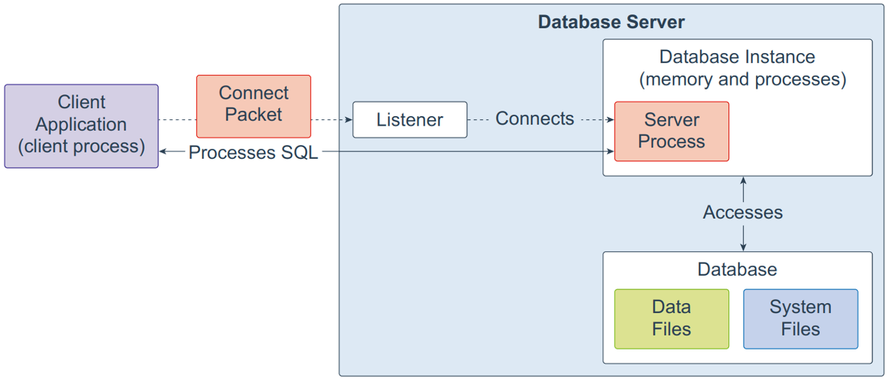
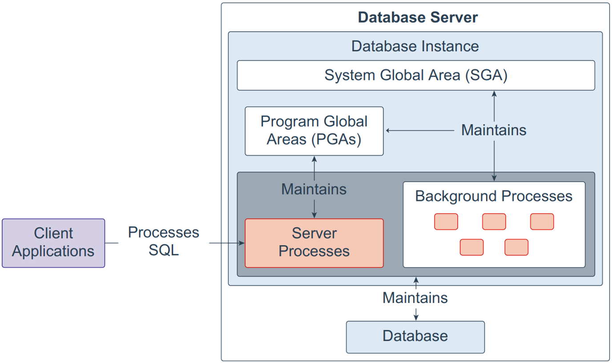
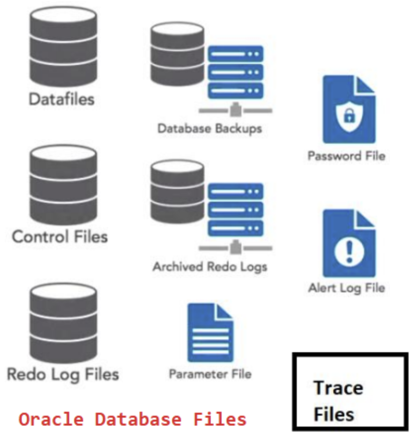
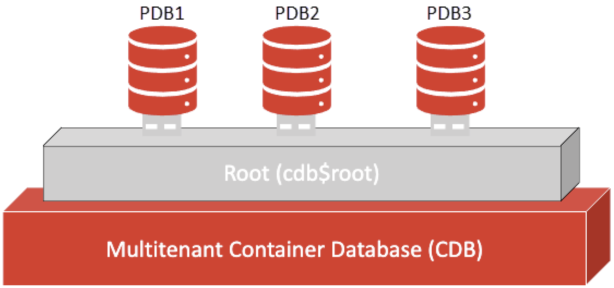
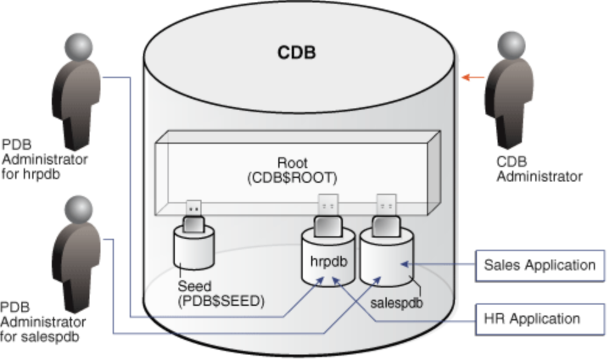
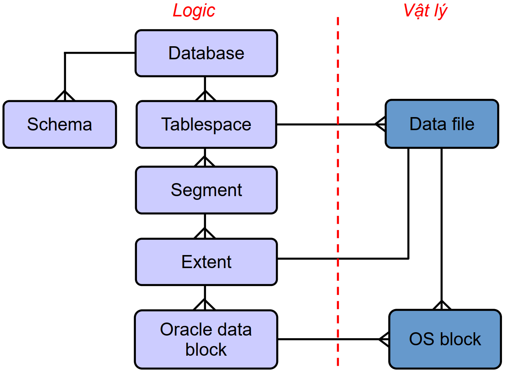
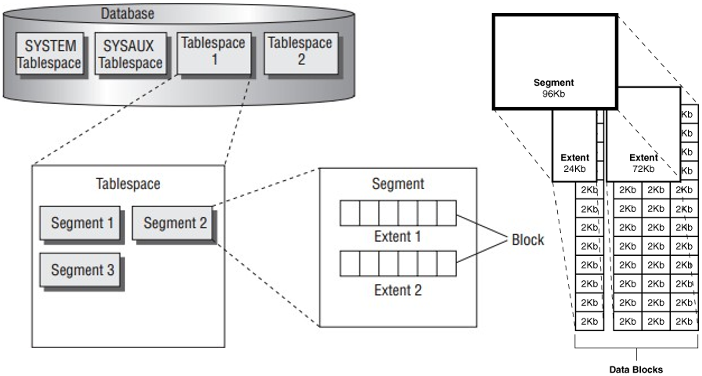
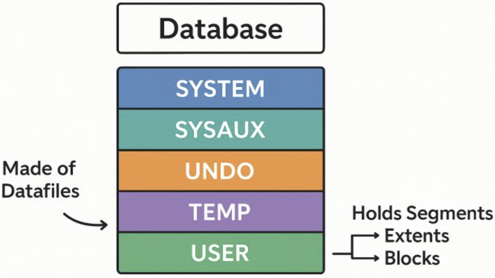
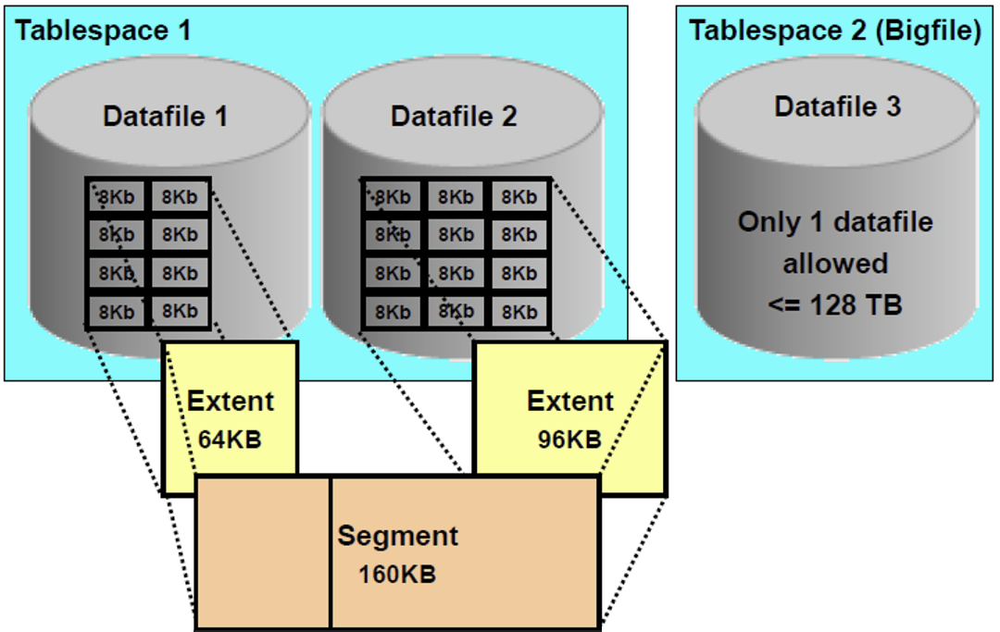

<!-- _class: cover -->

<div class="middle">

# Hệ quản trị CSDL Oracle

## Chương 4. Kiến trúc, Quản trị Oracle

</div>

### Giảng viên: Nguyễn Phồn Lữa

---

<!-- _class: toc -->

# Nội dung

- Kiến trúc Oracle Database
- Quản trị Tablespace và lưu trữ
- Schema và các đối tượng trong Schema
- Data Dictionary
- Quản trị người dùng và bảo mật
- Sao lưu và phục hồi

---

<!-- _class: section -->

# Kiến trúc Oracle Database

---

# Kiến trúc Oracle Database - Tổng quan

<div class="columns">
<div>

- Oracle Database là hệ quản trị cơ sở dữ liệu quan hệ (RDBMS) do Oracle phát triển.
- Kiến trúc bao gồm hai thành phần chính: **Instance** và **Database**.
- Instance là tập các tiến trình (process) và vùng nhớ (memory) để quản lý dữ liệu.

</div>
<div>
<br/>



</div>
</div>

- Database là tập các file vật lý lưu trữ dữ liệu thực tế.
- Kiến trúc Multitenant (từ 12c) cho phép nhiều PDB (Pluggable Database) bên trong một CDB (Container Database).
- Hiểu rõ kiến trúc giúp quản trị hiệu quả, tối ưu hiệu năng và xử lý sự cố.

---

# Oracle Instance - Định nghĩa

<div class="columns">
<div>

- Instance là một **System Global Area (SGA)** và các **background processes**.
- SGA: vùng nhớ dùng chung, chứa dữ liệu cache, câu lệnh SQL, thông tin điều khiển.
- Background processes: thực hiện các tác vụ nền như ghi dữ liệu xuống đĩa, kiểm tra checkpoint, phục hồi.

</div>
<div>



</div>
</div>

- Mỗi instance chỉ kết nối với một database (trong kiến trúc non-CDB) hoặc có thể kết nối với một CDB (trong kiến trúc Multitenant).
- Một database có thể được gắn với nhiều instance (RAC - Real Application Clusters) để tăng khả năng sẵn sàng.

---

# Oracle Database - Định nghĩa

<div class="columns">
<div>

- Database là tập hợp các file vật lý trên đĩa:
  - **Data files**: chứa dữ liệu của user và hệ thống.
  - **Control files**: lưu thông tin cấu trúc database (tên, trạng thái, các file log, checkpoint).
  - **Redo log files**: ghi lại mọi thay đổi để phục hồi khi gặp sự cố.
  - **Temp files**: dùng cho vùng nhớ tạm (sort, hash join, temporary tables).

</div>
<div>



</div>
</div>

- Các file này cùng tạo nên một database thống nhất.
- Khi instance khởi động, nó sẽ mount và mở database để người dùng truy cập.

---

# Quan hệ giữa Instance và Database

- **Instance** là phần **động** (chạy trong bộ nhớ và process).
- **Database** là phần **tĩnh** (file trên đĩa).
- Quan hệ: Một instance chỉ quản lý một database trong non-CDB; trong Multitenant, instance quản lý một CDB (chứa nhiều PDB).
- Các trạng thái:
  - **Shutdown**: không có instance, database đóng.
  - **Nomount**: instance khởi động nhưng chưa gắn database.
  - **Mount**: instance đã gắn database (đọc control file) nhưng chưa mở cho user.
  - **Open**: database mở, sẵn sàng cho truy cập.
- Kiểm tra trạng thái: `SELECT status FROM v$instance;`

---

# Ví dụ kiểm tra Instance và Database

- Truy vấn thông tin instance:

```sql
SELECT instance_name, host_name, version, status FROM v$instance;
```

- Truy vấn thông tin database:

```sql
SELECT name, dbid, created, log_mode FROM v$database;
```

- Kiểm tra trạng thái mở của database:

```sql
SELECT open_mode FROM v$database;
```

- Kết quả hiển thị tên instance, host, version, trạng thái, và open_mode (READ WRITE, READ ONLY, MOUNTED...).

---

# Kiến trúc Multitenant - Tổng quan

<div class="columns">
<div class="col-2">

- Giới thiệu từ Oracle 12c, cho phép một **CDB (Container Database)** chứa nhiều **PDB (Pluggable Database)**.
- CDB đóng vai trò container chính, có **root container (CDB\$ROOT)** và **seed PDB (PDB$SEED)**.

</div>
<div class="col-3">



</div>
</div>

- PDB là database độc lập về dữ liệu và ứng dụng, nhưng dùng chung các background process và SGA của CDB.
- Giúp quản lý tập trung, dễ dàng di chuyển, nâng cấp và bảo trì nhiều database.
- Mỗi PDB có lược đồ (schema) và dữ liệu riêng, tách biệt về bảo mật.

---

# CDB (Container Database)

<div class="columns">
<div>

- CDB là một database có chứa các container: **root**, **seed**, và các **PDB**.
- Root (CDB$ROOT) chứa metadata chung của toàn bộ CDB, như user common, các tablespace hệ thống.
- Seed (PDB$SEED) là PDB mẫu dùng để tạo PDB mới (template).
- Các PDB có thể được plug/unplug, tạo mới từ seed hoặc clone từ PDB khác.

</div>
<div>
<br/>



</div>
</div>

- Quản trị CDB bằng các lệnh SQL với `CONTAINER=CURRENT` hoặc `CONTAINER=ALL`.

---

# PDB (Pluggable Database)

- PDB là database có cấu trúc đầy đủ (tablespace, user, schema, data) nhưng nằm trong CDB.
- Mỗi PDB có **PDB name** và **PDB ID** duy nhất trong CDB.
- Có thể kết nối trực tiếp đến PDB để thực hiện các thao tác quản trị riêng.
- Các PDB có thể được khởi động/dừng độc lập.
- Xem danh sách PDB:

```sql
SELECT name, open_mode FROM v$pdbs;
```

---

# Seed Database (PDB$SEED)

- PDB$SEED là PDB hệ thống, chỉ đọc (read-only), dùng làm template để tạo PDB mới.
- Không thể kết nối hoặc sửa đổi dữ liệu trong PDB$SEED.
- Khi tạo PDB mới với `CREATE PLUGGABLE DATABASE ... FROM PDB$SEED`, Oracle sao chép cấu trúc từ seed.
- Có thể tạo PDB từ seed với các tùy chọn khác (storage, file location).
- Kiểm tra thông tin:

```sql
SELECT name, open_mode FROM v$pdbs WHERE name = 'PDB$SEED';
```

---

# Common User và Local User

- **Common User**: là user tồn tại trong toàn bộ CDB, có thể kết nối vào root và bất kỳ PDB nào (nếu được cấp quyền).
  - Tên thường bắt đầu bằng `C##` (ví dụ `C##ADMIN`).
- **Local User**: chỉ tồn tại trong một PDB cụ thể, không thể kết nối vào root hoặc PDB khác.
- Common user có thể quản lý toàn bộ CDB (với quyền phù hợp), local user chỉ quản lý PDB của mình.
- Tạo common user:

```sql
CREATE USER C##ADMIN IDENTIFIED BY pass CONTAINER=ALL;
```

- Tạo local user (đang kết nối vào PDB):

```sql
CREATE USER app_user IDENTIFIED BY pass CONTAINER=CURRENT;
```

---

# Cấu trúc lưu trữ vật lý - Tổng quan

- Các file vật lý chính của Oracle Database:
  - **Data files**: chứa dữ liệu bảng, index, v.v.
  - **Control files**: chứa thông tin metadata về database.
  - **Redo log files**: ghi lại các thay đổi để phục hồi.
  - **Temp files**: dùng cho các thao tác tạm thời.
- Ngoài ra còn có: Parameter file (spfile), Password file, Audit file, Alert log, Trace files.
- Vị trí các file được xác định bởi các tham số khởi tạo (`DB_CREATE_FILE_DEST`, `DB_RECOVERY_FILE_DEST`, v.v.)

---

# Data Files

- Data files là các file vật lý chứa dữ liệu của các tablespace (permanent và undo).
- Mỗi data file thuộc về một tablespace duy nhất.
- Có thể kích thước cố định hoặc tự động mở rộng (`AUTOEXTEND`).
- Data file được đọc/ghi bởi background process **DBWn** (Database Writer).
- Thông tin data file: `SELECT file_name, tablespace_name, bytes, autoextensible FROM dba_data_files;`
- Khi bảng hoặc index tăng trưởng, Oracle mở rộng data file nếu được cấu hình.

---

# Control Files

- Control file là file nhị phân nhỏ, ghi lại cấu trúc của database:
  - Tên database, DBID.
  - Thông tin các data files, redo log files, temp files.
  - Số sequence hiện tại của redo log, checkpoint.
  - Thông tin về backup và recovery.
- Oracle thường có ít nhất 2 control files (multiplex) để dự phòng.
- Xem thông tin:

```sql
SELECT name, status, block_size, file_size_blks FROM v$controlfile;
```

- Khi mất control file, database sẽ không thể mount, cần phục hồi từ backup.

---

# Redo Log Files

- Redo log file ghi lại tất cả các thay đổi của database (transaction) để phục hồi khi mất dữ liệu.
- Gồm các **redo log groups** và **redo log members** (các file trong group).
- Một group có ít nhất 2 members (multiplex) để an toàn.
- Oracle ghi tuần tự vào các group, khi một group đầy sẽ chuyển sang group khác (switch).
- Xem thông tin:

```sql
SELECT group#, sequence#, bytes, members, status FROM v$log;
SELECT member FROM v$logfile;
```

- Kịch bản: khi mất redo log, có thể mất dữ liệu; cần cấu hình archive log để phục hồi.

---

# Temp Files

- Temp files được sử dụng cho các vùng nhớ tạm thời (temporary tablespace).
- Dùng cho sort, hash join, group by, index creation, temporary tables.
- Không chứa dữ liệu lâu dài; dữ liệu sẽ được ghi đè khi instance restart.
- Có thể được tạo thêm để mở rộng dung lượng tạm.
- Xem thông tin:

```sql
SELECT file_name, tablespace_name, bytes, autoextensible FROM dba_temp_files;
```

- Có thể thêm tempfile:

```sql
ALTER TABLESPACE temp ADD TEMPFILE '/u01/app/oracle/oradata/temp02.dbf' SIZE 1G;
```

---

# Query các file hệ thống

- Sử dụng các dictionary views để xem thông tin file:
  - `dba_data_files`: data files
  - `dba_temp_files`: temp files
  - `v$controlfile`: control files
  - `v$logfile`: redo log members
- Ví dụ kết hợp:

```sql
SELECT file_name, bytes/1024/1024 AS size_mb, autoextensible, maxbytes/1024/1024 AS max_mb
FROM dba_data_files
WHERE tablespace_name = 'USERS';
```

- Xem tất cả file của database:

```sql
SELECT 'Datafile' AS type, file_name, bytes FROM dba_data_files
UNION ALL
SELECT 'Tempfile', file_name, bytes FROM dba_temp_files;
```

---

# Cấu trúc lưu trữ logic - Tổng quan

<div class="columns">
<div>

- Cấu trúc logic phân cấp: **Database** → **Tablespace** → **Segment** → **Extent** → **Data Block**.
- Tablespace là tập hợp các data file, là đơn vị quản lý lưu trữ logic.
- Segment là một đối tượng (bảng, index, v.v.) chiếm không gian trong tablespace.
- Extent là tập hợp các data block liên tục được cấp cho một segment.
- Data block là đơn vị lưu trữ nhỏ nhất (thường 8KB).
</div>
<div>
<br/>



</div>
</div>

- Hiểu logic giúp tối ưu lưu trữ và hiệu năng.

---

# Cấu trúc lưu trữ logic



---

# Tablespace (Logical)

- Tablespace là lớp logic giữa database và data file.
- Mỗi tablespace có thể chứa nhiều data file.
- Các loại tablespace: **Permanent** (dữ liệu người dùng), **Temporary** (dùng tạm), **Undo** (lưu thông tin rollback).
- Các tablespace hệ thống: SYSTEM (metadata), SYSAUX (các tính năng bổ sung), UNDO, TEMP.
- Tạo tablespace mới:

```sql
CREATE TABLESPACE ts_app DATAFILE '/u01/app/oracle/oradata/ts_app01.dbf' SIZE 500M;
```

- Xem danh sách:

```sql
SELECT tablespace_name, status, contents FROM dba_tablespaces;
```

---

# Segment

- Segment là một đối tượng lưu trữ dữ liệu trong tablespace.
- Mỗi segment thuộc về một schema và một tablespace.
- Các loại segment: table segment, index segment, LOB segment, temporary segment, undo segment.
- Mỗi segment bao gồm nhiều extent.
- Xem các segment:

```sql
SELECT owner, segment_name, segment_type, tablespace_name, bytes/1024/1024 AS size_mb
FROM dba_segments
WHERE owner = 'SCOTT';
```

- Khi bảng bị drop, segment được giải phóng.

---

# Extent

- Extent là một tập hợp các data block liên tục được cấp phát cho một segment.
- Khi segment cần thêm không gian, Oracle cấp thêm một hoặc nhiều extent.
- Kích thước extent có thể được thiết lập (uniform) hoặc tự động (autoallocate).
- Xem thông tin extent:

```sql
SELECT owner, segment_name, extent_id, file_id, block_id, blocks
FROM dba_extents
WHERE owner = 'SCOTT' AND segment_name = 'EMP';
```

- Quản lý extent giúp kiểm soát phân mảnh và hiệu năng.

---

# Data Block

- Data block là đơn vị I/O nhỏ nhất của Oracle, kích thước mặc định 8KB (có thể 2KB, 4KB, 16KB, 32KB).
- Cấu trúc một block: header (thông tin block), table directory, row directory, free space, row data.
- Các tham số điều khiển: PCTFREE (dành không gian trống để cập nhật), PCTUSED (ngưỡng để block được chèn lại).
- Xem kích thước block:

```sql
SELECT value FROM v$parameter WHERE name = 'db_block_size';
```

- Hiệu năng ảnh hưởng bởi kích thước block: block lớn phù hợp cho bảng lớn, OLAP; block nhỏ phù hợp OLTP.

---

<!-- _class: section -->

# Quản trị Tablespace và lưu trữ

---

# Tablespace - Tổng quan

<div class="columns">
<div>

- Tablespace là đơn vị lưu trữ logic, chứa các đối tượng của database.
- Mỗi database có ít nhất SYSTEM và SYSAUX tablespace.
- Các loại tablespace: Permanent (chứa dữ liệu), Temporary (chứa dữ liệu tạm), Undo (chứa thông tin rollback).

</div>
<div>



</div>
</div>

- Tablespace có thể được tạo, thay đổi, xóa, chuyển trạng thái (online/offline, read-only/read-write).
- Quản lý dung lượng: thêm datafile, resize, autoextend.
- Oracle Managed Files (OMF) tự động quản lý file.
- Bigfile tablespace giúp quản lý tablespace rất lớn chỉ với một datafile.

---

# Tạo Tablespace - Permanent

- Permanent tablespace lưu trữ dữ liệu bảng, index, v.v.
- Cú pháp:

```sql
CREATE TABLESPACE ts_permanent
  DATAFILE '/u01/app/oracle/oradata/ts_perm01.dbf' SIZE 100M
  AUTOEXTEND ON NEXT 10M MAXSIZE 500M
  EXTENT MANAGEMENT LOCAL
  SEGMENT SPACE MANAGEMENT AUTO;
```

<div class="columns">
<div>

- Các tùy chọn:
  - `DATAFILE`: file vật lý.
  - `AUTOEXTEND`: tự động mở rộng khi đầy.

</div>
<div>
<ul>

- `EXTENT MANAGEMENT LOCAL`: quản lý extent bằng bitmap (hiệu quả).
- `SEGMENT SPACE MANAGEMENT AUTO`: quản lý không gian segment tự động (ASSM).

</ul>
</div>
</div>

```sql
-- Kiểm tra
SELECT tablespace_name, status, contents FROM dba_tablespaces;
```

---

# Tạo Tablespace - Temporary

- Temporary tablespace dùng cho các thao tác sort, join, group by.
- Không lưu trữ dữ liệu vĩnh viễn.
- Cú pháp:

```sql
CREATE TEMPORARY TABLESPACE ts_temp
  TEMPFILE '/u01/app/oracle/oradata/temp_ts01.dbf' SIZE 200M
  AUTOEXTEND ON NEXT 50M MAXSIZE 1G
  EXTENT MANAGEMENT LOCAL UNIFORM SIZE 1M;
```

- `UNIFORM SIZE` giúp kiểm soát kích thước extent đồng đều.

```sql
-- Gán temporary tablespace cho user
ALTER USER scott TEMPORARY TABLESPACE ts_temp;

-- Xem temp tablespace
SELECT tablespace_name, status, contents FROM dba_tablespaces WHERE contents='TEMPORARY';
```

---

# Tạo Tablespace - Undo

- Undo tablespace lưu thông tin rollback, hỗ trợ phục hồi transaction, read consistency.
- Mỗi database có một undo tablespace hoạt động.
- Cú pháp:

```sql
CREATE UNDO TABLESPACE ts_undo
  DATAFILE '/u01/app/oracle/oradata/undo_ts01.dbf' SIZE 500M
  AUTOEXTEND ON NEXT 100M MAXSIZE 2G;
```

- Cấu hình undo tham số: `UNDO_TABLESPACE = ts_undo`, `UNDO_RETENTION` (thời gian giữ thông tin).

```sql
-- Xem undo
SELECT tablespace_name, status FROM dba_tablespaces WHERE contents='UNDO';

-- Chuyển đổi undo tablespace
ALTER SYSTEM SET UNDO_TABLESPACE = ts_undo2;
```

---

# Oracle Managed Files (OMF) - Khái niệm

- OMF tự động tạo và quản lý các file của database (datafiles, tempfiles, control files, redo log files).
- Khi tạo tablespace, không cần chỉ định tên file, Oracle tự tạo file với tên duy nhất.
- OMF giúp giảm công sức quản trị, tránh lỗi cấu hình.
- Kích hoạt bằng cách thiết lập các tham số:
  - `DB_CREATE_FILE_DEST`: thư mục cho data/temp files.
  - `DB_CREATE_ONLINE_LOG_DEST_n`: cho redo log và control files.
  - `DB_RECOVERY_FILE_DEST`: cho flash recovery area.

---

# Kích hoạt OMF và tạo Tablespace với OMF

- Kích hoạt OMF (cần quyền sysdba):

```sql
ALTER SYSTEM SET DB_CREATE_FILE_DEST = '/u01/app/oracle/oradata/';
```

- Tạo tablespace permanent với OMF:

```sql
CREATE TABLESPACE ts_omf DATAFILE SIZE 100M AUTOEXTEND ON NEXT 10M MAXSIZE 500M;
```

- Tên file sẽ được sinh tự động theo định dạng: `ORA$<sid>_TS_<tablespace>_<UUID>.dbf`.
- Tạo temp tablespace với OMF:

```sql
CREATE TEMPORARY TABLESPACE ts_temp_omf TEMPFILE SIZE 50M;
```

- Kiểm tra file:

```sql
SELECT file_name FROM dba_data_files WHERE tablespace_name='TS_OMF';
```

---

# Bigfile Tablespace - Khái niệm

<div class="columns">
<div>

- Bigfile tablespace chỉ có một data file (hoặc temp file) nhưng có thể rất lớn (lên tới 128TB với block size 8KB, 32TB với 4KB, v.v.).
- Giúp quản lý tablespace lớn dễ dàng hơn (ít file hơn).
- Hỗ trợ ASSM (Automatic Segment Space Management).

</div>
<div>



</div>
</div>

- Thường dùng cho các tablespace lớn như SYSTEM, SYSAUX, hoặc dữ liệu lớn.
- Không dùng cho undo và temporary? (Có thể dùng cho temporary, nhưng không khuyến nghị cho undo).
- Xem tham số: `DB_BIGFILE_TABLESPACE` (mặc định FALSE).

---

# Khi nào sử dụng Bigfile Tablespace

- Thích hợp với:
  - Tablespace có dung lượng rất lớn (hàng TB).
  - Các ứng dụng data warehouse (OLAP) với dữ liệu lịch sử.
  - Hệ thống sử dụng ASM (Automatic Storage Management) để quản lý storage.
- Không nên dùng khi có nhiều file nhỏ để tối ưu I/O phân tán.
- Bigfile giảm số lượng datafiles, đơn giản hóa quản lý.
- Tuy nhiên, nếu file bị lỗi, toàn bộ tablespace bị ảnh hưởng (do chỉ có một file).

---

# Tạo Bigfile Tablespace

- Sử dụng từ khóa `BIGFILE` trong câu lệnh:

```sql
CREATE BIGFILE TABLESPACE ts_big
  DATAFILE '/u01/app/oracle/oradata/ts_big.dbf' SIZE 10G
  AUTOEXTEND ON NEXT 1G MAXSIZE 32T;
```

- Hoặc đặt mặc định cho toàn bộ hệ thống:

```sql
ALTER DATABASE SET DEFAULT BIGFILE TABLESPACE;
```

- Khi đó mọi tablespace mới sẽ là bigfile.
- Kiểm tra:

```sql
SELECT tablespace_name, bigfile FROM dba_tablespaces;
```

- Chuyển đổi từ bigfile sang smallfile? Không thể trực tiếp, phải tạo mới và di chuyển dữ liệu.

---

# Quản lý Tablespace - Datafile

- Thêm datafile vào tablespace:

```sql
ALTER TABLESPACE ts_app ADD DATAFILE '/u01/app/oracle/oradata/ts_app02.dbf' SIZE 500M;
```

- Thay đổi kích thước (resize):

```sql
ALTER DATABASE DATAFILE '/u01/app/oracle/oradata/ts_app01.dbf' RESIZE 800M;
```

- Kích hoạt autoextend:

```sql
ALTER DATABASE DATAFILE '/u01/app/oracle/oradata/ts_app01.dbf' AUTOEXTEND ON NEXT 50M MAXSIZE 2G;
```

- Tắt autoextend:

```sql
ALTER DATABASE DATAFILE '...' AUTOEXTEND OFF;
```

---

# Quản lý Tablespace - Offline/Online

- Đưa tablespace offline (không truy cập được):

```sql
ALTER TABLESPACE ts_app OFFLINE;
```

- Có thể dùng `OFFLINE NORMAL` (checkpoint) hoặc `OFFLINE IMMEDIATE` (không checkpoint).
- Đưa online trở lại:

```sql
ALTER TABLESPACE ts_app ONLINE;
```

- Lưu ý: SYSTEM và SYSAUX không thể offline.
- Tablespace offline sẽ không thể truy cập dữ liệu cho đến khi online.
- Kiểm tra trạng thái:

```sql
SELECT tablespace_name, status FROM dba_tablespaces;
```

---

# Quản lý Tablespace - Read Only / Read Write

- Chuyển tablespace sang chỉ đọc (read-only):

```sql
ALTER TABLESPACE ts_app READ ONLY;
```

- Không thể thực hiện DML trên dữ liệu trong tablespace read-only.
- Chuyển sang read-write:

```sql
ALTER TABLESPACE ts_app READ WRITE;
```

- Sử dụng khi cần bảo vệ dữ liệu lịch sử khỏi thay đổi.
- Có thể di chuyển dữ liệu từ tablespace read-only sang khác.
- Xem trạng thái:

```sql
SELECT tablespace_name, status FROM dba_tablespaces;
```

---

# Quản lý Tablespace - Drop Tablespace

- Xóa tablespace và các file vật lý:

```sql
DROP TABLESPACE ts_app INCLUDING CONTENTS AND DATAFILES;
```

- Tùy chọn `INCLUDING CONTENTS` xóa các segment bên trong.
- `AND DATAFILES` xóa luôn các datafile trên đĩa.
- Nếu không dùng `AND DATAFILES`, các datafile vẫn tồn tại và cần xóa thủ công.
- Cần có quyền DROP TABLESPACE.
- Không thể drop SYSTEM, SYSAUX, hoặc UNDO đang hoạt động.

---

# Giám sát Tablespace - Xem thông tin

- Xem danh sách tablespace:

```sql
SELECT tablespace_name, status, contents, bigfile FROM dba_tablespaces;
```

- Xem thông tin datafile:

```sql
SELECT file_id, file_name, tablespace_name, bytes/1024/1024 AS size_mb, autoextensible, maxbytes/1024/1024 AS max_mb
FROM dba_data_files
ORDER BY tablespace_name;
```

- Xem dung lượng sử dụng và còn trống:

```sql
SELECT tablespace_name, sum(bytes)/1024/1024 AS total_mb,
       sum(maxbytes)/1024/1024 AS max_mb
FROM dba_data_files
GROUP BY tablespace_name;
```

---

# Giám sát Tablespace - Dung lượng còn trống

- Xem dung lượng trống trong mỗi tablespace:

```sql
SELECT tablespace_name,
       sum(bytes)/1024/1024 AS free_mb
FROM dba_free_space
GROUP BY tablespace_name;
```

- Kết hợp để tính tỷ lệ sử dụng:

```sql
SELECT df.tablespace_name,
       df.total_mb,
       nvl(fs.free_mb,0) AS free_mb,
       df.total_mb - nvl(fs.free_mb,0) AS used_mb,
       round((df.total_mb - nvl(fs.free_mb,0))*100/df.total_mb,2) AS pct_used
FROM (SELECT tablespace_name, sum(bytes)/1024/1024 AS total_mb FROM dba_data_files GROUP BY tablespace_name) df
LEFT JOIN (SELECT tablespace_name, sum(bytes)/1024/1024 AS free_mb FROM dba_free_space GROUP BY tablespace_name) fs
ON df.tablespace_name = fs.tablespace_name
ORDER BY pct_used DESC;
```

---

# Tablespace và User - Default và Temporary

- Mỗi user có default tablespace (nơi tạo các đối tượng mới) và temporary tablespace.
- Khi tạo user:

```sql
CREATE USER app_user IDENTIFIED BY password
  DEFAULT TABLESPACE ts_app
  TEMPORARY TABLESPACE ts_temp
  QUOTA UNLIMITED ON ts_app
  QUOTA 1G ON ts_data;
```

- Thay đổi default/temporary:

```sql
ALTER USER app_user DEFAULT TABLESPACE ts_new;
ALTER USER app_user TEMPORARY TABLESPACE ts_temp_new;
```

- Nếu không chỉ định, mặc định là `USERS` và `TEMP`.

---

# Tablespace Quota

- Quota là giới hạn dung lượng mà user có thể sử dụng trong một tablespace.
- Có thể thiết lập khi tạo user hoặc sau:

```sql
ALTER USER app_user QUOTA 500M ON ts_app;
ALTER USER app_user QUOTA UNLIMITED ON ts_data;
```

- Nếu không có quota trên tablespace, user không thể tạo đối tượng trong đó.
- Xem quota:

```sql
SELECT username, tablespace_name, bytes/1024/1024 AS quota_mb, max_bytes/1024/1024 AS max_mb
FROM dba_ts_quotas
WHERE username='APP_USER';
```

- Quota quan trọng để kiểm soát tài nguyên.

---

# Best Practices - Tablespace

- Phân tách dữ liệu và index vào các tablespace riêng để tối ưu I/O.
- Sử dụng tablespace riêng cho các ứng dụng lớn.
- Cấu hình autoextend với maxsize giới hạn để tránh tràn đĩa.
- Theo dõi dung lượng thường xuyên, cảnh báo khi sử dụng trên 80%.
- Sử dụng OMF để đơn giản hóa quản lý file.
- Bigfile tablespace chỉ khi thực sự cần.
- Đảm bảo có ít nhất một temporary tablespace cho mỗi database.
- Backup thường xuyên các tablespace.

---

<!-- _class: section -->

# Schema và các đối tượng trong Schema

---

# Schema và các đối tượng - Tổng quan

- Schema là tập hợp các đối tượng thuộc về một user.
- Mỗi user có một schema cùng tên.
- Các đối tượng: Table, View, Index, Procedure, Function, Package, Trigger, Sequence, Synonym, Database Link, Type, v.v.
- Quản trị các đối tượng bao gồm tạo, sửa đổi, xóa, di chuyển.
- Hiểu rõ từng loại đối tượng giúp thiết kế và tối ưu cơ sở dữ liệu.

---

# Schema - Khái niệm

- Schema là một tập hợp các đối tượng cơ sở dữ liệu (bảng, view, index, v.v.) thuộc về một user cụ thể.
- Khi tạo user, schema được tạo tự động.
- Mỗi đối tượng trong schema có thể được truy cập bằng tên đầy đủ: `schema.object`.
- Schema giúp tổ chức và bảo mật dữ liệu.
- Một user có thể truy cập các đối tượng trong schema khác nếu được cấp quyền.
- Xem schemas:

```sql
SELECT username FROM dba_users ORDER BY username;
```

---

# User và Schema - Mối quan hệ

- User và schema có mối quan hệ 1-1.
- User là tài khoản đăng nhập, schema là tập đối tượng.
- Khi user tạo bảng, bảng thuộc về schema của user đó.
- Có thể có user nhưng không có đối tượng (schema rỗng).
- Khi xóa user, schema và các đối tượng bị xóa (nếu dùng CASCADE).
- Một số user hệ thống như SYS (schema SYS chứa data dictionary), SYSTEM (schema SYSTEM chứa các bảng quản trị).

---

# Các nhóm Schema Objects - Lưu trữ

- **Table**: lưu trữ dữ liệu theo hàng và cột. Gồm bảng vĩnh viễn, temporary table.
- **View**: là câu lệnh SQL được lưu, không chứa dữ liệu vật lý.
- **Materialized View**: giống view nhưng lưu dữ liệu vật lý, có thể refresh.
- **Index**: cấu trúc tăng tốc truy vấn (B-tree, Bitmap, Function-based).
- **Cluster**: nhóm các bảng có cùng cột chia sẻ để tối ưu truy cập.
- Mỗi đối tượng có các thuộc tính riêng.

---

# Các nhóm Schema Objects - Lập trình

- **Procedure**: chương trình con thực hiện một tác vụ, không trả về giá trị.
- **Function**: chương trình con trả về giá trị (thường là scalar).
- **Package**: nhóm các procedure, function, biến thành một đơn vị.
- **Trigger**: đoạn PL/SQL tự động thực thi khi một sự kiện xảy ra (INSERT, UPDATE, DELETE, hoặc DDL).
- Các đối tượng này giúp đóng gói logic nghiệp vụ và tự động hóa.

---

# Các nhóm Schema Objects - Hỗ trợ

- **Sequence**: sinh ra dãy số tăng dần (dùng cho khóa chính).
- **Synonym**: bí danh (alias) cho đối tượng, có thể public hoặc private.
- **Type**: kiểu dữ liệu do người dùng định nghĩa (object type, collection).
- **Database Link**: kết nối đến một database khác để truy cập đối tượng từ xa.
- Các đối tượng này hỗ trợ linh hoạt truy cập và lập trình.

---

# Quản trị Table - Tạo bảng trong Tablespace

- Tạo bảng cơ bản:

```sql
CREATE TABLE employees (
  emp_id NUMBER(6) PRIMARY KEY,
  name VARCHAR2(100) NOT NULL,
  hire_date DATE DEFAULT SYSDATE,
  salary NUMBER(8,2)
)
TABLESPACE ts_app;
```

- Có thể chỉ định storage (initial, next, pctfree, pctused).
- Nếu không chỉ định tablespace, bảng được tạo trong default tablespace của user.
- Kiểm tra bảng:

```sql
SELECT owner, table_name, tablespace_name FROM dba_tables WHERE owner='APP_USER';
```

---

# Quản trị Table - Di chuyển bảng

- Di chuyển bảng sang tablespace khác:

```sql
ALTER TABLE employees MOVE TABLESPACE ts_data;
```

- Khi di chuyển, các index trở nên unusable, cần rebuild lại.
- Di chuyển với tùy chọn để update indexes:

```sql
ALTER TABLE employees MOVE TABLESPACE ts_data UPDATE INDEXES;
```

- Di chuyển bảng lớn sẽ ảnh hưởng đến hiệu năng, nên thực hiện trong thời gian ít tải.
- Kiểm tra sau di chuyển:

```sql
SELECT tablespace_name FROM dba_tables WHERE owner='APP_USER' AND table_name='EMPLOYEES';
```

---

# Quản trị Index - Các loại Index

- **B-tree index**: mặc định, thích hợp cho khóa chính, dữ liệu có tính chọn lọc cao.
- **Bitmap index**: thích hợp cho các cột có ít giá trị phân biệt (gender, status).
- **Function-based index**: index trên biểu thức (ví dụ UPPER(name)).
- Tạo B-tree:

```sql
CREATE INDEX idx_emp_name ON employees(name) TABLESPACE ts_idx;
```

- Tạo bitmap:

```sql
CREATE BITMAP INDEX idx_emp_status ON employees(status) TABLESPACE ts_idx;
```

- Tạo function-based:

```sql
CREATE INDEX idx_emp_upper_name ON employees(UPPER(name));
```

---

# Quản trị Index - Quản lý và Xóa

- Kiểm tra index:

```sql
SELECT index_name, table_name, uniqueness, status FROM dba_indexes WHERE owner='APP_USER';
```

- Rebuild index (sau khi di chuyển bảng hoặc để giảm phân mảnh):

```sql
ALTER INDEX idx_emp_name REBUILD TABLESPACE ts_idx;
```

- Xóa index:

```sql
DROP INDEX idx_emp_name;
```

- Nên có chiến lược rebuild định kỳ hoặc khi cần.
- Sử dụng `MONITORING USAGE` để kiểm tra index có được sử dụng không:

```sql
ALTER INDEX idx_emp_name MONITORING USAGE;
-- sau đó kiểm tra v$object_usage
```

---

# Quản trị View - Simple và Complex

- **Simple View**: dựa trên một bảng, không có hàm nhóm, không có join phức tạp; có thể DML trên view (với điều kiện).
- **Complex View**: dựa trên nhiều bảng, có group by, join, hàm; thường chỉ đọc.
- Tạo simple view:

```sql
CREATE VIEW emp_view AS SELECT emp_id, name, salary FROM employees WHERE department_id=10;
```

- Tạo complex view:

```sql
CREATE VIEW dept_salary AS
SELECT d.dept_name, avg(e.salary) avg_sal
FROM departments d JOIN employees e ON d.dept_id=e.dept_id
GROUP BY d.dept_name;
```

- Xem view:

```sql
SELECT view_name, text FROM dba_views WHERE owner='APP_USER';
```

---

# Quản trị Materialized View

- Materialized view lưu dữ liệu vật lý, giúp tăng hiệu năng truy vấn cho dữ liệu tổng hợp.
- Có thể refresh theo schedule hoặc thủ công.
- Tạo:

```sql
CREATE MATERIALIZED VIEW mv_sales_summary
BUILD IMMEDIATE
REFRESH COMPLETE ON DEMAND
AS SELECT product_id, sum(sales) total_sales FROM sales GROUP BY product_id;
```

- Refresh thủ công:

```sql
EXEC DBMS_MVIEW.REFRESH('MV_SALES_SUMMARY', 'C');
```

- Xem thông tin:

```sql
SELECT mview_name, refresh_mode, last_refresh_date FROM dba_mviews;
```

---

# Quản trị Sequence

- Sequence sinh dãy số tăng dần (hoặc giảm dần) để tạo giá trị duy nhất.

<div class="columns">
<div>

- Tạo:

```sql
CREATE SEQUENCE seq_emp
  START WITH 1000
  INCREMENT BY 1
  MAXVALUE 999999
  NOCYCLE
  CACHE 20;
```

</div>
<div class="col-2">

- Thay đổi:

```sql
ALTER SEQUENCE seq_emp INCREMENT BY 10 MAXVALUE 9999999;
```

- Xóa:

```sql
DROP SEQUENCE seq_emp;
```

</div>
</div>

- Sử dụng NEXTVAL và CURRVAL:

```sql
INSERT INTO employees(emp_id, name) VALUES(seq_emp.NEXTVAL, 'John');
SELECT seq_emp.CURRVAL FROM dual;
```

---

# Synonym - Khái niệm và Quản trị

- Synonym là bí danh (alias) cho một đối tượng (bảng, view, sequence, procedure, v.v.).
- **Private synonym**: thuộc về một schema, chỉ user đó truy cập.
- **Public synonym**: truy cập được bởi tất cả người dùng.

<div class="columns">
<div class="col-3">

- Tạo private:

```sql
CREATE SYNONYM emp FOR employees;
```

- Tạo public:

```sql
CREATE PUBLIC SYNONYM emp FOR app_user.employees;
```

</div>
<div class="col-2">

- Truy vấn qua synonym:

```sql
SELECT * FROM emp;
```

- Xóa synonym:

```sql
DROP SYNONYM emp;
DROP PUBLIC SYNONYM emp;
```

</div>
</div>

- Xem:

```sql
SELECT synonym_name, owner, table_owner, table_name FROM dba_synonyms;
```

---

<!-- _class: section -->

# Data Dictionary

---

# Data Dictionary và Dynamic Performance Views

- **Data Dictionary**: tập các bảng và view do Oracle tạo, lưu metadata về database (cấu trúc, user, tablespace, v.v.).
- **Dynamic Performance Views (V$)**: view dựa trên cấu trúc bộ nhớ và trạng thái hệ thống, cung cấp thông tin real-time.
- Các loại view: USER* (đối tượng của user), ALL* (đối tượng user có quyền truy cập), DBA* (tất cả), CDB* (trong CDB).
- Sử dụng data dictionary để giám sát, bảo trì, và khai thác thông tin.

---

# Data Dictionary - Khái niệm và Vai trò

- Data dictionary là nơi lưu trữ thông tin về tất cả đối tượng trong database.
- Được tự động cập nhật khi có DDL (CREATE, ALTER, DROP).
- Vai trò:
  - Cung cấp thông tin cho Oracle optimizer.
  - Hỗ trợ quản trị viên và người dùng tra cứu cấu trúc.
  - Đảm bảo tính toàn vẹn dữ liệu.
- Các view cơ bản: `DBA_OBJECTS`, `DBA_TABLES`, `DBA_USERS`, v.v.
- Các view thường có prefix `USER_`, `ALL_`, `DBA_`, `CDB_`.

---

# Các nhóm Data Dictionary

- **USER\_**: chỉ các đối tượng thuộc về user hiện tại.
- **ALL\_**: các đối tượng mà user hiện tại có quyền truy cập (bao gồm cả của người khác).
- **DBA\_**: tất cả các đối tượng trong toàn database (cần quyền DBA).
- **CDB\_**: tương tự DBA\_ nhưng áp dụng cho toàn bộ CDB (trong Multitenant), hiển thị thông tin từ root và các PDB.
- Ví dụ:

```sql
SELECT table_name FROM user_tables;
SELECT table_name FROM all_tables WHERE owner='SCOTT';
SELECT table_name FROM dba_tables;
```

---

# Dynamic Performance Views - V$ và GV$

- **V$** views lấy thông tin từ SGA và cấu trúc bộ nhớ, cung cấp dữ liệu động về instance.
- Ví dụ: `V$INSTANCE`, `V$DATABASE`, `V$SGA`, `V$SESSION`, `V$SQL`, `V$LOCK`.
- **GV$** views tương tự nhưng lấy từ tất cả instances trong RAC.
- Cần quyền SELECT ANY DICTIONARY hoặc quyền tương ứng.
- Truy vấn phổ biến:

```sql
SELECT * FROM v$version;
SELECT status FROM v$instance;
SELECT osuser, username, program FROM v$session;
```

---

# Khai thác thông tin hệ thống - Query Datafiles

- Xem chi tiết data files:

```sql
SELECT file_id, file_name, tablespace_name, bytes/1024/1024 AS size_mb, autoextensible, status
FROM dba_data_files
ORDER BY tablespace_name, file_id;
```

- Xem thông tin mở rộng:

```sql
SELECT file_name, increment_by*block_size/1024/1024 AS inc_mb, maxbytes/1024/1024 AS max_mb
FROM dba_data_files
WHERE autoextensible='YES';
```

- Sử dụng view `v$datafile` để xem trạng thái online:

```sql
SELECT file#, status, bytes/1024/1024 AS size_mb FROM v$datafile;
```

---

# Khai thác thông tin hệ thống - Query Tempfiles

- Xem temp files:

```sql
SELECT file_name, tablespace_name, bytes/1024/1024 AS size_mb, autoextensible
FROM dba_temp_files;
```

- Sử dụng view `v$tempfile`:

```sql
SELECT name, status, bytes/1024/1024 AS size_mb FROM v$tempfile;
```

- Kiểm tra dung lượng sử dụng tạm:

```sql
SELECT tablespace_name, sum(bytes_used)/1024/1024 AS used_mb, sum(bytes_free)/1024/1024 AS free_mb
FROM v$temp_space_header
GROUP BY tablespace_name;
```

---

# Khai thác thông tin hệ thống - Query Tablespaces

- Xem danh sách tablespace:

```sql
SELECT tablespace_name, status, contents, bigfile FROM dba_tablespaces;
```

- Xem thông tin trạng thái và tệp:

```sql
SELECT tablespace_name, file_name, status FROM dba_data_files;
```

- Kết hợp:

```sql
SELECT t.tablespace_name, t.status, t.contents,
       sum(f.bytes)/1024/1024 AS total_mb
FROM dba_tablespaces t LEFT JOIN dba_data_files f ON t.tablespace_name = f.tablespace_name
GROUP BY t.tablespace_name, t.status, t.contents;
```

---

# Khai thác thông tin hệ thống - Query Users

- Xem danh sách user:

```sql
SELECT username, account_status, default_tablespace, temporary_tablespace, created
FROM dba_users
ORDER BY username;
```

- Xem thông tin user hiện tại:

```sql
SELECT user FROM dual;
SELECT sys_context('USERENV', 'SESSION_USER') FROM dual;
```

- Xem các role của user:

```sql
SELECT granted_role FROM dba_role_privs WHERE grantee='APP_USER';
```

---

# Khai thác thông tin hệ thống - Query CDB/PDB

- Trong môi trường Multitenant:

```sql
SELECT name, open_mode, con_id FROM v$pdbs;
```

- Xem container hiện tại:

```sql
SELECT sys_context('USERENV', 'CON_NAME') FROM dual;
```

- Xem các đối tượng trong CDB:

```sql
SELECT owner, object_name, object_type FROM cdb_objects WHERE con_id = 3; -- PDB ID
```

- Chuyển đổi container:

```sql
ALTER SESSION SET CONTAINER = pdb_name;
```

---

<!-- _class: section -->

# Quản trị người dùng và bảo mật

---

# Bảo mật Oracle - Tổng quan

- Bảo mật dữ liệu qua xác thực, phân quyền, vai trò và hồ sơ.
- **User Account**: tài khoản đăng nhập, xác thực bằng password, Kerberos, LDAP, v.v.
- **Privileges**: quyền thực hiện hành động (system privilege) hoặc truy cập đối tượng (object privilege).
- **Role**: nhóm các quyền để gán cho user.
- **SYS và SYSTEM**: các user quản trị đặc biệt.
- **Profile**: giới hạn tài nguyên và chính sách mật khẩu.
- **Tablespace Quota**: giới hạn dung lượng.

---

# Oracle Account - User và Authentication

- User được tạo bằng `CREATE USER`.
- Các phương thức xác thực:
  - **Password**: mặc định, dùng password.
  - **External**: dùng thông tin từ OS hoặc dịch vụ bên ngoài.
  - **Global**: dùng LDAP hoặc Oracle Internet Directory.

<div class="columns">
<div class="col-4">

- Tạo user với password:

```sql
CREATE USER app_user IDENTIFIED BY password;
```

- Thay đổi password:

```sql
ALTER USER app_user IDENTIFIED BY new_password;
```

</div>
<div class="col-3">

- Khóa/mở khóa user:

```sql
ALTER USER app_user ACCOUNT LOCK;
ALTER USER app_user ACCOUNT UNLOCK;
```

</div>
</div>

---

# Privileges - System Privilege

- System privilege cho phép thực hiện hành động quản trị (CREATE TABLE, CREATE USER, ALTER SYSTEM, etc.).
- Một số system privileges quan trọng:
  - `CREATE SESSION`: kết nối database.
  - `CREATE TABLE`: tạo bảng trong schema.
  - `CREATE ANY TABLE`: tạo bảng trong bất kỳ schema.
  - `ALTER DATABASE`, `ALTER SYSTEM`.
  - `DBA`, `SYSDBA`, `SYSOPER`.

<div class="columns">
<div>

- Cấp quyền:

```sql
GRANT CREATE SESSION, CREATE TABLE TO app_user;
```

</div>
<div>

- Thu hồi:

```sql
REVOKE CREATE TABLE FROM app_user;
```

</div>
</div>

---

# Privileges - Object Privilege

- Object privilege cho phép thao tác trên một đối tượng cụ thể (bảng, view, sequence, procedure).
- Các object privileges: SELECT, INSERT, UPDATE, DELETE, EXECUTE, REFERENCES, INDEX, ALTER.
- Cấp quyền:

```sql
GRANT SELECT, INSERT ON employees TO hr_user;
GRANT EXECUTE ON proc_calc TO app_user;
```

- Thu hồi:

```sql
REVOKE INSERT ON employees FROM hr_user;
```

- Quyền có thể được cấp với `WITH GRANT OPTION` để cho phép cấp tiếp.

---

# Role - Khái niệm

- Role là tập hợp các quyền, giúp đơn giản hóa quản lý.
- Thay vì cấp nhiều quyền riêng lẻ cho user, cấp một role.
- Có các role mặc định: `CONNECT`, `RESOURCE`, `DBA`.
- Tạo role:

```sql
CREATE ROLE app_role;
```

- Cấp quyền cho role:

```sql
GRANT CREATE SESSION, CREATE TABLE TO app_role;
```

- Cấp role cho user:

```sql
GRANT app_role TO app_user;
```

---

# Default Roles và Quản trị Role

- User có thể có nhiều role, nhưng chỉ một số là **default** (tự động kích hoạt khi connect).
- Xem default roles:

```sql
SELECT username, default_role FROM dba_roles;
```

- Thay đổi default role:

```sql
ALTER USER app_user DEFAULT ROLE app_role, CONNECT;
```

<div class="columns">
<div class="col-3">

- Kích hoạt/tắt role trong session:

```sql
SET ROLE app_role;
SET ROLE NONE;
```

</div>
<div class="col-4">

- Vô hiệu hóa role:

```sql
REVOKE app_role FROM app_user;
```

- Xóa role:

```sql
DROP ROLE app_role;
```

</div>
</div>

---

# SYS và SYSTEM

- **SYS**: user quản trị cao nhất, sở hữu data dictionary. Có tất cả quyền, bao gồm SYSDBA.
- **SYSTEM**: user quản trị, sở hữu các bảng mở rộng, có quyền DBA nhưng không phải SYSDBA.
- Chỉ sử dụng SYS để thực hiện các tác vụ yêu cầu SYSDBA (khởi động, tắt, backup, recovery).
- Không nên sử dụng SYS/SYSTEM cho các tác vụ thường ngày.
- Thay đổi mật khẩu:

```sql
ALTER USER SYS IDENTIFIED BY new_password;
ALTER USER SYSTEM IDENTIFIED BY new_password;
```

- Cấp quyền SYSDBA cho user khác:

```sql
GRANT SYSDBA TO admin_user;
```

---

# Profile - Password Policy

- Profile định nghĩa chính sách mật khẩu và giới hạn tài nguyên.
- Password policy:
  - `FAILED_LOGIN_ATTEMPTS`: số lần thất bại trước khi khóa.
  - `PASSWORD_LOCK_TIME`: thời gian khóa.
  - `PASSWORD_LIFE_TIME`: thời gian tồn tại mật khẩu.
  - `PASSWORD_REUSE_TIME/MAX`: hạn chế dùng lại.
  - `PASSWORD_VERIFY_FUNCTION`: hàm kiểm tra độ mạnh.

<div class="columns">
<div class="col-3">

- Tạo profile:

```sql
CREATE PROFILE app_profile LIMIT
  FAILED_LOGIN_ATTEMPTS 5
  PASSWORD_LOCK_TIME 1
  PASSWORD_LIFE_TIME 90
  PASSWORD_REUSE_TIME 365;
```

</div>
<div class="col-4">

- Gán cho user:

```sql
ALTER USER app_user PROFILE app_profile;
```

</div>
</div>

---

# Profile - Resource Limit

- Resource limit giới hạn sử dụng tài nguyên hệ thống trong một session.
- Các tham số:

<div class="columns">
<div class="col-4">
<ul>

- `SESSIONS_PER_USER`: số session tối đa.
- `CPU_PER_SESSION`: CPU time tối đa.
- `LOGICAL_READS_PER_SESSION`: số block đọc tối đa.

</ul>
</div>
<div class="col-3">
<ul>

- `IDLE_TIME`: thời gian idle tối đa (phút).
- `CONNECT_TIME`: thời gian kết nối tối đa.

</ul>
</div>
</div>

- Ví dụ:

```sql
CREATE PROFILE resource_profile LIMIT
  SESSIONS_PER_USER 10
  CPU_PER_SESSION 1000
  IDLE_TIME 30;
```

- Để kích hoạt giới hạn tài nguyên, tham số `RESOURCE_LIMIT` phải là TRUE:

```sql
ALTER SYSTEM SET RESOURCE_LIMIT=TRUE;
```

---

# Tablespace Quota - Nhắc lại

- Quota giới hạn dung lượng user sử dụng trên tablespace.
- Xem quota:

```sql
SELECT username, tablespace_name, bytes/1024/1024 AS used_mb, max_bytes/1024/1024 AS max_mb
FROM dba_ts_quotas
WHERE username='APP_USER';
```

- Thiết lập quota:

```sql
ALTER USER app_user QUOTA 500M ON ts_app;
ALTER USER app_user QUOTA UNLIMITED ON ts_data;
```

- Nếu không có quota, user không thể tạo đối tượng trên tablespace đó.

---

<!-- _class: section -->

# Sao lưu và phục hồi

---

# Backup & Recovery - Tổng quan

- Backup & Recovery đảm bảo an toàn dữ liệu khi gặp sự cố (lỗi phần cứng, lỗi người dùng, thiên tai).
- Nguyên nhân mất dữ liệu: lỗi media, lỗi logic, lỗi user.
- RTO (Recovery Time Objective): thời gian tối đa để phục hồi.
- RPO (Recovery Point Objective): lượng dữ liệu tối đa có thể mất (tính bằng thời gian).
- Chiến lược backup: full, incremental, cold, hot.
- Phương pháp backup: user-managed (thủ công) hoặc RMAN (Oracle Recovery Manager).
- RMAN là công cụ mạnh mẽ, tích hợp, hỗ trợ nhiều tính năng.

---

# Nguyên nhân mất dữ liệu và RTO/RPO

- **Lỗi media**: hỏng đĩa, lỗi file system.
- **Lỗi logic**: lỗi phần mềm, sai sót người dùng (DROP TABLE, DELETE không có điều kiện).
- **Lỗi site**: mất trung tâm dữ liệu.
- **RTO**: thời gian phục hồi tối đa chấp nhận được. Ví dụ: 2 giờ.
- **RPO**: lượng dữ liệu có thể mất. Ví dụ: 15 phút (có nghĩa cần backup mỗi 15 phút).
- Xác định RTO/RPO giúp chọn chiến lược backup phù hợp.

---

# Chiến lược Backup - Full và Incremental

- **Full backup**: sao lưu toàn bộ database (data files, control file, archive logs).
- **Incremental backup**: chỉ sao lưu các block đã thay đổi từ lần backup trước.
  - Cấp 0: full (cơ sở cho incremental).
  - Cấp 1: incremental kể từ cấp 0 hoặc cấp 1 trước.
- Incremental giảm dung lượng và thời gian, nhưng phục hồi phức tạp hơn.
- Ví dụ lịch: full hàng tuần, incremental hàng ngày.

---

# Chiến lược Backup - Cold và Hot

- **Cold backup** (offline): backup khi database shutdown. Đơn giản, an toàn, nhưng thời gian downtime cao.
- **Hot backup** (online): backup trong khi database đang mở. Dùng với archive log mode.
- Hot backup yêu cầu database ở chế độ ARCHIVELOG.
- Hot backup phù hợp với hệ thống 24/7.
- Cold backup có thể thực hiện bằng cách copy các file khi database đóng.

---

# Phương pháp Backup - User Managed Backup

- User-managed: backup thủ công bằng các lệnh OS (cp, tar) hoặc SQL.
- Cần thực hiện đồng bộ: đưa tablespace offline, backup data file, đưa online (cho hot).
- Cold backup: shutdown, copy tất cả file, startup.
- Hot backup (chế độ archive log):

```sql
ALTER TABLESPACE ts_app BEGIN BACKUP;

-- copy data file
ALTER TABLESPACE ts_app END BACKUP;
```

- Quản lý phức tạp, dễ sai sót, khuyến nghị dùng RMAN.

---

# Recovery Manager (RMAN) - Kiến trúc và Thành phần

- RMAN là công cụ backup và recovery tích hợp của Oracle.
- Kiến trúc: client (rman) kết nối đến target database thông qua Net.
- RMAN sử dụng các process server session để thực hiện backup/recovery.
- Thành phần:
  - **Target database**: database cần backup.
  - **Catalog database**: repository lưu metadata (tùy chọn, khuyến nghị).
  - **Recovery catalog**: schema chứa thông tin backup.
- Không cần catalog, RMAN có thể dùng control file để lưu metadata (nhưng hạn chế).

---

# RMAN - Backup Sets và Image Copies

- **Backup Set**: định dạng backup của RMAN, gồm một hoặc nhiều **backup pieces**.
  - Có thể nén, nhiều file vào một piece.
- **Image Copy**: bản sao chính xác của data file (giống OS copy), nhưng được quản lý bởi RMAN.
  - Có thể dùng để phục hồi nhanh (restore).
- Backup set thường dùng với incremental, tiết kiệm dung lượng.
- Image copy hữu ích cho phục hồi tại chỗ.

---

# RMAN - Các lệnh cơ bản (Configuration)

- Cấu hình RMAN:

```sql
CONFIGURE RETENTION POLICY TO REDUNDANCY 2;  -- giữ 2 bản backup
CONFIGURE BACKUP OPTIMIZATION ON;
CONFIGURE DEFAULT DEVICE TYPE TO DISK;
CONFIGURE DEVICE TYPE DISK PARALLELISM 2;
CONFIGURE CHANNEL DEVICE TYPE DISK FORMAT '/backup/%U.bkp';
CONFIGURE CONTROLFILE AUTOBACKUP ON;
```

- Xem cấu hình: `SHOW ALL;`
- Các thiết lập này lưu trong control file hoặc recovery catalog.

---

# RMAN - Lệnh Backup

<div class="columns">
<div>

- Backup full database:

```cmd
RMAN> BACKUP DATABASE PLUS ARCHIVELOG DELETE INPUT;
```

- Backup tablespace:

```cmd
RMAN> BACKUP TABLESPACE ts_app;
```

- Backup datafile:

```cmd
RMAN> BACKUP DATAFILE 5;
```

</div>
<div>

- Backup incremental level 0:

```cmd
RMAN> BACKUP INCREMENTAL LEVEL 0 DATABASE;
```

- Backup với tag:

```cmd
RMAN> BACKUP DATABASE TAG 'full_backup_20260107';
```

</div>
</div>

---

# RMAN - Lệnh Restore và Recovery

- **Restore**: lấy lại file từ backup.
- **Recovery**: áp dụng redo logs để đưa dữ liệu lên thời điểm mới nhất.
- Ví dụ restore database:

```cmd
RMAN> RESTORE DATABASE;
RMAN> RECOVER DATABASE;
```

- Restore tablespace:

```cmd
RMAN> RESTORE TABLESPACE ts_app;
RMAN> RECOVER TABLESPACE ts_app;
```

- Restore datafile:

```cmd
RMAN> RESTORE DATAFILE 5;
RMAN> RECOVER DATAFILE 5;
```

---

# RMAN - Lệnh Reporting và Maintenance

- Báo cáo:

```cmd
RMAN> LIST BACKUP SUMMARY;
RMAN> LIST BACKUP OF DATABASE;
RMAN> REPORT NEED BACKUP;   -- những file cần backup
RMAN> REPORT UNRECOVERABLE;
```

- Maintenance:

```cmd
RMAN> DELETE OBSOLETE;      -- xóa các backup không cần thiết theo chính sách
RMAN> DELETE EXPIRED BACKUP;-- xóa backup bị lỗi
RMAN> CROSSCHECK BACKUP;    -- kiểm tra sự tồn tại của backup
```

---

# RMAN Script mẫu

```cmd
#!/bin/bash
# RMAN backup script
rman target / <<EOF
CONFIGURE RETENTION POLICY TO RECOVERY WINDOW OF 7 DAYS;
BACKUP AS COMPRESSED BACKUPSET DATABASE PLUS ARCHIVELOG DELETE INPUT;
BACKUP CURRENT CONTROLFILE;
DELETE OBSOLETE;
EXIT;
EOF
```

- Lưu thành file .sh và lập lịch (cron) hàng ngày.
- Có thể thêm email notification.
- Đảm bảo backup được lưu trên storage khác để an toàn.

---

<!-- _class: empty -->

# Thank you
